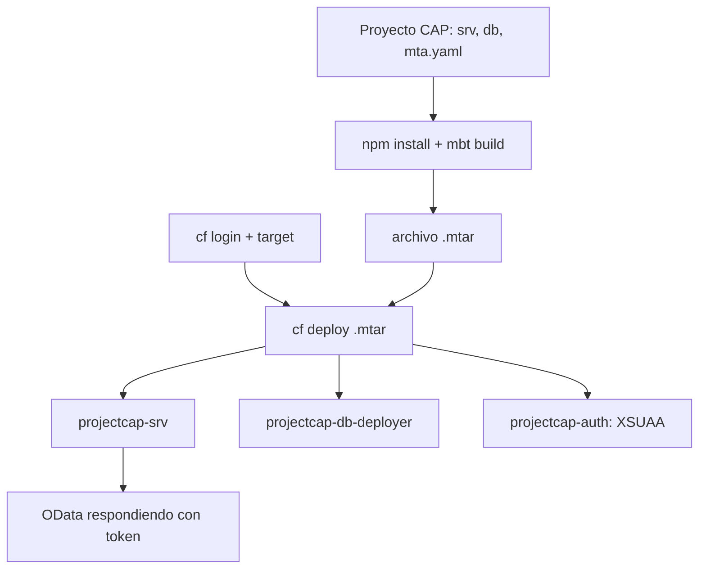

Los cinco posts anteriores desmontaron las piezas: orgs y espacios, el `mta.yaml`, la `cf CLI`, `VCAP_SERVICES` y los buildpacks. Toca juntarlas en el recorrido que de verdad haces en un proyecto: **una app CAP full-stack, con base de datos HANA y autenticación XSUAA, desde el proyecto vacío hasta responder peticiones**.

## El proyecto CAP

Un proyecto CAP nativo de BTP tiene una estructura reconocible: `srv` (el servicio y el modelo CDS), `db` (la base de datos), y los descriptores `mta.yaml`, `package.json` y `xs-security.json`. Al crearlo desde plantilla eliges el runtime (Node.js), las capacidades (**SAP HANA Cloud** y **User Authentication vía XSUAA**) y el destino de despliegue (**Cloud Foundry: MTA Deployment**).



## Paso 1: dependencias y build

Desde la terminal del proyecto, instalas dependencias y construyes el artefacto. El `mbt build` empaqueta los tres módulos en un solo `.mtar`:

```bash
npm install
mbt build
# genera mta_archives/projectcap_1.0.0.mtar
```

## Paso 2: iniciar sesión en Cloud Foundry

El IDE no conoce tu subcuenta ni tu espacio: hay que iniciar sesión en el entorno CF explícitamente. Sin esto, el despliegue falla:

```bash
cf login
cf target -o NOMBRE_ORG -s dev
```

## Paso 3: desplegar el MTA completo

Un solo comando despliega los tres módulos en orden, crea los recursos y resuelve los enlaces. Ni `push` app por app, ni bindings a mano:

```bash
cf deploy mta_archives/projectcap_1.0.0.mtar
```

Al terminar, `cf deploy` devuelve la URL de la aplicación. En el cockpit lo ves en el espacio, bajo **Applications**, con `projectcap-srv` y `projectcap-db-deployer` desplegados, y los **Service Bindings** hacia `projectcap-auth` (XSUAA) y `projectcap-db` (HANA) ya resueltos.

## Paso 4: probar el servicio protegido

El servicio está detrás de XSUAA, así que no responde a un GET pelado: necesita un token OAuth 2.0. Tomas el `clientid` y el `clientsecret` del binding `projectcap-auth`, pides el token y lo usas contra la entidad:

```bash
# pedir token con las credenciales del binding XSUAA (flujo client credentials)
curl -s -X POST "$UAA_URL/oauth/token" \
  -d "grant_type=client_credentials&client_id=$CLIENT_ID&client_secret=$CLIENT_SECRET"

# llamar a la entidad con el token
curl -s "$APP_URL/odata/v4/catalog/Books" \
  -H "Authorization: Bearer $TOKEN"
```

Si la base de datos HANA está detenida, recibirás un `503`: en Trial las instancias se paran por la noche y hay que arrancarlas antes de probar. Es el falso fallo más común de toda la serie.

## Lo que hemos evitado haciéndolo así

- No hay credenciales en el código: XSUAA y HANA llegan por binding vía `VCAP_SERVICES`.
- No hay orden manual de despliegue: el `mta.yaml` lo declara y `cf deploy` lo respeta.
- El mismo `.mtar` sirve para dev, qua y prod: cada espacio enlaza sus propias instancias.

> Una app CAP bien desplegada no es la que arranca en la demo. Es la que se reconstruye desde el `.mtar`, sin secretos en git y sin pasos manuales, tantas veces como haga falta.

Con esto cerramos la serie de Cloud Foundry: del árbol de orgs y espacios al despliegue full-stack reproducible. La disciplina es siempre la misma: declara la unidad de despliegue, deja que la plataforma inyecte lo sensible, y no adivines cuando puedes leer los logs.
