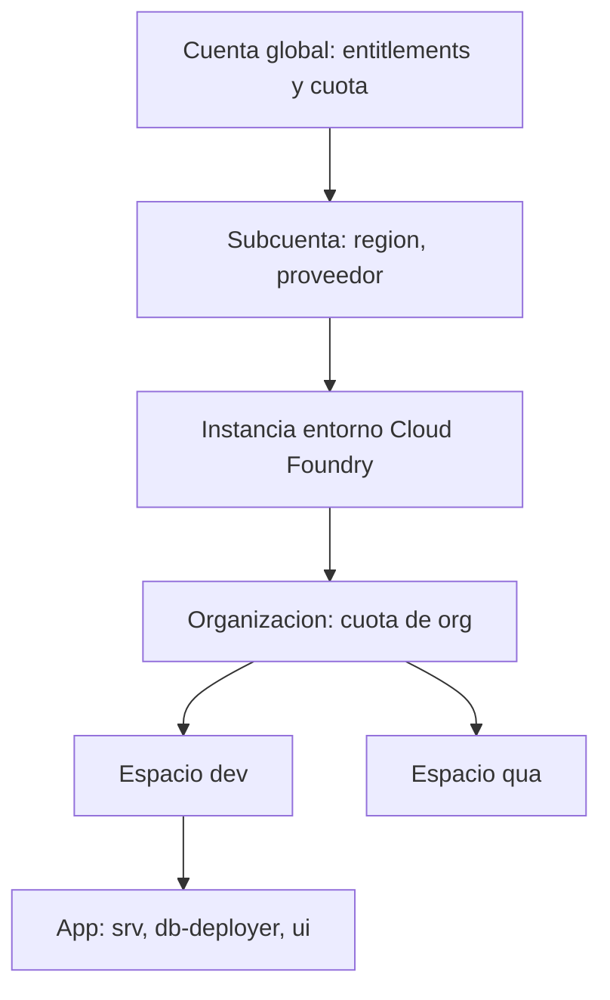

La mayoría de los líos con Cloud Foundry no vienen del `cf push`. Vienen de **desplegar en el espacio equivocado, con la cuota equivocada, porque nadie se paró a entender la jerarquía**. En SAP BTP, Cloud Foundry no es un cajón plano donde tiras aplicaciones: es un árbol de contenedores con cuota y permisos en cada nivel.

## La jerarquía, de arriba a abajo

- **Cuenta global**: el contrato con SAP. Aquí viven los derechos (`entitlements`) y las cuotas globales que luego repartes.
- **Subcuenta**: la unidad de aislamiento real. Tiene región, proveedor (AWS, Azure) y sus propios servicios. Una subcuenta habilita **una** instancia de entorno Cloud Foundry.
- **Organización (org)**: dentro del entorno CF, agrupa espacios y comparte una cuota de org.
- **Espacio (space)**: donde de verdad se ejecutan las aplicaciones y viven las instancias de servicio. Aquí van dev, qua y prod separados.
- **Aplicación (app)**: tu servicio CAP, tu módulo Fiori, tu deployer de base de datos.

La regla que casi nadie escribe: **la subcuenta es el límite; la org y el espacio son la organización interna de ese límite**. BTP CLI trabaja hasta crear la instancia de entorno Cloud Foundry; a partir de ahí manda `cf`.



## Las cuotas no son decoración

Cada nivel puede tener una cuota, y en una cuenta Trial los topes son bajos. Antes de desplegar conviene fijar una cuota de espacio explícita en lugar de rezar para que quepa:

```bash
# Cuota de espacio: memoria por instancia, memoria total, rutas, servicios, instancias de app
cf create-space-quota quota_q -i 8192M -m 4096M -r 10 -s 400 -a 20

# Crear el espacio y atarle la cuota
cf create-space space_qua -o NOMBRE_ORG -q quota_q
```

Si tienes varias organizaciones, apuntas a la correcta antes de tocar nada. Este es el error clásico: desplegar en la org de otro proyecto porque el `target` apuntaba mal.

```bash
cf login
cf target -o NOMBRE_ORG -s space_qua
```

## El error que verás en todos los proyectos

Todo el equipo desplegando en el mismo espacio, sin separar dev de prod, y descubriendo el problema cuando una prueba tumba la aplicación que estaba en la demo. El aislamiento no es opcional: **un espacio por etapa del ciclo de vida**, y la cuota que lo respalde.

> Un `cf push` bien hecho empieza tres pasos antes: la subcuenta correcta, la org correcta, el espacio con su cuota. Lo demás es escribir un nombre de app.

En el próximo post: el descriptor MTA y por qué la unidad de despliegue no es la app, es el `mta.yaml`.
