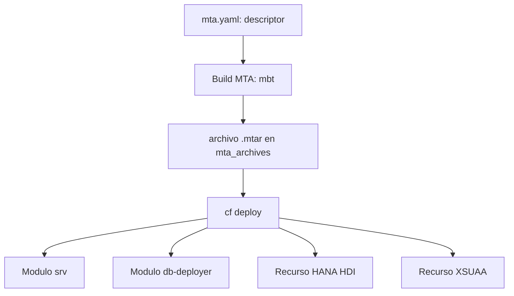

Puedes desplegar una aplicación suelta con `cf push` y ser feliz. El problema llega cuando tu aplicación son **tres módulos que dependen entre sí**: un servicio CAP, un deployer de base de datos HANA y una capa de UI. Ahí `cf push` uno a uno te obliga a recordar el orden, las dependencias y los enlaces a mano. La Multi-Target Application (MTA) existe para no tener que recordar nada de eso.

## Qué es realmente una MTA

Una MTA es **un único artefacto desplegable** (`.mtar`) que empaqueta todos los módulos y recursos de la aplicación, con sus dependencias declaradas. El descriptor es el `mta.yaml`, y define cuatro bloques que importan:

- **modules**: los componentes que se despliegan (servicio `srv`, `db-deployer`, `ui`).
- **resources**: los servicios que la aplicación necesita (HANA HDI, XSUAA).
- **requires / provides**: el cableado entre módulos y recursos.
- **build-parameters / buildpacks**: cómo se compila y empaqueta cada módulo.

La opinión, sin rodeos: **en BTP la unidad de despliegue no es la app, es el MTA**. Versionas el `mta.yaml`, y el despliegue completo es reproducible. Un `cf push` a pelo es cómodo para una prueba; para un proyecto es deuda.



## Un descriptor mínimo pero honesto

Fíjate en cómo el módulo `srv` **requiere** los recursos, y cómo cada módulo declara su `buildpack` y su cuota de memoria:

```yaml
_schema-version: "3.1"
ID: projectcap
version: 1.0.0
modules:
  - name: projectcap-srv
    type: nodejs
    path: gen/srv
    parameters:
      buildpack: nodejs_buildpack
      memory: 256M
      disk-quota: 256M
    requires:
      - name: projectcap-db
      - name: projectcap-auth
  - name: projectcap-db-deployer
    type: hdb
    path: gen/db
    parameters:
      buildpack: nodejs_buildpack
      memory: 256M
    requires:
      - name: projectcap-db
resources:
  - name: projectcap-db
    type: com.sap.xs.hdi-container
  - name: projectcap-auth
    type: org.cloudfoundry.managed-service
    parameters:
      service: xsuaa
      service-plan: application
```

## Del descriptor al artefacto

El build convierte el proyecto en el `.mtar`. En SAP Business Application Studio es un clic derecho sobre `mta.yaml` y **Build MTA Project**; por terminal es la herramienta `mbt`:

```bash
# instala dependencias del proyecto
npm install

# construye el artefacto .mtar en mta_archives/
mbt build

# despliega el artefacto completo, en orden y con enlaces resueltos
cf deploy mta_archives/projectcap_1.0.0.mtar
```

Ese `cf deploy` hace lo que `cf push` no: crea los recursos, respeta el orden de dependencias y enlaza los servicios antes de arrancar los módulos.

> Escribir el `mta.yaml` cuesta media hora la primera vez. Reconstruir un despliegue de tres módulos a mano cuesta una tarde cada vez que algo cambia.

En el próximo post entramos en la `cf CLI`: `push`, `bind` y `logs`, las tres que usas todos los días.
