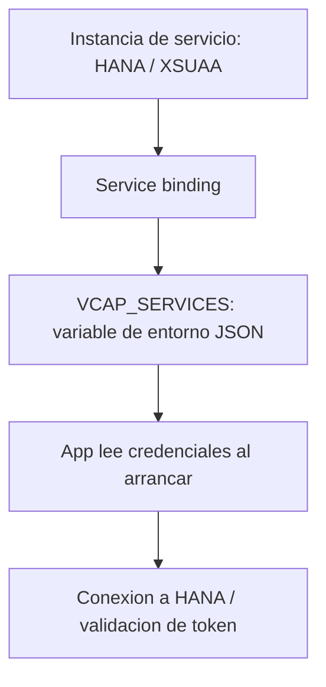

Hay un antipatrón que sigue apareciendo en proyectos BTP: el `clientID`, el `clientSecret` y la cadena de conexión a HANA escritos en un fichero de configuración del repositorio. En Cloud Foundry eso no solo es inseguro: es **innecesario**. La plataforma inyecta esas credenciales en tiempo de ejecución a través de `VCAP_SERVICES`. Tu código las lee de ahí, no las conoce de antemano.

## Cómo funciona el binding en tiempo de ejecución

Cuando enlazas un servicio a una app (`cf bind-service`), Cloud Foundry no copia nada a tu código. Lo que hace es, al arrancar la app, **poblar una variable de entorno JSON** llamada `VCAP_SERVICES` con las credenciales de cada servicio enlazado. La app la lee al iniciarse.

- **Instancia de servicio**: HANA HDI, XSUAA, una base de datos.
- **Service binding**: el vínculo entre la instancia y la app.
- **VCAP_SERVICES**: el JSON que la plataforma inyecta con las credenciales del binding.



## Qué hay dentro de VCAP_SERVICES

Un vistazo al contenido lo aclara todo. Cada servicio enlazado aparece con sus credenciales bajo su tipo:

```json
{
  "hana": [
    {
      "name": "projectcap-db",
      "credentials": {
        "host": "xxxxx.hana.prod-us10.hanacloud.ondemand.com",
        "port": "443",
        "user": "DBADMIN_...",
        "password": "..."
      }
    }
  ],
  "xsuaa": [
    {
      "name": "projectcap-auth",
      "credentials": {
        "clientid": "sb-projectcap!t123",
        "clientsecret": "...",
        "url": "https://subaccount.authentication.us10.hana.ondemand.com"
      }
    }
  ]
}
```

Ese `clientid` y ese `clientsecret` de XSUAA son los mismos que verías en el cockpit bajo **Service Bindings / Show sensitive data**. La diferencia es que aquí llegan solos, sin que nadie los teclee.

## Leerlo sin parsear a mano

Puedes hacer `JSON.parse(process.env.VCAP_SERVICES)`, pero es frágil. En CAP el runtime ya resuelve el binding por ti; para todo lo demás existe `xsenv`, que localiza el servicio por su etiqueta o nombre:

```javascript
const xsenv = require("@sap/xsenv");

// carga y localiza el binding de xsuaa por su etiqueta
const services = xsenv.getServices({ uaa: { label: "xsuaa" } });
const { clientid, clientsecret, url } = services.uaa;

// las credenciales salen del entorno, nunca del repositorio
```

Inspeccionar el entorno inyectado desde la CLI también ayuda a depurar:

```bash
cf env mi-app
```

## Por qué esto es una decisión de arquitectura, no un truco

Si tu código lee credenciales de `VCAP_SERVICES`, el mismo artefacto funciona en dev, qua y prod **sin tocar una línea**: cada espacio enlaza su propia instancia de HANA y su propio XSUAA. Si en cambio las escribes en el repositorio, has acoplado el código a un entorno concreto y has metido un secreto en git.

> Las credenciales que se teclean se filtran. Las que se inyectan viven y mueren con el binding, y el mismo `.mtar` sirve para los tres entornos.

En el próximo post: buildpacks y staging, qué pasa entre tu `cf push` y una app corriendo.
