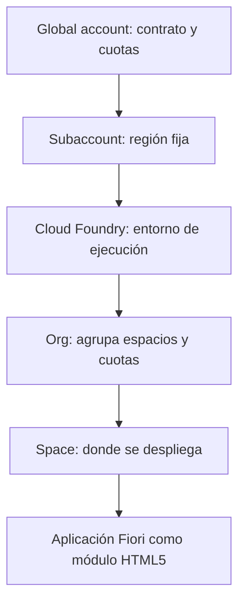
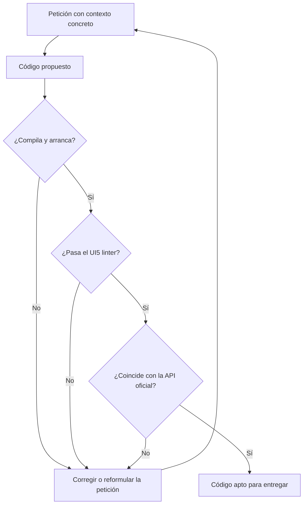

El 21 de septiembre de 2026 se impartió la primera clase del Máster en Fiori SAPUI5: Frontend Programming with AI. La grabación completa está publicada en YouTube y este artículo condensa su contenido técnico: qué entorno necesita un desarrollador de frontend SAP, qué decisiones se toman antes de escribir la primera línea de código y cómo se incorpora un asistente de IA al proyecto sin perder el control del resultado.

La sesión no programa nada. Su objetivo es que cada alumno termine con el entorno montado y verificado, porque las once clases siguientes construyen una misma aplicación sobre él y una cuenta sin crear bloquea el resto del programa.

## El vídeo de la sesión

[](https://www.youtube.com/watch?v=xbBV2ZimRyo)

La sesión se extendió más allá de los 90 minutos previstos porque incluye un recorrido comparado por varias herramientas de desarrollo con IA, con la misma petición lanzada en cada una. Las secciones siguientes recogen lo esencial en el orden en que se expuso.

## Qué queda montado al terminar

1. Una cuenta SAP BTP trial activa, con su subcuenta y su espacio de Cloud Foundry.
2. SAP Business Application Studio accesible desde el navegador, con un dev space de tipo SAP Fiori en estado RUNNING.
3. Visual Studio Code con el extension pack de SAP Fiori Tools.
4. Node.js, npm y Git instalados y comprobados.
5. Un asistente de IA operativo en el editor, con el servidor MCP de UI5 conectado.

El criterio de cierre no es haber instalado el software, sino haber ejecutado la comprobación de cada punto. La lista de verificación está al final del artículo.

## SAP BTP: la jerarquía que hay que fijar

SAP Business Technology Platform es donde se despliega la aplicación Fiori, donde se configura la conectividad con el backend y donde se publica el launchpad. Cuatro niveles aparecen en el trabajo diario y en el examen de certificación: **global account**, **subaccount**, **org** y **space**.



La subcuenta nace y permanece en el centro de datos que se eligió al crearla, y la cuenta trial ofrece un subconjunto reducido de los centros de datos de SAP: en la sesión, Estados Unidos (Amazon Web Services) y Singapur (Microsoft Azure). El detalle está en [la jerarquía de cuentas de SAP BTP](/blog/btp-admin-jerarquia-cuentas/) y en [el modelo org, space y app de Cloud Foundry](/blog/cf-modelo-org-space-app/).

**Trial y free tier no son lo mismo.** La cuenta trial es gratuita, sin contrato y limitada en tiempo y recursos; es la del máster. El free tier son planes gratuitos dentro de una cuenta productiva: no caduca, pero exige un acuerdo comercial y una tarjeta asociada, y es la vía habitual en una empresa.

La cuenta trial dura 90 días en intervalos de 30, renovables entrando con regularidad o con el botón **Extend Trial Account**. Treinta días consecutivos sin acceso eliminan la cuenta y su contenido. De ahí la regla operativa del máster: **entrar en la cuenta al menos una vez por semana**. El código no se pierde si está en un repositorio Git, y por eso Git es requisito desde la primera clase.

| Dirección | Uso |
|---|---|
| `cockpit.hanatrial.ondemand.com/trial/` | Cuentas trial |
| `account.hana.ondemand.com` | Cuentas productivas |
| `cockpit.hana.ondemand.com` | Entorno Neo, retirado. Devuelve `Service Unavailable` |

Confundir la tercera dirección con la primera es la causa principal de bloqueo en una primera sesión. Ante ese error, la causa es la dirección, no la cuenta.

## Business Application Studio o Visual Studio Code

En un proyecto real se encuentran los dos entornos.

**SAP Business Application Studio** se ejecuta en el navegador desde BTP y está construido sobre Code-OSS, el mismo proyecto abierto en el que se basa Visual Studio Code. Se organiza en dev spaces que se crean con un tipo concreto, y el tipo decide qué herramientas vienen preinstaladas. Para SAPUI5 y Fiori elements el tipo es **SAP Fiori**: generador de aplicaciones, UI5 Tooling, editores de anotaciones y previsualización. Un dev space es una máquina Linux aprovisionada en la nube; la primera arrancada tarda uno o dos minutos y hay que esperar al estado RUNNING. En una cuenta trial se pueden crear dos, solo uno puede estar en ejecución y un dev space que no se arranca en treinta días se elimina.

**Visual Studio Code** es el entorno local. Requiere Node.js y el extension pack **SAP Fiori Tools - Extension Pack**, del publicador SAPSE, que instala del orden de diez extensiones: Application Wizard, Application Modeler, Service Modeler, Annotation Modeler y el soporte de lenguaje UI5. Comprobación desde la terminal:

```bash
code --list-extensions | grep -i "sap-ux"
```

En Windows, `grep` no existe ni en PowerShell ni en el símbolo del sistema. El equivalente en PowerShell es `Select-String`:

```powershell
code --list-extensions | Select-String sap-ux
```

El criterio de elección: si el equipo de la empresa no permite instalar software, se trabaja en Business Application Studio desde el navegador sin quedar fuera de nada; si se puede instalar, Visual Studio Code gana en control y velocidad; si además hay suscripción a BAS en la subcuenta, se usan ambos, con el código en Git como punto común. El máster trabaja principalmente en Visual Studio Code y recurre a BAS cuando interesa la conectividad directa con BTP. Las herramientas de Fiori en el editor se amplían en [Fiori tools en VS Code](/blog/fe-fiori-tools-vscode/).

## Node.js, Git y la versión de SAPUI5

**Node.js** no ejecuta la aplicación en producción. La aplicación Fiori se ejecuta en el navegador del usuario; Node.js ejecuta todo lo que la construye: el generador, el servidor de previsualización, el build, el linter y los tests. Con Node.js se instala npm, el gestor de paquetes que descarga las dependencias declaradas en `package.json`.

```bash
node -v
npm -v
git --version
```

Si los tres comandos devuelven versión, no hay nada más que hacer. Conviene instalar una versión **LTS** de Node.js, porque el UI5 Tooling y las herramientas de SAP se prueban contra LTS. En Windows, tras la instalación hay que cerrar y reabrir la terminal para que se actualice la variable `PATH`.

**Git** es requisito por una razón estructural. En ABAP el código vive en el servidor de aplicaciones y el propio sistema resuelve la concurrencia con el bloqueo del objeto. En el desarrollo de frontend el código está en la máquina de cada desarrollador, también cuando esa máquina es un dev space de Business Application Studio, y la sincronización entre varias personas se resuelve con Git. GitHub, GitLab, Bitbucket o Azure DevOps alojan el repositorio remoto y resultan intercambiables.

**La versión de SAPUI5 del proyecto se fija**, y se elige una LTS. Situación en la fecha de la clase:

| Versión | Estado |
|---|---|
| 1.152 | Última disponible, en mantenimiento |
| 1.148 | LTS |
| 1.136 | LTS |
| 1.120 | LTS |

Con destino on-premise la versión no se elige: la impone el sistema de destino. La librería que sirve un sistema S/4HANA tiene una versión concreta y la aplicación no puede construirse contra una superior. La comprobación se hace antes de empezar, consultando el fichero `sap-ui-version.json` que el servidor expone junto a la librería. Esta cautela no aplica al despliegue en SAP BTP, donde la librería se sirve desde el repositorio de SAPUI5 de SAP.

## TypeScript frente a JavaScript

Los controladores del máster se escriben en TypeScript, y la razón no es la sintaxis sino el momento en que aparece el error. En JavaScript, el error se manifiesta al ejecutar:

```javascript
function calcularTotal(precio, cantidad) {
    return precio * cantidad;
}
calcularTotal("120,50", 3);   // NaN, detectado solo en ejecución
```

En TypeScript, el error se detecta al escribir:

```typescript
function calcularTotal(precio: number, cantidad: number): number {
    return precio * cantidad;
}
calcularTotal("120,50", 3);   // Error de compilación: string no es number
```

TypeScript se compila a JavaScript antes del despliegue, de modo que el navegador recibe lo mismo. Lo que se gana es la detección temprana y un autocompletado completo sobre una API tan extensa como la de UI5, porque SAP publica las definiciones de tipos del framework. Desde la versión 1.115.0 los manejadores de eventos disponen de tipos específicos, por ejemplo `Button$PressEvent`. La migración de un proyecto existente se trata en [TypeScript en SAPUI5](/blog/ui5-typescript/).

## Asistentes de IA: gana el contexto, no la potencia

El máster integra asistentes de IA desde la primera clase con una regla que ordena todo lo demás: **el asistente acelera la escritura; el desarrollador responde del código que entrega**.

| Pieza | Qué es |
|---|---|
| Modelo | El sistema que genera la respuesta |
| Harness | El programa que dirige al modelo, ejecuta herramientas y trabaja sobre los ficheros |
| Contexto | Lo que el harness pone delante del modelo en cada petición: ficheros, documentación, herramientas y memoria del proyecto |

Una petición al modelo no tiene memoria propia. El harness reenvía en cada llamada el historial, los ficheros relevantes y la definición de las herramientas registradas, y ante una sola petición del desarrollador realiza decenas de llamadas hasta dar la tarea por cumplida. En la sesión se mostró un caso medido: un único prompt generó **49 peticiones** al modelo. Resuelto por consumo de clave de API con un modelo económico, el trabajo completo costó **0,01 USD**; el mismo uso intensivo con un modelo de gama alta agota una suscripción en cuestión de horas. De ahí la práctica habitual en un equipo: modelos económicos para las tareas largas y mecánicas, y modelos más capaces para el trabajo que exige criterio.

### La demostración

La misma petición, una aplicación SAPUI5 de ejemplo en TypeScript, se lanzó sobre varias herramientas: un entorno de agentes de Google, un agente de terminal de código abierto, el agente de OpenAI, un harness local conectado a DeepSeek por clave de API y Claude Code. Todas produjeron una aplicación que arranca. Solo una recibió además el servidor MCP oficial de UI5, y fue la única que entregó el proyecto con las convenciones oficiales: TypeScript, controlador base y estructura de carpetas correcta. La diferencia no estuvo en el modelo, sino en el contexto que se le dio.

### MCP, el mecanismo que aporta el contexto

El **Model Context Protocol** es un estándar que conecta un asistente con fuentes de información y herramientas externas, a la manera de un puerto de conexión universal: el servidor se enchufa al asistente y le aporta capacidades que no tenía.

| Sin servidor MCP | Con servidor MCP |
|---|---|
| Responde con lo que memorizó en el entrenamiento | Consulta la documentación oficial vigente |
| Deduce la firma de un control | Lee la referencia de la API de la versión del proyecto |
| Propone código y lo da por bueno | Ejecuta el linter oficial sobre lo que ha escrito |

La referencia de la API de SAPUI5 ilustra por qué hace falta: buena parte se construye de forma dinámica en el navegador, y un asistente que se limite a recorrer páginas no obtiene de ella lo que necesita.

El servidor MCP oficial de UI5 lo publica SAP en [github.com/UI5](https://github.com/UI5) y es el único obligatorio en el máster. Entre sus herramientas:

| Herramienta | Qué hace |
|---|---|
| `get_guidelines` | Devuelve las reglas oficiales de SAP para desarrollo UI5 |
| `get_api_reference` | Consulta la API de la versión de UI5 del proyecto |
| `run_ui5_linter` | Ejecuta el linter oficial, con opción de corregir |
| `create_ui5_app` | Genera un proyecto UI5 |
| `get_project_info` | Devuelve la configuración del proyecto, versión y librerías |
| `get_version_info` | Lista las versiones disponibles e indica cuáles son LTS |

Un servidor MCP se registra de forma global o en el ámbito del proyecto, y la recomendación es **el ámbito del proyecto**: lo que se registra viaja en cada petición, y un servidor de UI5 registrado de forma global sigue cargando su contexto en proyectos que no tienen nada que ver con UI5. La configuración es un fichero `.mcp.json` en la raíz del proyecto:

```json
{
  "mcpServers": {
    "ui5": {
      "type": "stdio",
      "command": "npx",
      "args": ["-y", "@ui5/mcp-server"]
    }
  }
}
```

El transporte `stdio` indica que el servidor se ejecuta como proceso local. No hay que arrancarlo a mano, pero tras registrarlo hay que reiniciar la sesión del asistente para que lo detecte. En Claude Code existe además un plugin oficial que instala el mismo servidor junto con el resto del contexto de UI5:

```bash
claude plugin marketplace add anthropics/claude-plugins-official
claude plugin install ui5@claude-plugins-official
claude plugin list
```

Omitir el primer comando produce el error `Plugin "ui5" not found in marketplace`, que es la confusión más habitual.

### Las reglas que devuelve el servidor

Las guidelines que entrega `get_guidelines` son el documento que SAP publica para que los agentes trabajen correctamente, y aplican igual al desarrollo manual:

- Nunca acceder a objetos del framework mediante variables globales. Las dependencias se declaran con `sap.ui.define` en JavaScript, con `import` en TypeScript y con `core:require` en las vistas XML.
- Nunca usar script en línea en HTML, por la política de seguridad de contenido.
- Usar siempre `sap/ui/core/ComponentSupport` para inicializar la aplicación.
- No escribir formateadores propios para tipos estándar de OData, porque los tipos integrados ya los resuelven.
- En TypeScript, usar el tipo de evento específico del control, disponible desde UI5 1.115.0.

Las dos primeras se desarrollan en [sap.ui.define y carga asíncrona](/blog/ui5-carga-asincrona-define/).

### Los ficheros que gobiernan el proyecto

Además del código, un proyecto trabajado con asistente contiene tres elementos con funciones distintas. El fichero `.mcp.json` declara los servidores disponibles. El fichero de memoria del proyecto, en Markdown, se carga en todas las peticiones, incluso en un saludo de cuatro caracteres, de modo que debe recoger decisiones y convenciones y no documentación extensa. La carpeta de configuración del asistente contiene las **skills**, instrucciones especializadas que indican cómo se hace bien una tarea concreta: el servidor MCP aporta herramientas y datos; la skill aporta criterio. Logali Tech publica un [catálogo de skills](/ai/skills/) para Fiori y SAPUI5, entre ellas las de buenas prácticas de UI5, Fiori tools, Fiori elements, anotaciones, tests OPA5 y tablas.

## El protocolo de verificación

Es la parte que se repite en las once clases siguientes. Cuatro reglas para todo código propuesto por un asistente:

1. **Ejecutar, no leer.** Código que compila y arranca, no código que parece correcto. Un servicio se comprueba con una petición real.
2. **Exigir el nivel de confianza.** Pedir al asistente que distinga qué parte de la respuesta es firme y qué parte requiere comprobación.
3. **Contrastar contra la fuente.** Para SAPUI5, la referencia de la API en el Demo Kit. Para un servicio OData, el documento `$metadata`.
4. **Pasar el linter.** El UI5 linter detecta la API obsoleta y los patrones desaconsejados, que es donde más se equivocan los asistentes al arrastrar código antiguo.



Un servidor MCP reduce el error, no lo elimina, y el protocolo sigue siendo obligatorio. La IA no reduce la necesidad de conocer SAPUI5, la desplaza: antes había que saber escribirlo y ahora hay que saber juzgarlo, y para juzgarlo hay que conocerlo igual de bien.

## Errores frecuentes de la primera clase

| Síntoma | Causa | Solución |
|---|---|---|
| `Service Unavailable` al abrir el cockpit | Dirección del entorno Neo, retirado | Usar `cockpit.hanatrial.ondemand.com/trial/` |
| La cuenta trial ha desaparecido | Treinta días sin ningún acceso | Volver a darse de alta y entrar cada semana |
| El dev space no ofrece las herramientas esperadas | Tipo de dev space equivocado | Crear uno de tipo SAP Fiori |
| No arranca un segundo dev space | La cuenta trial solo permite uno en ejecución | Detener el que no se use |
| `node` no se reconoce como comando | La variable `PATH` no se ha actualizado | Cerrar y reabrir la terminal |
| `Plugin "ui5" not found in marketplace` | Falta registrar el marketplace | Ejecutar primero el comando de registro |
| El asistente propone API de UI5 obsoleta | Arrastra patrones de versiones antiguas | Pasar el UI5 linter y contrastar con el Demo Kit |

## Antes de la clase 2

Lista de verificación que cada alumno debe poder confirmar:

1. La cuenta SAP BTP trial abre y muestra la subcuenta, con su org y su space.
2. Existe un dev space de tipo SAP Fiori en estado RUNNING.
3. `node -v`, `npm -v` y `git --version` devuelven versión.
4. El extension pack de SAP Fiori Tools aparece activo y el Application Wizard se abre desde la paleta de comandos.
5. El asistente responde dentro del editor y el servidor MCP de UI5 figura conectado.

Y una tarea: generar una aplicación de prueba con el Application Wizard, abrirla en previsualización y pedir al asistente una explicación del fichero `manifest.json` generado para contrastarla con la documentación oficial. El objetivo es doble: familiarizarse con [el descriptor que concentra toda la configuración de la aplicación](/blog/ui5-manifest-descriptor/) y practicar el contraste de una respuesta. La clase 2 arranca ahí.

## Sobre la certificación

El máster cubre las áreas de la certificación **SAP Certified Associate, SAP Fiori Application Developer**, código vigente **C_FIORD_2502**. El código `C_FIORID` no existe, aunque circule en foros, y `C_FIORDEV_20`, `C_FIORDEV_21` y `C_FIORDEV_22` corresponden a temarios retirados. Datos publicados por SAP a la fecha de la clase: dos horas, nota de corte del 60 por ciento y evaluación basada en escenario, con una actividad. Una evaluación por escenario no se supera memorizando respuestas, y por eso el máster construye una aplicación real de principio a fin. SAP modifica formato, duración y precio sin previo aviso, de modo que conviene confirmar los datos en [la ficha oficial de la certificación](https://learning.sap.com/certifications/sap-certified-associate-sap-fiori-application-developer-1) antes de reservar convocatoria. El examen no está incluido en el precio del máster.

## Síntesis

1. La primera clase no programa: monta y verifica el entorno, porque las once siguientes construyen una misma aplicación sobre él.
2. En SAP BTP hay que fijar cuatro niveles, global account, subaccount, org y space, y entrar en la cuenta trial cada semana. La dirección del cockpit trial lleva `hanatrial`.
3. En Business Application Studio el tipo de dev space decide las herramientas; para SAPUI5 es SAP Fiori. En local, Visual Studio Code con SAP Fiori Tools, Node.js LTS y Git.
4. La versión de SAPUI5 del proyecto se fija en una LTS y, con destino on-premise, la impone el sistema de destino. Los controladores van en TypeScript.
5. Con asistentes de IA gana el contexto, no la potencia del modelo: servidor MCP de UI5 en el ámbito del proyecto, memoria de proyecto breve, skills para el criterio y el protocolo de verificación en cada entrega.

El siguiente artículo de las clases del máster corresponde a la clase 2, Arquitectura de una aplicación SAPUI5. El programa completo, el calendario y el acceso al aula virtual están en [la ficha del Máster en Fiori SAPUI5](/masters/fiori-sapui5/).

<figure>
  
  <figcaption>Gheorghe Valer, formador del Máster en Fiori SAPUI5.</figcaption>
</figure>
