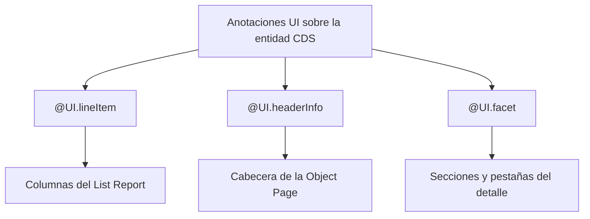

Si Fiori Elements genera la UI a partir de metadatos, esas anotaciones UI son el lenguaje con el que hablas con el framework. No hay muchas, y dominar tres o cuatro te lleva lejos. Vamos a las que estructuran cualquier List Report + Object Page.

## Las tres que necesitas dominar

- **`@UI.lineItem`**: define las columnas del listado. Cada elemento es una columna, con su posición y su importancia (cuándo se muestra según el tamaño de pantalla).
- **`@UI.headerInfo`**: define la cabecera de la Object Page. Título, subtítulo, tipo de objeto (singular y plural) e imagen.
- **`@UI.facet`**: organiza el cuerpo de la Object Page en secciones y pestañas, cada una referenciando un grupo de campos, un punto de dato o una tabla.



## Cabecera: headerInfo

La cabecera de la Object Page no se maqueta, se declara. Le dices el nombre del objeto y qué campos son el título y la descripción:

```cds
UI.HeaderInfo : {
    TypeName       : 'Product',
    TypeNamePlural : 'Products',
    ImageUrl       : ImageUrl,
    Title          : {Value : ProductName},
    Description    : {Value : Description}
}
```

`TypeName` y `TypeNamePlural` son lo que Fiori muestra al ver uno o varios registros. El `ImageUrl` pinta la imagen de cabecera. Ni una línea de código de UI.

## Detalle: facets que organizan

Una Object Page vacía no sirve de nada. Los `facet` la llenan de secciones. Cada `ReferenceFacet` apunta a otra anotación (un grupo de campos, un punto de dato) y se convierte en una pestaña o sección:

```cds
UI.Facets : [
    {
        $Type  : 'UI.ReferenceFacet',
        ID     : 'GeneralInfo',
        Label  : 'General Information',
        Target : '@UI.FieldGroup#GeneratedGroup1'
    }
]
```

El `Target` es la clave: el facet no contiene campos, referencia una agrupación declarada aparte. Así separas "qué campos van juntos" de "cómo se disponen en el detalle". Cambias uno sin tocar el otro.

## El detalle que marca la diferencia

Las posiciones. La costumbre en el modelo de metadata extensions es empezar en 10 e ir de diez en diez:

- Si empiezas en 1, 2, 3 y luego necesitas meter una columna entre la 2 y la 3, tienes que renumerarlo todo.
- Si empiezas en 10, 20, 30, siempre te queda hueco (15, 25) para insertar sin tocar el resto.

Es un detalle tonto que te ahorra reescrituras enteras dentro de seis meses, cuando el negocio pida "una columna más, justo ahí".

> Las anotaciones UI son declarativas: describes el resultado, no el proceso. Eso es lo que hace que una app Fiori Elements se lea como una especificación y no como un enredo de callbacks.

En el próximo post: draft y acciones, el comportamiento que da vida a estas pantallas.
