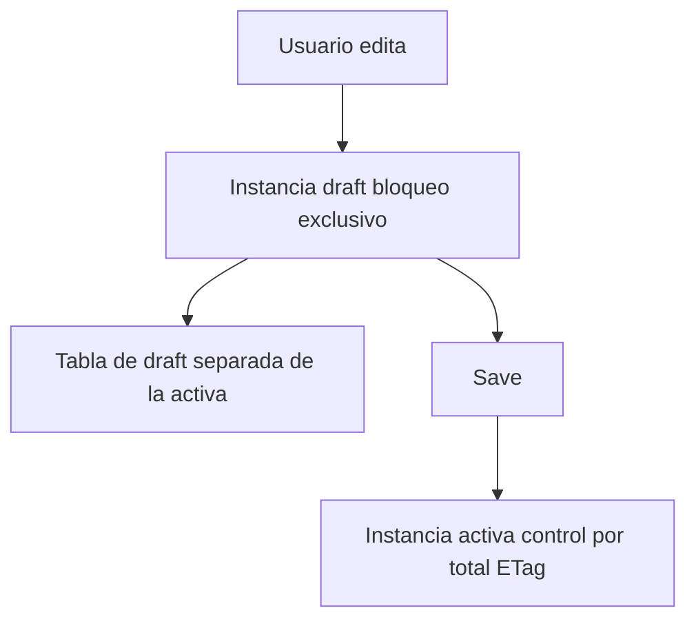

Mostrar datos es la mitad fácil. Lo que convierte una app Fiori Elements en una aplicación de negocio de verdad es que el usuario pueda editar con seguridad y ejecutar operaciones. Dos piezas hacen ese trabajo: el **draft** y las **acciones**. Y, fiel al espíritu de Fiori Elements, ninguna de las dos se programa en la UI.

## El draft: editar sin miedo a perder trabajo

El borrador (draft) da al usuario final flexibilidad: puede empezar a editar un registro, dejarlo a medias y volver luego, sin haber tocado todavía el dato activo. En RAP, el draft se declara en la definición de comportamiento del objeto de negocio, no en la pantalla.

Detalles que importan del modelo de draft:

- **Es exclusivo por usuario**: un borrador pertenece a quien lo creó. Solo ese usuario lo ve y lo procesa. En cuanto empieza a trabajar, establece un bloqueo exclusivo.
- **Vive en su propia tabla**: las instancias de borrador se almacenan aparte de las activas, en una tabla de draft separada que se genera desde la definición de comportamiento.
- **Nunca se accede por SQL directo**: el acceso a la tabla de borrador se hace siempre por EML, para que los metadatos del draft se mantengan coherentes.
- **Total ETag para la concurrencia**: un campo designado permite comprobar simultaneidad al pasar de borrador a activo, evitando pisar cambios de otro.



## Las acciones: botones que llaman a lógica ABAP

Una acción es un botón en la barra que ejecuta una operación. En Fiori Elements el botón se declara con una anotación, y esa anotación referencia un método ABAP del objeto de negocio:

```cds
UI.LineItem : [
    {
        $Type      : 'UI.DataFieldForAction',
        Label      : 'Approve',
        Action     : 'com.logalitech.service.approve'
    }
]
```

En el modelo RAP con metadata extensions, el mismo botón se declara con `type: #FOR_ACTION` y un `dataAction` que apunta al método implementado en la clase de comportamiento. La UI no contiene la lógica: la invoca.

Lo elegante es que puedes replicar el mismo botón en el listado y en la Object Page cambiando solo dónde lo declaras. Y el framework decide cuándo habilitarlo: la acción de crear siempre está disponible, la de borrar se activa al seleccionar una fila, y con el control de features de RAP puedes deshabilitar dinámicamente un botón según el estado del registro.

## El anti-patrón

Meter lógica de negocio en el frontend porque "es más rápido". El día que otra app o una API necesite esa misma operación, la lógica está atrapada en JavaScript. Con acciones declaradas sobre el objeto de negocio, la operación vive en el backend y cualquier consumidor la reutiliza.

> El draft y las acciones son la prueba de fuego de Fiori Elements: comportamiento complejo que sigue siendo declarativo. Si te encuentras escribiendo un controlador para gestionar un guardado, párate y pregúntate si el modelo de negocio no debería hacerlo por ti.

En el próximo post: los extension points, cuándo sí está justificado salir del carril.
