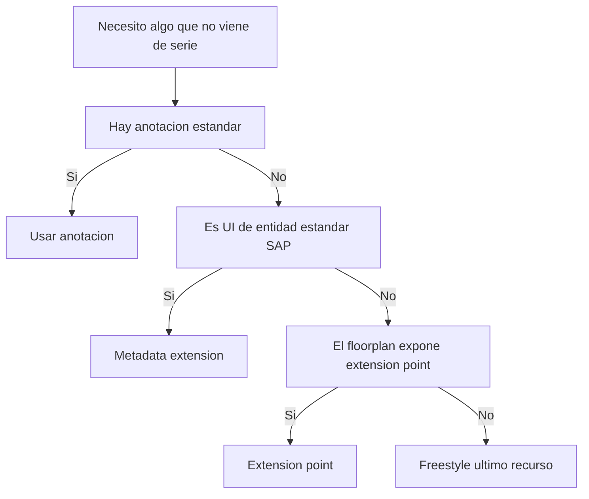

Fiori Elements te resuelve el 80% de la pantalla sin escribir código. El otro 20% es la trampa: cuando el framework no hace exactamente lo que quieres, la tentación es tirar de código a mano y romper todo lo que ganaste. Los **extension points** son la salida diseñada para eso. La clave está en usarlos como excepción, no como norma.

## La jerarquía de "cómo lo consigo"

Antes de escribir una línea de UI5, recorre esta escalera de menor a mayor coste:

1. **Anotación estándar**: ¿existe una anotación UI que ya haga lo que quieres? Casi siempre sí. Empieza aquí.
2. **Metadata extension**: si necesitas ajustar la UI de una entidad estándar de SAP sin tocarla, extiendes su metadata extension. Es la forma canónica y respeta el Clean Core.
3. **Extension point del floorplan**: si necesitas una columna calculada en cliente, un botón con lógica propia o una sección personalizada, ahí van los extension points que el floorplan expone.
4. **Freestyle**: solo si nada de lo anterior encaja. Y entonces cuestiona si Fiori Elements era el patrón correcto.



## Por qué las metadata extensions van primero

Separan las anotaciones UI del cuerpo del CDS. La entidad se queda enfocada en el modelo de datos; las anotaciones viven en ficheros aparte con capas: `#CORE` es la base de SAP, `#CUSTOMER` es la tuya y siempre gana. Extender un metadata extension estándar no toca el CDS original:

```cds
@Metadata.layer: #CUSTOMER
annotate entity I_Product with
{
  @UI.lineItem: [{ position: 90, importance: #HIGH, label: 'Custom Field' }]
  MyCustomField;
}
```

Esa capa `#CUSTOMER` se superpone a lo estándar sin modificarlo. El día del upgrade, SAP cambia su capa `#CORE` y la tuya sigue intacta. Eso es Clean Core aplicado a la UI: extiendes sin modificar.

## El coste real de saltarse la jerarquía

Un extension point freestyle escrito porque no buscaste la anotación equivalente es deuda técnica pura. Funciona el día de la demo y se convierte en el punto frágil del próximo upgrade. Multiplícalo por cada pantalla que "tuvo prisa" y tienes un proyecto Fiori Elements que ya no es declarativo: es freestyle disfrazado.

La pregunta correcta antes de cada extension point no es "¿puedo?", sino "**¿es esta la capa más barata donde se puede resolver?**".

> Salir del carril de Fiori Elements no es un fracaso: es una decisión de arquitectura. Lo que es un fracaso es salirse sin haber mirado si el carril ya te llevaba donde querías ir.

En el próximo post: las Fiori tools en VS Code, el tooling que hace productivo todo esto.
