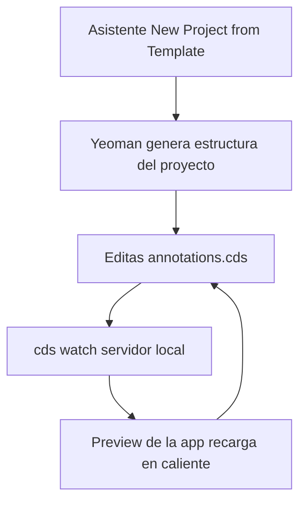

Fiori Elements sin buen tooling sería escribir anotaciones a ciegas en un fichero de texto. Los **Fiori tools** (disponibles tanto en VS Code como en SAP Business Application Studio, que es VS Code en la nube) son lo que convierte ese modelo declarativo en algo productivo. No es opcional: es la diferencia entre horas y minutos.

## Qué te dan de verdad

- **El asistente de generación**: "New Project from Template" arranca un proyecto Fiori Elements, te pide el floorplan, conectas la fuente de datos OData y eliges la entidad principal y la de navegación. En minutos tienes la estructura completa.
- **La paleta de comandos**: con Ctrl+Shift+P accedes a todas las operaciones habituales sin memorizar comandos.
- **Yeoman por debajo**: el generador de proyectos por plantillas evita crear todo desde cero y minimiza los errores de arranque.
- **Recarga en caliente**: en un proyecto CAP, `cds watch` levanta el servidor local y refresca la app en cuanto cambias una anotación. Ves el efecto al instante.



## El flujo real de arranque

Tras generar el proyecto, la carpeta `app` contiene la app Fiori Elements. En el proyecto CAP, el fichero `service.cds` referencia el fichero de anotaciones que el asistente ya dejó preparado:

```cds
using MyService as service from '../../srv/service';
annotate service.Products with @(
    UI.LineItem : [
        { $Type : 'UI.DataField', Value : ProductName },
        { $Type : 'UI.DataField', Value : Price }
    ]
);
```

Lanzas `cds watch`, se levanta el servidor local, y entre los endpoints aparece la aplicación web que es tu app Fiori Elements sobre la entidad. Editas la anotación, guardas, y el preview se actualiza sin reiniciar nada.

## El error que verás

Escribir anotaciones a mano en un editor de texto plano porque "así entiendo mejor lo que hago". Entiendes mejor el primer día y pierdes productividad el resto del proyecto. El tooling no te oculta las anotaciones: te las autocompleta, te valida la sintaxis y te enseña el efecto en vivo. Rechazarlo es artesanía mal entendida.

Y el opuesto: depender tanto del asistente que no sabes qué anotación generó ni por qué. El tooling acelera, pero las anotaciones las tienes que leer y entender tú, porque son las que mantendrás.

> El buen tooling no sustituye saber qué hace cada anotación: lo hace rápido. Fiori Elements es declarativo, y lo declarativo pide un editor que te muestre el resultado mientras escribes, no después de desplegar.

Con esto cerramos la serie de Fiori Elements: qué son, sus floorplans, las anotaciones UI, draft y acciones, los extension points y el tooling que lo hace todo llevadero.
