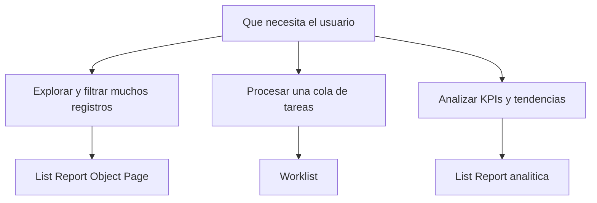

Un floorplan es una plantilla de pantalla con un comportamiento predefinido. Fiori Elements te da varios, y la mayoría de proyectos usan siempre el mismo por inercia. Elegir bien el floorplan de entrada te ahorra pelear contra el framework después.

## Los que usarás de verdad

- **List Report + Object Page**: el caballo de batalla. Un listado con barra de filtros arriba y, al pulsar una fila, una página de detalle (Object Page) con cabecera, secciones y pestañas. El 80% de las apps transaccionales son esto.
- **Worklist**: como el List Report pero sin la barra de filtros elaborada. Pensado para "aquí tienes tu lista de tareas pendientes, trabájalas". Menos exploración, más acción directa.
- **List Report analítica**: la misma estructura de listado pero con visualizaciones (KPIs, gráficos) y agregaciones. Requiere un modelo analítico detrás, no solo una entidad transaccional.
- **Overview Page**: un tablero de tarjetas para dar contexto y navegar. Es un caso aparte: no es "listar y editar", es "resumir y saltar".



## Cómo se elige en la práctica

No se elige a mano en un fichero: lo eliges en el asistente. En SAP Business Application Studio, por "New Project from Template" arrancas un proyecto Fiori Elements y el generador (Yeoman) te pide el floorplan. Para el caso más común eliges **List Report Object Page**, conectas la fuente de datos OData y seleccionas la entidad principal y la de navegación.

Ese asistente genera la estructura del proyecto en la carpeta `app`, y ahí ya aparece el fichero de anotaciones que rellenarás:

```cds
UI.SelectionFields : [
    ToCategory_ID,
    ToCurrency_ID,
    StockAvailability
]
```

Esos `SelectionFields` son la barra de filtros del List Report. En un Worklist prescindirías de ellos; en la analítica los combinarías con visualizaciones. El floorplan condiciona qué anotaciones tienen sentido.

## El error clásico

Elegir List Report Object Page para todo, incluso cuando el usuario solo quiere procesar una cola de trabajo. Acabas con una barra de filtros que nadie toca y una Object Page sobrecargada. Si la interacción es "ver la lista, actuar, siguiente", un Worklist encaja mejor y con menos configuración.

Y al revés: forzar un List Report a mostrar KPIs con gráficos cuando en realidad querías una analítica. Sin el modelo analítico detrás, terminas peleando con el framework para que haga lo que no es su patrón.

> El floorplan correcto no es el que puede hacer más cosas: es el que hace exactamente lo que tu usuario necesita, sin que tengas que apagar la mitad de sus funciones.

En el próximo post: las anotaciones UI que dan forma a esas pantallas.
