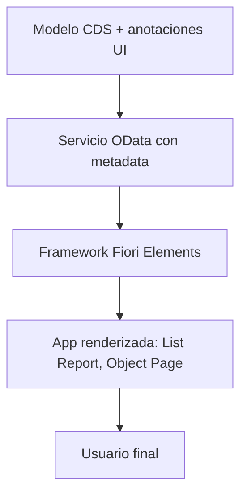

La primera vez que alguien ve una app Fiori Elements en marcha suele hacer la misma pregunta: "¿dónde está el código de la pantalla?". No lo hay, o casi. Y ese es exactamente el punto. **Fiori Elements genera la interfaz a partir de metadatos, no de vistas XML escritas a mano.**

## El cambio de paradigma

En SAPUI5 freestyle escribes la vista, el controlador, el binding, el enrutado y el formateo. Cada pantalla es código tuyo, y todo ese código es tuyo de mantener durante años.

En Fiori Elements la app es una plantilla (un floorplan) que se rellena en tiempo de ejecución leyendo el servicio OData y sus **anotaciones UI**. Tú no describes cómo pintar una tabla: describes qué campos forman la línea, y el framework la pinta.

- **Menos código propio**: no hay controlador que mantener para el 80% de los casos.
- **UX consistente por defecto**: filtros, ordenación, exportar a Excel, personalización de columnas, todo viene ya resuelto e igual en todas las apps.
- **La UI vive cerca del dato**: las anotaciones se declaran sobre la entidad CDS, no dispersas en ficheros JavaScript.



## Un ejemplo concreto

Esto es lo que "programas" para que una columna aparezca en el listado de productos. Es una anotación, no una vista:

```cds
UI.LineItem : [
    {
        $Type : 'UI.DataField',
        Label : 'ProductName',
        Value : ProductName
    },
    {
        $Type : 'UI.DataField',
        Label : 'Price',
        Value : Price
    }
]
```

Con esas líneas ya tienes columnas ordenables, filtrables y exportables. No has tocado una sola línea de UI5.

Fíjate en tres cosas que valen oro:

1. `$Type: 'UI.DataField'` le dice al framework que es un campo de dato normal; hay otros tipos para acciones, imágenes o puntos de dato.
2. `Value` referencia el elemento del modelo, no una etiqueta hardcodeada: si cambias el CDS, la UI le sigue.
3. No hay coordenadas de píxeles ni CSS: el layout responsivo lo decide el floorplan.

## Cuándo NO es la respuesta

Seamos honestos: Fiori Elements brilla en el patrón "listar, filtrar, ver detalle, editar". Si tu app es un configurador con drag and drop, un dashboard muy visual o una experiencia a medida, el freestyle sigue siendo el camino. La regla sana es empezar por Elements y salir del carril solo cuando el caso lo exija de verdad.

> Cada línea de UI5 que no escribes es una línea que no tienes que mantener en el próximo upgrade. Fiori Elements convierte pantallas en metadatos, y los metadatos envejecen mucho mejor que el JavaScript.

En el próximo post: los floorplans disponibles y cuándo elegir cada uno.
