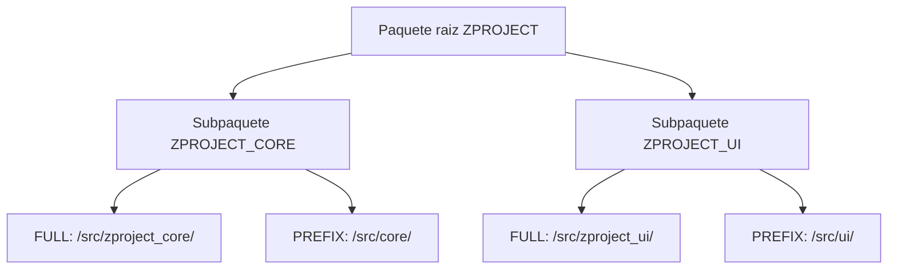

Cuando haces tu primer push con abapGit, en la raiz del repositorio aparece un fichero discreto: `.abapgit.xml`. La mayoria de la gente lo ignora hasta que un pull importa objetos en el paquete equivocado. Entonces descubren, tarde, que ese fichero **es el contrato entre tu jerarquia de paquetes ABAP y la estructura de carpetas del repo**.

## Que contiene

El `.abapgit.xml` guarda la configuracion del repositorio. Sus campos clave:

```xml
<?xml version="1.0" encoding="utf-8"?>
<abapGit version="v1.0.0">
 <asx:abap xmlns:asx="http://www.sap.com/abapxml">
  <asx:values>
   <DATA>
    <MASTER_LANGUAGE>E</MASTER_LANGUAGE>
    <STARTING_FOLDER>/src/</STARTING_FOLDER>
    <FOLDER_LOGIC>FULL</FOLDER_LOGIC>
    <IGNORE>
     <item>/.gitignore</item>
     <item>/README.md</item>
    </IGNORE>
   </DATA>
  </asx:values>
 </asx:abap>
</abapGit>
```

- **MASTER_LANGUAGE**: el idioma maestro de los textos. Fijalo bien desde el principio; cambiarlo despues es doloroso.
- **STARTING_FOLDER**: la carpeta donde vive el codigo, casi siempre `/src/`.
- **FOLDER_LOGIC**: como se mapean paquetes a carpetas. Es el campo que decide todo.
- **IGNORE**: patrones de ficheros que abapGit no toca.

## FULL frente a PREFIX: la decision que importa

Al vincular un paquete, abapGit te pregunta por la logica de carpetas. Hay dos opciones y no son intercambiables a la ligera:

- **FULL**: acepta cualquier nombre de subpaquete. La estructura de carpetas refleja la jerarquia real de paquetes tal cual.
- **PREFIX**: exige que todos los subpaquetes lleven el nombre del paquete principal como prefijo. Las carpetas usan solo la parte que sobra tras el prefijo, asi que quedan mas cortas.



Mi recomendacion practica: **FULL por defecto**. Es la opcion que abapGit sugiere y la menos sorprendente, porque el nombre de la carpeta coincide con el nombre real del paquete. PREFIX solo compensa si tu convencion de nombres es tan estricta que el prefijo repetido en cada carpeta se vuelve ruido puro.

## Por que esto te muerde

El escenario clasico del dolor: vinculas un repo con FOLDER_LOGIC FULL en el sistema origen, y en el destino intentas hacer pull esperando otra estructura de paquetes. Si el mapeo no cuadra con los paquetes que existen, o abapGit crea paquetes que no querias o falla el pull.

- El `.abapgit.xml` **viaja con el repo**, no con el sistema. Quien haga pull hereda tu decision.
- Cambiar FOLDER_LOGIC a mitad de proyecto reorganiza todas las carpetas: un commit gigante y ruidoso.

> El `.abapgit.xml` no es metadata decorativa. Es el mapa que traduce paquetes a carpetas. Decidelo una vez, al crear el repo, y no lo toques salvo que sepas exactamente que reorganizacion estas provocando.

Consejo final: fija MASTER_LANGUAGE y FOLDER_LOGIC en el primer commit, revisa que STARTING_FOLDER sea `/src/`, y deja ese fichero en paz. Es de las pocas cosas en abapGit donde "configurar y olvidar" es la respuesta correcta.
