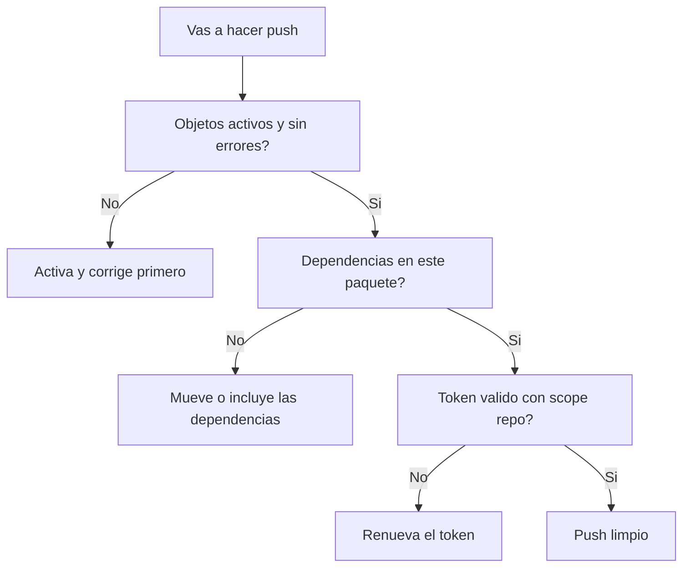

abapGit es solido, pero no es magia. Despues de unos cuantos proyectos aprendes que los problemas casi siempre son los mismos cinco o seis, y todos se pueden evitar. Esta es la lista honesta de lo que sale mal y como no pisar el charco.

## Los errores tipicos

- **Objetos no soportados**: no todo objeto de desarrollo se serializa. abapGit soporta clases, CDS, informes, estructuras, tablas y un largo etcetera, pero hay tipos exoticos o muy dependientes de configuracion que no viajan. Si un objeto no aparece en el staging, comprueba si el tipo esta soportado antes de asumir un bug.
- **Dependencias fantasma**: un push lleva los objetos de tu paquete, no los objetos de otros paquetes de los que dependes. Haces pull en el destino, activas, y explota porque falta un elemento de diccionario o una clase base que estaba en otro paquete. **El repo no resuelve dependencias por ti.**
- **Token caducado o sin permisos**: el Personal Access Token classic viene con 30 dias por defecto y necesita el scope `repo`. El dia que caduca, todos los push fallan con un error de autenticacion que despista.
- **Master language mal fijado**: si el `.abapgit.xml` declara un idioma maestro distinto al de tus textos, los textos se serializan raros o se pierden entre pull y push.
- **Objetos inactivos**: hacer push de objetos con errores de sintaxis o inactivos mete basura en el repo. Activa antes de confirmar.

## Las buenas practicas

Nada revolucionario, todo lo que la experiencia repite:

- **Un paquete autocontenido por repo**: agrupa en el paquete todo lo que forma una unidad logica y desplegable, para que un pull traiga algo que activa sin faltantes.
- **Commits pequenos y con mensaje real**: ya lo hemos dicho, pero es la practica que mas rentabiliza el historial.
- **Activa siempre antes de confirmar**: el repo debe contener solo codigo que compila.
- **Token con expiracion controlada**: apunta la fecha de caducidad y renuevalo antes, no cuando ya te ha roto el pipeline. Usa el scope minimo necesario (`repo`).
- **Fija `.abapgit.xml` al inicio**: master language y folder logic decididos en el primer commit, no a mitad de proyecto.
- **Revisa el diff antes del push**: abapGit te muestra que va a cambiar. Miralo. Los pushes accidentales de objetos que no querias mover son de los errores mas comunes.

> El fallo mas caro de abapGit no es un bug de la herramienta: es hacer pull en el sistema equivocado o pushear un paquete con dependencias que se quedaron fuera. La herramienta hace exactamente lo que le pides. El profesionalismo esta en pedirle lo correcto.

En resumen: abapGit no falla casi nunca por su cuenta. Falla cuando le das objetos inactivos, dependencias incompletas o un token muerto. Controla esos tres frentes y el resto del ciclo (staging, commit, push, pull) es tan aburrido y fiable como debe ser el buen tooling.
