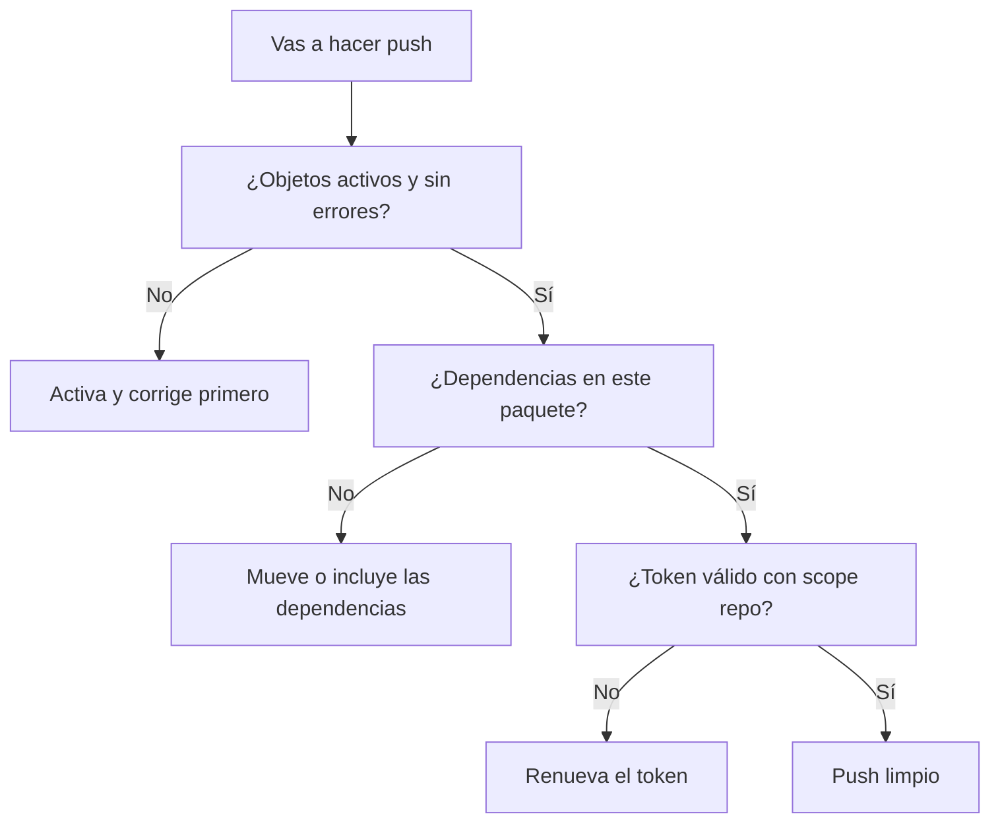

abapGit es sólido, pero no es magia. Después de unos cuantos proyectos aprendes que los problemas casi siempre son los mismos cinco o seis, y todos se pueden evitar. Esta es la lista honesta de lo que sale mal y cómo no pisar el charco.

## Los errores típicos

- **Objetos no soportados**: no todo objeto de desarrollo se serializa. abapGit soporta clases, CDS, informes, estructuras, tablas y un largo etcétera, pero hay tipos exóticos o muy dependientes de configuración que no viajan. Si un objeto no aparece en el staging, comprueba si el tipo está soportado antes de asumir un bug.
- **Dependencias fantasma**: un push lleva los objetos de tu paquete, no los objetos de otros paquetes de los que dependes. Haces pull en el destino, activas, y explota porque falta un elemento de diccionario o una clase base que estaba en otro paquete. **El repo no resuelve dependencias por ti.**
- **Token caducado o sin permisos**: el Personal Access Token classic viene con 30 días por defecto y necesita el scope `repo`. El día que caduca, todos los push fallan con un error de autenticación que despista.
- **Master language mal fijado**: si el `.abapgit.xml` declara un idioma maestro distinto al de tus textos, los textos se serializan raros o se pierden entre pull y push.
- **Objetos inactivos**: hacer push de objetos con errores de sintaxis o inactivos mete basura en el repo. Activa antes de confirmar.

```mermaid
flowchart TD
 PUSH["Vas a hacer push"] --> CHK["¿Objetos activos y sin errores?"]
 CHK -->|No| FIX["Activa y corrige primero"]
 CHK -->|Sí| DEP["¿Dependencias en este paquete?"]
 DEP -->|No| MOVE["Mueve o incluye las dependencias"]
 DEP -->|Sí| TOK["¿Token válido con scope repo?"]
 TOK -->|No| RENEW["Renueva el token"]
 TOK -->|Sí| OK["Push limpio"]
```

## Las buenas prácticas

Nada revolucionario, todo lo que la experiencia repite:

- **Un paquete autocontenido por repo**: agrupa en el paquete todo lo que forma una unidad lógica y desplegable, para que un pull traiga algo que activa sin faltantes.
- **Commits pequeños y con mensaje real**: ya lo hemos dicho, pero es la práctica que más rentabiliza el historial.
- **Activa siempre antes de confirmar**: el repo debe contener solo código que compila.
- **Token con expiración controlada**: apunta la fecha de caducidad y renuévalo antes, no cuando ya te ha roto el pipeline. Usa el scope mínimo necesario (`repo`).
- **Fija `.abapgit.xml` al inicio**: master language y folder logic decididos en el primer commit, no a mitad de proyecto.
- **Revisa el diff antes del push**: abapGit te muestra qué va a cambiar. Míralo. Los pushes accidentales de objetos que no querías mover son de los errores más comunes.

> El fallo más caro de abapGit no es un bug de la herramienta: es hacer pull en el sistema equivocado o pushear un paquete con dependencias que se quedaron fuera. La herramienta hace exactamente lo que le pides. El profesionalismo está en pedirle lo correcto.

En resumen: abapGit no falla casi nunca por su cuenta. Falla cuando le das objetos inactivos, dependencias incompletas o un token muerto. Controla esos tres frentes y el resto del ciclo (staging, commit, push, pull) es tan aburrido y fiable como debe ser el buen tooling.
