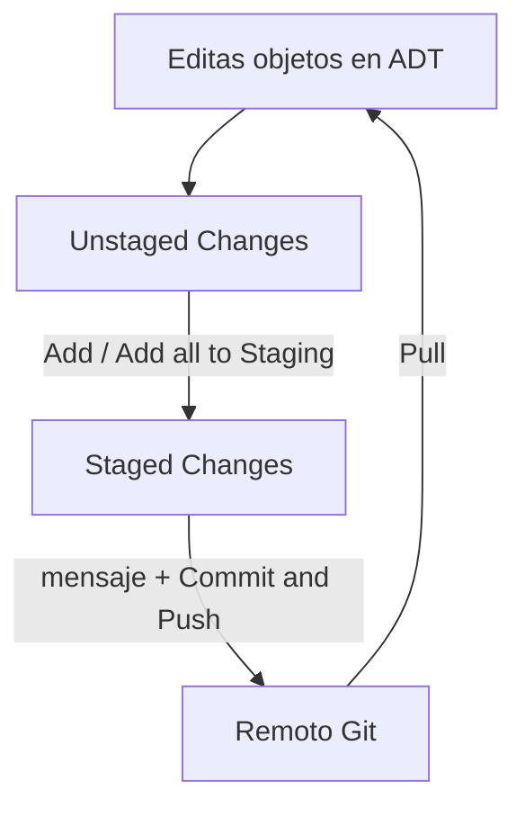

Una vez tienes el paquete vinculado a un repo online, empieza lo que haras todos los dias: preparar cambios, confirmarlos y enviarlos. abapGit no reinventa Git, lo **traduce a ADT**. Si entiendes el ciclo `add > commit > push` de Git, ya sabes abapGit; solo cambia el envoltorio.

## El ciclo diario

La vista **abapGit Staging** es el centro de operaciones. Divide tus cambios en dos zonas:

- **Unstaged Changes**: objetos modificados que aun no has marcado para confirmar.
- **Staged Changes**: lo que va a entrar en el proximo commit.



El mapeo con Git de terminal es directo:

```text
Arrastrar a Staged Changes      ->  git add
Commit Message + Commit & Push  ->  git commit && git push
Open in abapGit Staging         ->  abrir el repo para trabajar
Pull                            ->  git pull
```

Pasar todos los objetos del paquete de golpe se hace con **Add all to Staging Area**. Luego escribes el mensaje en **Commit Message** y pulsas **Commit and Push**. abapGit te pedira usuario y token si no los introdujiste al vincular.

## Mensajes de commit que sirven

Un commit no es un boton de guardar. Es una entrada de historial que alguien leera dentro de un ano, quiza tu mismo:

- Mal: `cambios`, `fix`, `.`
- Bien: `Anadir validacion de moneda en create_project`

Cada commit deberia ser una unidad logica: un cambio con sentido, no "todo lo que toque hoy". Eso es lo que hace que el historial valga algo cuando busques cuando y por que se rompio algo.

## Ramas: donde abapGit deja de ser un backup y se vuelve control de versiones

Trabajar siempre contra `main` funciona para una sandbox de una persona. En cuanto hay mas de un desarrollador o quieres aislar un experimento, necesitas **ramas**:

- Creas una rama (por ejemplo `feature/nueva-validacion`) desde la vista de repositorios.
- abapGit te posiciona en esa rama: tus commits van alli, no a `main`.
- Cuando el trabajo esta listo, se integra a `main` con un pull request en GitHub, con revision incluida.

El punto delicado en ABAP: **el sistema solo tiene una version activa de cada objeto**. Cambiar de rama en abapGit trae la version de esa rama al sistema (un pull), asi que no puedes tener dos ramas "vivas" simultaneamente en el mismo paquete del mismo sistema como harias en tu portatil con Git local. Por eso las ramas de feature suelen vivir en sistemas o paquetes separados, o se integran rapido.

> abapGit no te obliga a usar ramas, igual que Git tampoco. Pero trabajar siempre en `main` con varios desarrolladores es pedir un conflicto. La rama no es burocracia: es el sitio donde tu experimento no rompe el trabajo de otro.

El flujo maduro: rama por feature, commits pequenos y descriptivos, push frecuente, pull antes de empezar el dia para no divergir. Aburrido, si. Justo por eso funciona.
