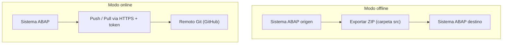

Cuando vinculas un paquete en abapGit, la primera decision no es el nombre del repo: es **si el repositorio va a estar conectado a un remoto o no**. abapGit soporta dos modos, online y offline, y confundirlos es la causa numero uno de flujos rotos que he visto en proyectos.

## Repositorio online

Un repo online esta **vinculado a una URL Git remota** (GitHub, GitLab, Azure Repos, lo que sea). abapGit habla directamente con ese remoto:

- Haces `pull` para traer cambios del remoto al sistema ABAP.
- Haces `push` (commit and push) para enviar tus objetos al remoto.
- Requiere que el sistema ABAP tenga **salida HTTPS** hacia el remoto y un **Personal Access Token** para autenticar.

Es el modo por defecto y el que quieres siempre que el sistema tenga conectividad. Todo el ciclo de versionado ocurre sin salir de ADT.

## Repositorio offline

Un repo offline **no tiene remoto**. abapGit serializa tus objetos igual, pero en lugar de empujarlos a GitHub, produce un **ZIP** que descargas. Y a la inversa: importas un ZIP para traer codigo a un sistema.



El offline existe por una razon muy concreta: **sistemas sin acceso a internet**. Muchos entornos productivos SAP estan detras de firewalls que jamas dejaran salir una peticion a github.com. Ahi el ZIP es tu unico puente.

## Cuando usar cada uno

- **Online** para desarrollo diario, sandboxes, formacion y cualquier sistema con salida a internet. Es donde brilla: historial, ramas, colaboracion.
- **Offline** para trasladar codigo a sistemas aislados, para entregar un snapshot a un cliente que no comparte tu GitHub, o para archivar una version concreta como artefacto.

Un patron habitual y muy util: desarrollas en un sistema online contra GitHub, y para el sistema productivo aislado exportas un ZIP desde el repo y lo importas alli.

```text
Repo online (dev)  --push-->  GitHub  --clone/descarga ZIP-->  Repo offline (prod aislado)
```

> El modo online no es "mejor" que el offline. El offline no es un modo degradado: es la respuesta correcta cuando la red dice que no. Elige por la topologia de tu paisaje, no por moda.

La regla practica: si el sistema puede llegar al remoto, online sin dudarlo. Si no puede, offline y disciplina con los ZIP. Lo que no debes hacer es forzar online en un sistema sin conectividad y perder media manana peleando con timeouts de proxy.
