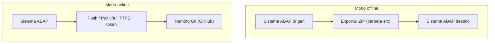

Cuando vinculas un paquete en abapGit, la primera decisión no es el nombre del repo: es **si el repositorio va a estar conectado a un remoto o no**. abapGit soporta dos modos, online y offline, y confundirlos es la causa número uno de flujos rotos que he visto en proyectos.

## Repositorio online

Un repo online está **vinculado a una URL Git remota** (GitHub, GitLab, Azure Repos, lo que sea). abapGit habla directamente con ese remoto:

- Haces `pull` para traer cambios del remoto al sistema ABAP.
- Haces `push` (commit and push) para enviar tus objetos al remoto.
- Requiere que el sistema ABAP tenga **salida HTTPS** hacia el remoto y un **Personal Access Token** para autenticar.

Es el modo por defecto y el que quieres siempre que el sistema tenga conectividad. Todo el ciclo de versionado ocurre sin salir de ADT.

## Repositorio offline

Un repo offline **no tiene remoto**. abapGit serializa tus objetos igual, pero en lugar de empujarlos a GitHub, produce un **ZIP** que descargas. Y a la inversa: importas un ZIP para traer código a un sistema.


```mermaid
flowchart TD
 subgraph OFF["Modo offline"]
 A["Sistema ABAP origen"] --> Z["Exportar ZIP (carpeta src)"]
 Z --> B["Sistema ABAP destino"]
 end
 subgraph ON["Modo online"]
 C["Sistema ABAP"] --> R["Push / Pull vía HTTPS + token"]
 R --> G["Remoto Git (GitHub)"]
 end
```

El offline existe por una razón muy concreta: **sistemas sin acceso a internet**. Muchos entornos productivos SAP están detrás de firewalls que jamás dejarán salir una petición a github.com. Ahí el ZIP es tu único puente.

## Cuándo usar cada uno

- **Online** para desarrollo diario, sandboxes, formación y cualquier sistema con salida a internet. Es donde brilla: historial, ramas, colaboración.
- **Offline** para trasladar código a sistemas aislados, para entregar un snapshot a un cliente que no comparte tu GitHub, o para archivar una versión concreta como artefacto.

Un patrón habitual y muy útil: desarrollas en un sistema online contra GitHub, y para el sistema productivo aislado exportas un ZIP desde el repo y lo importas allí.

```text
Repo online (dev)  --push-->  GitHub  --clone/descarga ZIP-->  Repo offline (prod aislado)
```

> El modo online no es "mejor" que el offline. El offline no es un modo degradado: es la respuesta correcta cuando la red dice que no. Elige por la topología de tu paisaje, no por moda.

La regla práctica: si el sistema puede llegar al remoto, online sin dudarlo. Si no puede, offline y disciplina con los ZIP. Lo que no debes hacer es forzar online en un sistema sin conectividad y perder media mañana peleando con timeouts de proxy.
