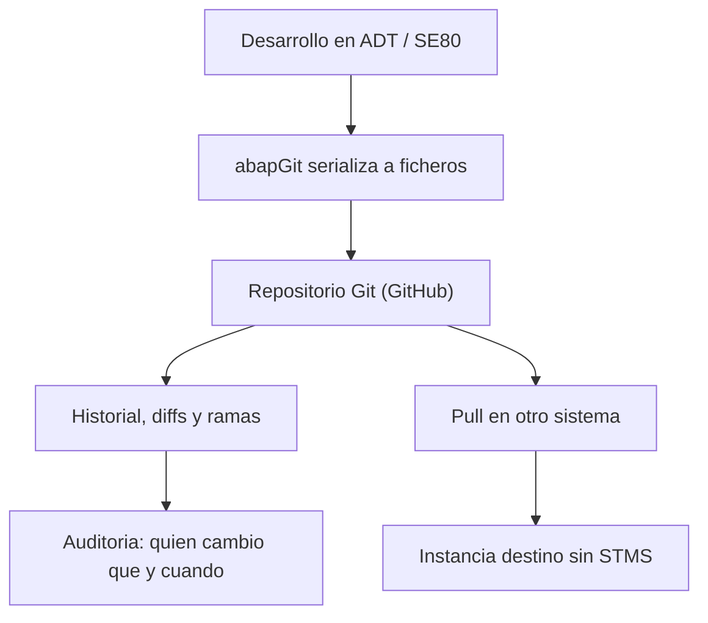

Durante veinte años, el control de versiones en ABAP fue una tabla de la base de datos y una orden de transporte. Funcionaba, pero nadie en el mundo del software fuera de SAP lo llamaría control de versiones. **abapGit cambia eso**: es un cliente Git escrito en ABAP que corre dentro del propio sistema y serializa tus objetos de desarrollo a ficheros que Git entiende.

## Qué es exactamente

abapGit es una herramienta de codigo abierto, creada y mantenida por Lars Hvam, compatible desde ABAP 702 SP8 en adelante. La idea es simple y potente a la vez:

- Toma tus objetos de desarrollo (clases, CDS, informes, estructuras) y los **serializa a ficheros de texto** dentro de una carpeta `src`.
- Esos ficheros viven en un repositorio Git, normalmente en GitHub.
- Desde ahí puedes importarlos y exportarlos entre sistemas, ver diffs, crear ramas y volver atras.

Lo importante: no reemplaza al transporte estandar, **convive** con el. abapGit no es un plugin propietario oscuro; forma parte del ecosistema open source de ABAP que puedes encontrar catalogado en `dotabap.org`, junto con abaplint y otros.

## Por que versionar ABAP en serio



Las ventajas no son teoricas:

- **Historial real**: cada commit lleva autor, fecha y mensaje. Sabes por que existe cada linea.
- **Diffs legibles**: comparar dos versiones de una clase es un diff de texto, no abrir dos ventanas de SE80 y entrecerrar los ojos.
- **Backup vivo**: si un sistema de formacion o una sandbox se recrea, tu codigo esta a salvo en el repositorio.
- **Colaboracion**: ramas, pull requests y revisiones, las mismas practicas que usa el resto de la industria.

## El plugin en ADT

En ABAP Cloud y en on-premise moderno se usa el plugin de abapGit para ADT (Eclipse). Se instala desde `https://eclipse.abapgit.org/updatesite/` via **Help > Install New Software**, y aparece con dos vistas clave:

```text
Window > Show View > Other... > abapGit
  - abapGit Repositories   (vincular y gestionar repos)
  - abapGit Staging        (preparar y confirmar cambios)
```

Con eso ya tienes todo el ciclo Git dentro del IDE en el que ya trabajas, sin salir a una terminal.

> El transporte te dice que cambio. Git te dice por que cambio, quien lo hizo y como deshacerlo. Esa diferencia es la que separa un desarrollo mantenible de un misterio arqueologico.

En los proximos posts entramos en el detalle: repos online frente a offline, la anatomia del `.abapgit.xml`, los flujos con ramas, y por que abapGit puede mover codigo entre sistemas sin tocar STMS.
