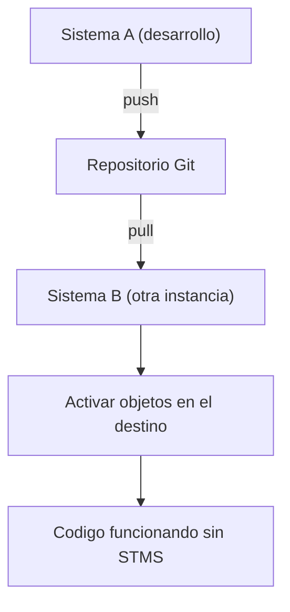

Aqui esta la capacidad de abapGit que a algunos administradores les quita el sueno: **puede mover objetos de un sistema ABAP a otro sin STMS**, sin una orden de transporte, sin la ruta oficial DEV > QAS > PRD. El repositorio Git es el vehiculo. Es potente. Tambien es facil de usar mal.

## Como funciona el traslado

El mecanismo es el mismo push/pull de siempre, solo que aprovechado como puente entre sistemas:

1. En el sistema origen, haces push del paquete al repositorio.
2. En el sistema destino, vinculas el mismo repositorio a un paquete.
3. Haces pull: abapGit crea o actualiza los objetos en el destino.
4. Activas y listo. Ninguna orden de transporte cruzo el paisaje.

Para sistemas aislados, el mismo resultado se logra con un ZIP offline en lugar del remoto.

## Cuando esto es exactamente lo que quieres

- **Sandboxes y formacion**: llevar un ejemplo a varias instancias de practica sin montar rutas de transporte.
- **Sistemas sin STMS compartido**: dos paisajes que no comparten dominio de transporte, por ejemplo un cliente y tu entorno interno.
- **Compartir codigo open source**: instalar una herramienta de la comunidad (el propio abapGit se instala asi) o entregar un componente a un tercero.
- **Recuperar tras recrear un sistema**: una sandbox que se destruye y se levanta de cero recupera su codigo con un pull.

## Cuando NO deberias hacerlo

Y aqui viene la parte que la gente prefiere no oir. En un paisaje productivo gobernado, **STMS existe por buenas razones**:

- El transporte registra, aprueba y ordena los cambios hacia produccion. Un pull de abapGit se salta ese control.
- STMS gestiona dependencias y secuencia de importacion. abapGit trae lo que hay en la rama, sin la red de seguridad del sistema de transporte.
- La auditoria y el cumplimiento en muchas organizaciones **exigen** la traza de STMS hacia produccion.

> abapGit puede saltarse STMS. Que pueda no significa que debas. Para sandboxes y codigo compartido es una bendicion. Para el camino a produccion en un sistema gobernado, saltarte el transporte es saltarte los controles, y eso no es agilidad, es deuda de riesgo.

La linea que yo trazo: usa abapGit para **mover codigo entre entornos de desarrollo, formacion y sistemas aislados**, y para **distribuir** componentes. Deja el camino a produccion a STMS salvo que tu organizacion haya decidido conscientemente, y documentado, otra cosa. La herramienta es fantastica; la disciplina de saber donde parar es lo que separa al profesional del que un dia mete un pull sin revisar en el sistema equivocado.
