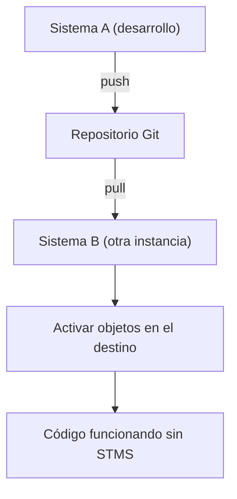

Aquí está la capacidad de abapGit que a algunos administradores les quita el sueño: **puede mover objetos de un sistema ABAP a otro sin STMS**, sin una orden de transporte, sin la ruta oficial DEV > QAS > PRD. El repositorio Git es el vehículo. Es potente. También es fácil de usar mal.

## Cómo funciona el traslado

El mecanismo es el mismo push/pull de siempre, solo que aprovechado como puente entre sistemas:

```mermaid
flowchart TD
 ORIG["Sistema A (desarrollo)"] -->|"push"| REPO["Repositorio Git"]
 REPO -->|"pull"| DEST["Sistema B (otra instancia)"]
 DEST --> ACT["Activar objetos en el destino"]
 ACT --> LISTO["Código funcionando sin STMS"]
```

1. En el sistema origen, haces push del paquete al repositorio.
2. En el sistema destino, vinculas el mismo repositorio a un paquete.
3. Haces pull: abapGit crea o actualiza los objetos en el destino.
4. Activas y listo. Ninguna orden de transporte cruzó el paisaje.

Para sistemas aislados, el mismo resultado se logra con un ZIP offline en lugar del remoto.

## Cuándo esto es exactamente lo que quieres

- **Sandboxes y formación**: llevar un ejemplo a varias instancias de práctica sin montar rutas de transporte.
- **Sistemas sin STMS compartido**: dos paisajes que no comparten dominio de transporte, por ejemplo un cliente y tu entorno interno.
- **Compartir código open source**: instalar una herramienta de la comunidad (el propio abapGit se instala así) o entregar un componente a un tercero.
- **Recuperar tras recrear un sistema**: una sandbox que se destruye y se levanta de cero recupera su código con un pull.

## Cuándo NO deberías hacerlo

Y aquí viene la parte que la gente prefiere no oír. En un paisaje productivo gobernado, **STMS existe por buenas razones**:

- El transporte registra, aprueba y ordena los cambios hacia producción. Un pull de abapGit se salta ese control.
- STMS gestiona dependencias y secuencia de importación. abapGit trae lo que hay en la rama, sin la red de seguridad del sistema de transporte.
- La auditoría y el cumplimiento en muchas organizaciones **exigen** la traza de STMS hacia producción.

> abapGit puede saltarse STMS. Que pueda no significa que debas. Para sandboxes y código compartido es una bendición. Para el camino a producción en un sistema gobernado, saltarte el transporte es saltarte los controles, y eso no es agilidad, es deuda de riesgo.

La línea que yo trazo: usa abapGit para **mover código entre entornos de desarrollo, formación y sistemas aislados**, y para **distribuir** componentes. Deja el camino a producción a STMS salvo que tu organización haya decidido conscientemente, y documentado, otra cosa. La herramienta es fantástica; la disciplina de saber dónde parar es lo que separa al profesional del que un día mete un pull sin revisar en el sistema equivocado.
