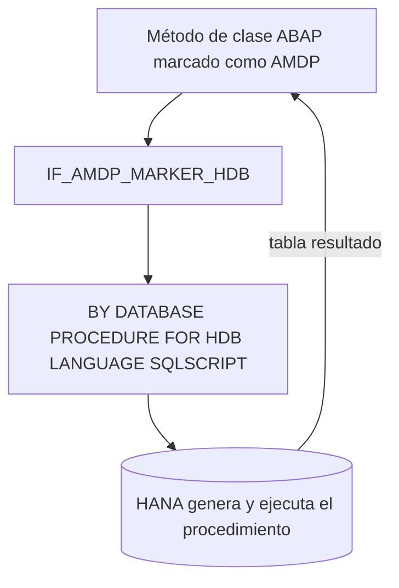

Cuando ABAP SQL se queda corto (necesitas lógica procedural, tablas intermedias, varios pasos con estado ejecutados dentro de HANA) llega **AMDP: ABAP Managed Database Procedure**. Es un framework basado en clases ABAP para escribir y llamar procedimientos almacenados de HANA **sin conectarte a la base de datos** y sin un usuario de base de datos.

## Qué es y qué te ahorra

Un AMDP es un procedimiento de HANA cuyo cuerpo está escrito en SQLScript, pero que vive dentro de un método de una clase ABAP. Dos ventajas que no son menores:

- **Sin usuario de base de datos**: el procedimiento se genera en HANA la primera vez que se ejecuta el método y se actualiza cada vez que cambias el método en ABAP.
- **Transporte como una clase normal**: entra en la orden de transporte igual que cualquier objeto ABAP. No hay un artefacto de base de datos que gestionar aparte.

Solo funciona sobre HANA. Desde ABAP 7.50, además de procedimientos, AMDP admite funciones con valor de retorno tabular.



## Las reglas de declaración que hay que respetar

La clase implementa la interfaz marcadora `IF_AMDP_MARKER_HDB`. El método es estático, todos los parámetros de entrada y salida se pasan **por valor** (nada de `RETURNING`), y en la implementación se declaran las cláusulas de procedimiento de base de datos:

```abap
CLASS zcl_amdp_flights DEFINITION PUBLIC.
  PUBLIC SECTION.
    INTERFACES if_amdp_marker_hdb.
    CLASS-METHODS get_flights
      IMPORTING VALUE(iv_carrid) TYPE s_carr_id
      EXPORTING VALUE(et_flights) TYPE tt_flights.
ENDCLASS.

CLASS zcl_amdp_flights IMPLEMENTATION.
  METHOD get_flights
    BY DATABASE PROCEDURE FOR HDB
    LANGUAGE SQLSCRIPT
    OPTIONS READ-ONLY
    USING sflight.

    et_flights = SELECT carrid, connid, fldate, price, currency
                   FROM sflight
                  WHERE carrid = :iv_carrid;
  ENDMETHOD.
ENDCLASS.
```

Fíjate en `USING sflight`: cada tabla del diccionario que uses dentro del AMDP hay que declararla. Y `OPTIONS READ-ONLY` cuando solo consultas, que además ayuda al optimizador.

## Se llama como un método, se depura como código

Desde ABAP la llamada es la de cualquier método de clase. Y desde 7.5 puedes depurar el AMDP paso a paso: pones breakpoints en el servidor de aplicaciones y en el AMDP, y el debugger salta entre el hilo ABAP y el hilo de base de datos de HANA sin configuración adicional. Es de las cosas que más sorprenden a quien viene del SQL nativo, donde depurar era un ejercicio de fe.

> AMDP es potente precisamente porque es el escape hatch. Si lo estás usando para algo que un `SELECT` con `CASE` ya resolvía, has añadido complejidad sin ganar nada.

La regla es sencilla: primero ABAP SQL, y solo cuando la lógica procedural lo exige, AMDP. En el siguiente post lo combinamos con CDS a través de las Table Functions, que es donde AMDP brilla de verdad.
