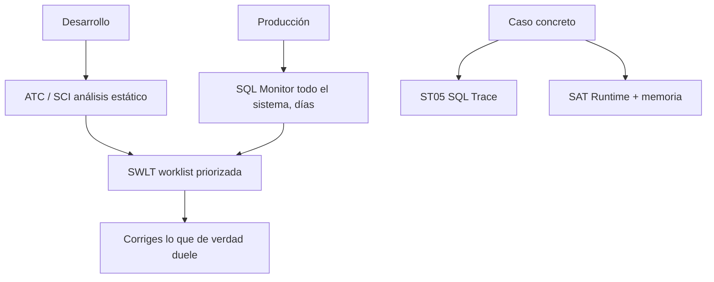

La peor optimización es la que haces por corazonada. Cambias un `SELECT`, te sientes mejor y no has medido nada. HANA y ABAP traen un arsenal de herramientas de análisis, y el error habitual es no saber cuál usar cuándo. Cada una responde a una pregunta distinta.

## El mapa de herramientas

- **ATC (ABAP Test Cockpit) y SCI (Code Inspector)**: análisis **estático**. Revisan el código sin ejecutarlo: sintaxis, convenciones, patrones de rendimiento sospechosos. Ideal durante el desarrollo y como Q-Gate al liberar transportes. Ojo: el estático no predice el rendimiento real, solo señala olores.
- **ST05 (SQL Trace)**: la herramienta clásica para un caso concreto. Ejecutas el programa (varias veces, para llenar buffers) y ves cada sentencia SQL con su tiempo. Solo una traza activa por servidor de aplicaciones, así que desactívala en cuanto termines.
- **SAT (Runtime Analysis, sucesora de SE30)**: análisis de tiempo de ejecución de un programa concreto, incluido el consumo de memoria. Para cuando el cuello de botella no es solo el SQL.
- **SQLM (SQL Monitor)**: la joya para producción. Monitoriza **todas** las sentencias SQL de un sistema entero durante días, con sobrecarga despreciable, y vincula cada una a su proceso de negocio.
- **SWLT (SQL Performance Tuning Worklist)**: combina el estático (ATC/SCI) con el dinámico (SQLM) en una única lista de trabajo priorizada por impacto.

## Por qué SQLM cambia el juego

Antes de migrar a HANA o S/4HANA hay que revisar el código propio, y la pregunta correcta no es "¿qué SELECT parece feo?" sino "¿qué SELECT consume de verdad el tiempo de base de datos en los procesos de negocio reales?". ST05 y SAT rastrean peticiones puntuales; no están pensados para vigilar un sistema durante semanas.

SQLM sí. Rastrea Open SQL, CDS, ADBC, SQL nativo y AMDP; agrega estadísticas (número de ejecuciones, tiempos máximo, mínimo, medio y desviación); e identifica el punto de entrada (transacción, informe, RFC o URL) de cada sentencia. Su recolección está optimizada en el kernel, así que puedes dejarlo corriendo en producción sin miedo.

## El orden que funciona

1. En desarrollo, **ATC** te avisa mientras escribes. Barato y constante.
2. En producción, **SQLM** te dice qué duele de verdad, con datos, no con opiniones.
3. **SWLT** cruza ambos y te da una lista ordenada por relevancia empresarial.
4. Para el caso concreto que ya has aislado, bajas a **ST05** y **SAT**.

> El estático te dice qué podría ir mal; el dinámico te dice qué va mal de verdad. Optimizar solo con el primero es pulir el código que nadie ejecuta.

Con esto cerramos la serie ABAP for HANA. Del paradigma code-to-data a las herramientas para verificarlo: la misma idea recorre todo, empuja el trabajo a la base y mide antes de tocar nada.
