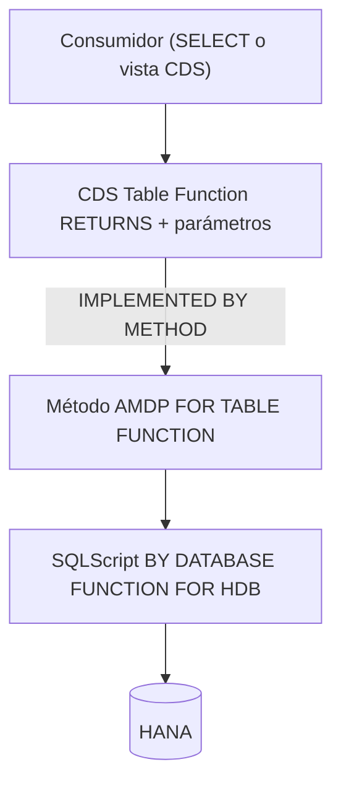

Las vistas CDS normales son declarativas: un `SELECT` con joins, asociaciones y agregaciones. Potentes, pero hay un techo. Cuando la lógica exige SQLScript procedural (bucles, tablas intermedias, algo que un `define view` no expresa) entran las **CDS Table Functions**. Son objetos CDS que extienden el modelado con la capacidad de inserción de código de HANA, implementados por un método AMDP.

## Dos piezas que se cablean

Una Table Function no es un objeto único: son dos artefactos que se apuntan mutuamente.

- **El objeto CDS**: declara los parámetros de entrada y, en `RETURNS`, la estructura tabular. La cláusula `IMPLEMENTED BY METHOD` señala la clase y el método AMDP que la resuelven.
- **La clase AMDP**: implementa la lógica en SQLScript. En la definición se marca `FOR TABLE FUNCTION` con el nombre del CDS; en la implementación, `BY DATABASE FUNCTION FOR HDB LANGUAGE SQLSCRIPT`.



El objeto CDS se ve así:

```abap
@ClientDependent: true
define table function ZTF_SALES_BY_CARRIER
  with parameters @Environment.systemField: #CLIENT
                  p_clnt : abap.clnt
  returns { client   : s_mandt;
            carrid   : s_carr_id;
            total    : s_price; }
  implemented by method zcl_tf_sales=>get_sales_by_carrier;
```

Y el método AMDP que lo implementa:

```abap
METHOD get_sales_by_carrier
  BY DATABASE FUNCTION FOR HDB
  LANGUAGE SQLSCRIPT
  OPTIONS READ-ONLY
  USING sflight.

  RETURN SELECT mandt AS client,
                carrid,
                SUM( price ) AS total
           FROM sflight
          WHERE mandt = :p_clnt
          GROUP BY mandt, carrid;
ENDMETHOD.
```

Lo mejor es lo que viene después: esa Table Function se consume como cualquier fuente CDS. Puedes hacer `SELECT` sobre ella o usarla dentro de otra vista CDS. Modelas como CDS, ejecutas como SQLScript.

## El detalle que descoloca: los SELECT-OPTIONS

Las Table Functions **no admiten filtrado por SELECT-OPTIONS** de forma nativa. Es una limitación real que sorprende en el primer proyecto. El patrón para resolverlo:

- Declaras en la Table Function un parámetro `CHAR` largo que llevará el filtro construido dinámicamente.
- En el método AMDP aplicas ese filtro con la función `APPLY_FILTER`.
- En el programa, construyes la cadena del `SELECT-OPTIONS` con `CL_SHDB_SELTAB=>COMBINE_SELTABS`, que te devuelve el filtro como `STRING` listo para pasar al parámetro.

No es elegante, pero es el camino soportado, y una vez que lo tienes montado se reutiliza.

> Una Table Function es la respuesta correcta a una pregunta muy concreta: "necesito SQLScript pero quiero consumirlo como CDS". Si no te haces esa pregunta, no la necesitas.

Con esto cerramos el trío code-to-data, AMDP y Table Functions. Los siguientes posts van al día a día: el golden rule del SELECT y las herramientas de HANA para medir en vez de adivinar.
