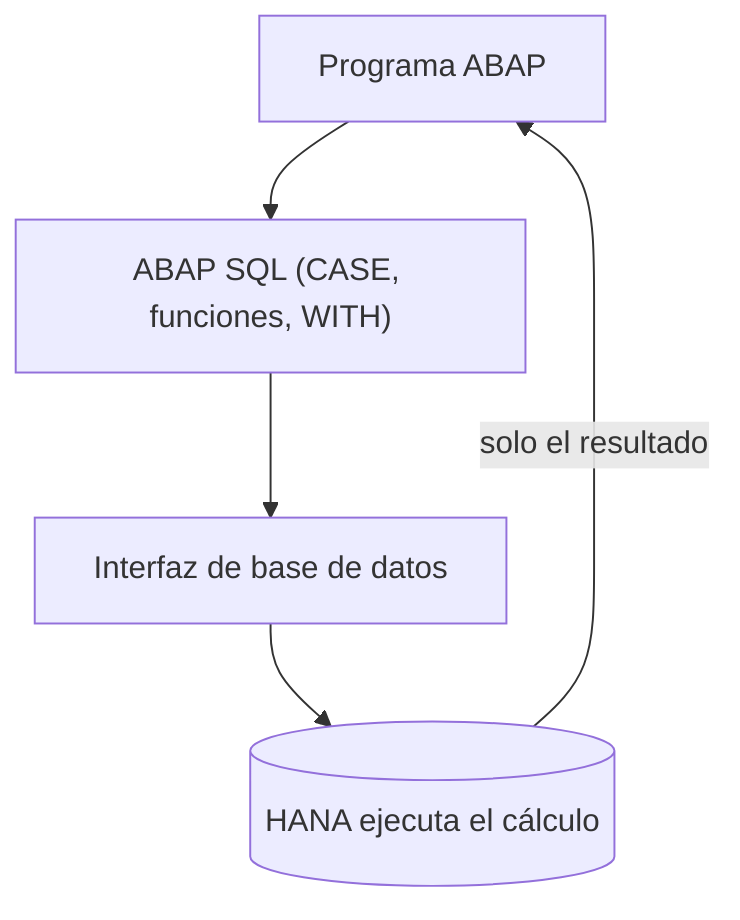

El code-to-data es el principio; el **code pushdown** es la técnica. Empujar significa escribir la lógica de forma que la ejecute la base de datos y no el servidor de aplicaciones. Y la buena noticia es que ABAP SQL moderno (desde 7.40) trae casi todo lo que necesitas sin bajar a SQL nativo ni AMDP.

## Lo que ya puedes empujar con ABAP SQL

- **Expresiones CASE**, simple y compleja, para clasificar sin `IF` en ABAP.
- **Funciones SQL**: numéricas (`ROUND`, `DIV`, `MOD`, `ABS`), de cadena (`CONCAT`, `SUBSTRING`, `UPPER`, `LPAD`), de fecha (`DATS_DAYS_BETWEEN`, `DATS_ADD_MONTHS`) y de conversión (`CURRENCY_CONVERSION`, `UNIT_CONVERSION`).
- **CTE con WITH**: descomponer una consulta compleja en pasos nombrados, todo dentro de un único viaje a la base.
- **Operadores de conjunto**: `UNION`, `INTERSECT`, `EXCEPT`.



## Un CASE que antes era un LOOP

Clasificar pedidos por importe solía ser un bucle con `IF`. Empujado a HANA es una columna calculada:

```abap
SELECT vbeln,
       netwr,
       CASE WHEN netwr >= 100000 THEN 'A'
            WHEN netwr >= 10000  THEN 'B'
            ELSE 'C'
       END AS categoria
  FROM vbak
  WHERE erdat >= @lv_desde
  INTO TABLE @DATA(lt_pedidos).
```

Sin `LOOP`, sin `IF`, sin traer `netwr` para compararlo en ABAP. HANA evalúa el `CASE` fila a fila en memoria y devuelve la categoría ya calculada.

## Descomponer con WITH en lugar de encadenar SELECTs

Cuando la lógica tiene varios pasos, la tentación es hacer tres SELECTs y unirlos en ABAP. Con una CTE lo haces en un solo viaje:

```abap
WITH
  +ventas AS ( SELECT carrid, SUM( price ) AS total
                 FROM sflight
                 GROUP BY carrid )
  SELECT c~carrname, v~total
    FROM +ventas AS v
    INNER JOIN scarr AS c ON c~carrid = v~carrid
    ORDER BY v~total DESCENDING
    INTO TABLE @DATA(lt_ranking).
```

## Hasta dónde empujar: los hints son el último recurso

ABAP SQL permite forzar al optimizador con `%_HINTS`, indicando por ejemplo qué índice usar. Suena tentador y casi siempre es un error. Un hint congela una decisión que la base tomaría mejor por su cuenta, y hay que revisarlo en cada upgrade de versión o cambio de configuración.

> Los hints son la aspirina del rendimiento: alivian un síntoma concreto, no curan el diseño. Úsalos cuando todo lo demás ha fallado y documenta por qué.

El pushdown tiene un límite natural: la lógica puramente declarativa (agregar, filtrar, transformar) empuja de maravilla. La lógica procedural compleja, con bucles y estado, es donde entra AMDP. De eso hablamos en el siguiente post.
