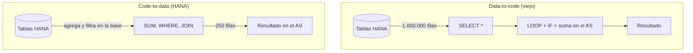

Durante veinte años el ABAP clásico hizo lo contrario de lo sensato: traía los datos crudos al servidor de aplicaciones y los procesaba allí, fila a fila, dentro de un `LOOP`. Con discos lentos y bases de datos tontas tenía cierta lógica. Con HANA, no. El paradigma **code-to-data** invierte la regla: **empuja el cálculo hacia donde viven los datos**, no al revés.

## Data-to-code contra code-to-data

- **Data-to-code (el patrón viejo)**: `SELECT *`, todo a una tabla interna, y luego ABAP suma, filtra y agrupa en memoria. La base de datos solo lee; el trabajo pesado lo hace el AS.
- **Code-to-data (el patrón HANA)**: la agregación, el filtrado y el join se expresan en SQL y los ejecuta la base de datos. Al AS solo llega el resultado, ya reducido.

La diferencia no es estética. Mover un millón de filas por la interfaz de base de datos para descartar el 99% en un `IF` es exactamente el tipo de derroche que HANA fue diseñada para eliminar.



## El antipatrón que verás en todos los sistemas heredados

```abap
" NO: trae todo y suma en memoria
DATA lv_total TYPE p DECIMALS 2.
SELECT * FROM vbap INTO TABLE @DATA(lt_items).
LOOP AT lt_items INTO DATA(ls_item).
  IF ls_item-matnr = lv_matnr.
    lv_total = lv_total + ls_item-netwr.
  ENDIF.
ENDLOOP.
```

Ese código lee toda la tabla de posiciones, la copia entera al AS y descarta casi todo. La versión code-to-data hace que HANA haga el trabajo:

```abap
" SÍ: la base agrega y solo devuelve el total
SELECT SUM( netwr ) AS total
  FROM vbap
  WHERE matnr = @lv_matnr
  INTO @DATA(lv_total).
```

Una fila viaja por la red en lugar de un millón. Y HANA, columnar y en memoria, suma esa columna a una velocidad que ningún `LOOP` ABAP alcanza.

## No es solo SUM

Code-to-data abarca mucho más que agregaciones. Es empujar a la base los `CASE`, las funciones SQL (`CONCAT`, `SUBSTRING`, `ROUND`), las conversiones de moneda con `CURRENCY_CONVERSION`, las expresiones de tabla comunes con `WITH`. Todo lo que antes hacías en ABAP con bucles y llamadas a funciones, hoy tiene un equivalente que corre dentro de HANA.

> Regla mental: si estás a punto de escribir un `LOOP` para calcular algo que la base sabe calcular, es que has traído los datos demasiado lejos.

En el próximo post bajamos al detalle: qué es exactamente el code pushdown, cómo saber si tu SELECT lo aprovecha y dónde el optimizador deja de ayudarte.
