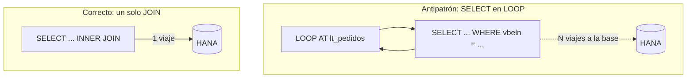

Hay una creencia peligrosa: "como ahora corremos sobre HANA, el rendimiento ya no importa". Es falsa. HANA es brutalmente rápida, pero un `SELECT` mal escrito sigue siendo un `SELECT` mal escrito, y sobre una base columnar en memoria algunos errores duelen incluso más. Estas son las reglas que no negociamos.

## Regla 1: nunca SELECT *

`SELECT *` trae todas las columnas, y HANA guarda los datos por columnas. Pedir columnas que no usas obliga a la base a reconstruir filas completas y a mover bytes que vas a tirar. Especifica siempre los campos:

```abap
" NO
SELECT * FROM vbak INTO TABLE @DATA(lt_all).

" SÍ: solo lo que necesitas
SELECT vbeln, erdat, netwr, waerk
  FROM vbak
  WHERE vkorg = @lv_vkorg
  INTO TABLE @DATA(lt_orders).
```

## Regla 2: jamás un SELECT dentro de un LOOP

Es el pecado capital. Un `SELECT` por cada iteración son mil, diez mil o un millón de viajes a la base de datos. La solución es leer todo de una vez y usar `FOR ALL ENTRIES` o, mejor, un `JOIN`.



```abap
" SÍ: un JOIN en lugar de N SELECTs
SELECT k~vbeln, k~erdat, p~posnr, p~netwr
  FROM vbak AS k
  INNER JOIN vbap AS p ON p~vbeln = k~vbeln
  WHERE k~vkorg = @lv_vkorg
  INTO TABLE @DATA(lt_result).
```

## Regla 3: filtra y agrega en la base, no en ABAP

Esto es code-to-data en una frase. Todo `WHERE`, `SUM`, `GROUP BY` y `CASE` que puedas empujar, empújalo. Si tu programa lee un millón de filas para quedarse con doscientas, has puesto el filtro en el sitio equivocado.

## Regla 4: cuidado con FOR ALL ENTRIES vacío

`FOR ALL ENTRIES` sobre una tabla interna vacía **lee toda la tabla de base de datos**, ignorando el `WHERE` que dependía de ella. Comprueba siempre que la tabla no esté vacía antes:

```abap
IF lt_keys IS NOT INITIAL.
  SELECT vbeln, netwr FROM vbak
    FOR ALL ENTRIES IN @lt_keys
    WHERE vbeln = @lt_keys-vbeln
    INTO TABLE @DATA(lt_data).
ENDIF.
```

## Regla 5: mide, no adivines

La intuición sobre rendimiento falla. Antes de optimizar, mide con el SQL Trace (ST05) o el SQL Monitor (SQLM). El código que crees lento a veces no lo es, y el cuello de botella real casi siempre está donde no mirabas.

> HANA no arregla el mal SQL, lo hace más rápido. Un `SELECT` en un `LOOP` sobre HANA sigue siendo un `SELECT` en un `LOOP`: solo tarda menos en hacerte daño.

Estas reglas son la higiene mínima. Para pasar de la higiene a la ingeniería hace falta medir de verdad, y ahí entran las herramientas de análisis de HANA. Es el tema del último post.
