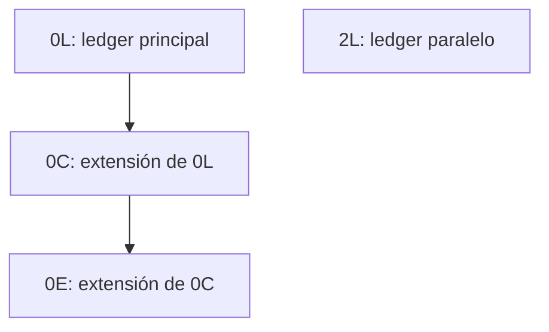
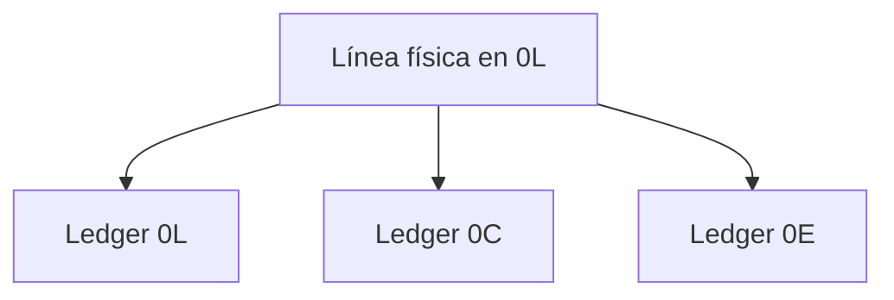

En SAP S/4HANA, la misma posición de un asiento puede aparecer una, dos o cuatro veces según dónde se lea y cómo se filtre. No es un error de datos: es la forma en que el Universal Journal combina los ledgers estándar con los ledgers de extensión. Una consulta que no tenga en cuenta esa combinación devuelve un importe plausible y equivocado, sin ningún aviso.

Este segundo artículo de la serie SAP FI Journal Entry explica el mecanismo con un asiento real de un sistema SAP S/4HANA 2025, mide el resultado de cada forma de filtrar y fija la regla, con sus límites. Todas las consultas se han ejecutado el 30 de septiembre de 2026.

## Ledger estándar y ledger de extensión

- Un **ledger estándar** es autónomo: contiene todas sus líneas. Hay un ledger principal y puede haber ledgers no principales, por ejemplo para valorar con otro principio contable.
- Un **ledger de extensión** (*Extension Ledger*; el diccionario en español lo traduce como «ledger de apéndice») se define sobre un ledger base y contiene únicamente sus propios apuntes. Su contenido es el del ledger base más esos apuntes. La ventaja es de volumen: mil ajustes ocupan mil filas, no una copia del ledger base.

La configuración del sistema de prueba, leída de la tabla `FINSC_LEDGER` y de `I_LedgerText`:

| Ledger | Nombre | Tipo | Principal |
|---|---|---|---|
| `0L` | Libro 0L | Ledger estándar | Sí |
| `2L` | Libro 2L | Ledger estándar | No |
| `0C` | Contabilidad | Ledger de extensión | No |
| `0E` | Comprometido/Predicción | Ledger de extensión | No |

La vista liberada `I_LedgerSourceLedger` indica de qué ledgers de origen se alimenta cada ledger:

| Ledger | Ledgers de origen |
|---|---|
| `0L` | `0L` |
| `2L` | `2L` |
| `0C` | `0C`, `0L` |
| `0E` | `0E`, `0C`, `0L` |

Los ledgers de extensión se pueden apilar: `0E` no se apoya directamente en `0L`, sino en `0C`, que a su vez se apoya en `0L`.



## Lo que guarda ACDOCA: cuatro filas

El sistema de prueba contiene un asiento de dos posiciones en la sociedad 1010. La tabla del Universal Journal lo guarda así:

```sql
SELECT rldnr, rbukrs, gjahr, belnr, docln, racct, hsl, rhcur
  FROM acdoca
  ORDER BY belnr, docln, rldnr
```

| `RLDNR` | `BELNR` | `DOCLN` | `RACCT` | `HSL` |
|---|---|---|---|---|
| 0L | 0100000000 | 000001 | 0011001000 | 1.003,00 |
| 2L | 0100000000 | 000001 | 0011001000 | 1.003,00 |
| 0L | 0100000000 | 000002 | 0011001090 | -1.003,00 |
| 2L | 0100000000 | 000002 | 0011001090 | -1.003,00 |

Cada posición existe una vez por ledger estándar. De los ledgers de extensión no hay ninguna fila, porque ninguno tiene apuntes propios.

### La primera solución evidente: filtrar la tabla por el ledger de extensión

```sql
SELECT COUNT(*) FROM acdoca WHERE rldnr = '0E'
```

La consulta devuelve **0 filas**. La conclusión inmediata, que el ledger `0E` no tiene movimientos, es incorrecta: `0E` contiene todas las líneas de `0L` y de `0C`. La herencia no está materializada en la tabla, y una lectura directa de ACDOCA la pierde. Es uno de los motivos por los que SAP marca la tabla como no liberable, como se explica en [el primer artículo de la serie](/blog/vistas-cds-liberadas-journal-entry/).

## Lo que devuelve I_JournalEntryItem: ocho filas

La misma información, leída con la vista liberada:

```sql
SELECT Ledger, SourceLedger, CompanyCode, AccountingDocument,
       LedgerGLLineItem, GLAccount, AmountInCompanyCodeCurrency
  FROM I_JournalEntryItem
  ORDER BY AccountingDocument, LedgerGLLineItem, Ledger
```

| `Ledger` | `SourceLedger` | `LedgerGLLineItem` | `GLAccount` | Importe |
|---|---|---|---|---|
| 0C | 0L | 000001 | 0011001000 | 1.003,00 |
| 0E | 0L | 000001 | 0011001000 | 1.003,00 |
| 0L | 0L | 000001 | 0011001000 | 1.003,00 |
| 2L | 2L | 000001 | 0011001000 | 1.003,00 |
| 0C | 0L | 000002 | 0011001090 | -1.003,00 |
| 0E | 0L | 000002 | 0011001090 | -1.003,00 |
| 0L | 0L | 000002 | 0011001090 | -1.003,00 |
| 2L | 2L | 000002 | 0011001090 | -1.003,00 |

La vista no duplica datos: resuelve la herencia que la tabla no contiene. Para ello, su clave lleva dos campos de ledger con significados distintos:

- **`SourceLedger`** es el ledger de origen: aquel en el que la línea se contabilizó físicamente. Procede directamente del campo `RLDNR` de ACDOCA.
- **`Ledger`** es el ledger desde el que se mira: el propio ledger de origen o cualquier ledger de extensión que lo incluya.

El mecanismo está en la definición de la vista. Cada línea física se une con todas las filas de la correspondencia de ledgers que tienen ese ledger de origen en esa sociedad:

```cds
define view entity I_JournalEntryItem
as select from I_GLAccountLineItemRawData as I_GLAccountLineItemRawData
     inner join   I_CoCodeLedgerSourceLedger  on  I_GLAccountLineItemRawData.SourceLedger = I_CoCodeLedgerSourceLedger.SourceLedger
                                              and I_GLAccountLineItemRawData.CompanyCode  = I_CoCodeLedgerSourceLedger.CompanyCode
// ...
key I_GLAccountLineItemRawData.SourceLedger,
// ...
key I_CoCodeLedgerSourceLedger.Ledger,
```

Una línea contabilizada en `0L` aparece, por tanto, tres veces:



## Cinco formas de filtrar, cinco resultados

Importe real de la cuenta `0011001000` en cualquiera de los ledgers: **1.003,00 EUR**. Resultado de cada filtro sobre `I_JournalEntryItem`, medido en el sistema de prueba:

| Filtro | Filas | Importe | Lectura |
|---|---|---|---|
| Sin filtro de ledger | 4 | 4.012,00 | Suma los cuatro ledgers |
| `SourceLedger = '0L'` | 3 | 3.009,00 | La misma línea física, vista desde 0L, 0C y 0E |
| `Ledger IN ('0L', '0E')` | 2 | 2.006,00 | Dos ledgers que contienen la misma línea |
| `Ledger = '0L'` | 1 | 1.003,00 | Correcto |
| `Ledger = '0E'` | 1 | 1.003,00 | Correcto: la línea heredada de 0L |

### La segunda solución evidente: filtrar el ledger de origen

Filtrar `SourceLedger = '0L'` parece la forma de quedarse con lo contabilizado en el ledger principal. El resultado es el triple del importe real, porque la misma línea física aparece una vez por cada ledger que la incluye. El error no se detecta mirando el número: en este sistema el factor es tres porque hay dos ledgers de extensión sobre `0L`; en otro sistema será otro.

## La regla: filtrar Ledger con un único valor

Sobre `I_JournalEntryItem`, cada suma filtra `Ledger` con un único valor, el del ledger que se quiere consultar:

```abap
SELECT FROM I_JournalEntryItem
  FIELDS GLAccount, CompanyCodeCurrency,
         SUM( AmountInCompanyCodeCurrency ) AS Amount
  WHERE Ledger      = @lv_ledger
    AND CompanyCode = @lv_company_code
    AND FiscalYear  = @lv_fiscal_year
  GROUP BY GLAccount, CompanyCodeCurrency
  INTO TABLE @DATA(lt_totals).
```

En una vista CDS propia construida encima, el ledger llega como parámetro o como filtro obligatorio de la vista de consumo, nunca como un valor opcional que el consumidor pueda omitir. El artículo [Parámetros en CDS](/blog/cds-parametros/) desarrolla ese patrón.

`SourceLedger` tiene un uso legítimo: descomponer por origen un ledger ya fijado.

```sql
SELECT SourceLedger, COUNT(*) AS filas, SUM( AmountInCompanyCodeCurrency ) AS importe
  FROM I_JournalEntryItem
  WHERE Ledger = '0E'
  GROUP BY SourceLedger
```

En el sistema de prueba solo aparece `0L`, porque `0C` y `0E` no tienen apuntes propios. Según la correspondencia de `I_LedgerSourceLedger`, en un sistema con apuntes propios en ambos ledgers aparecerían también `0C` y `0E`, y la combinación `Ledger = '0E' AND SourceLedger = '0E'` aislaría los ajustes propios de `0E`.

## Límites

1. **El arrastre de saldos.** `I_JournalEntryItem` no incluye el arrastre de saldos del período 000. Para saldos de balance, la vista es `I_GLAccountLineItem`, que usa la misma unión con la correspondencia de ledgers y, por tanto, se filtra con la misma regla.
2. **La vista en bruto no resuelve la herencia.** `I_GLAccountLineItemRawData` solo tiene `SourceLedger`. El comentario de SAP en la propia vista advierte de que su resultado es incompleto para los ledgers que no son de base.
3. **La asignación a la sociedad.** La unión incluye la sociedad: un ledger de extensión solo proyecta líneas en las sociedades a las que está asignado. En el sistema de prueba, la sociedad 1010 tiene asignados los cuatro ledgers.
4. **Los ledgers apilados.** Filtrar un ledger de extensión devuelve también las líneas de todos los ledgers sobre los que se apoya: `0E` incluye `0L` y `0C`.
5. **El ledger paralelo no es una extensión.** `2L` tiene sus propias líneas, con `Ledger` y `SourceLedger` iguales. Sumarlo con `0L` mezcla dos valoraciones del mismo asiento.
6. **El volumen.** Sin filtro de ledger, la vista devuelve una fila por cada combinación de línea y ledger: en el sistema de prueba, 8 filas donde la tabla tiene 4. El filtro de ledger debe llegar a la vista desde el primer momento.
7. **ABAP Cloud.** `I_LedgerSourceLedger` figura en el catálogo de objetos liberados para desarrollo cloud, de modo que la correspondencia entre ledgers también se puede consultar desde un desarrollo propio en ABAP Cloud.

## Síntesis

1. ACDOCA solo contiene lo contabilizado físicamente: un ledger de extensión sin apuntes propios no tiene ninguna fila en la tabla.
2. `I_JournalEntryItem` proyecta cada línea una vez por cada ledger que la incluye. `SourceLedger` indica dónde se contabilizó; `Ledger`, desde qué ledger se mira.
3. Cada suma filtra `Ledger` con un único valor. Filtrar solo `SourceLedger`, o varios ledgers a la vez, multiplica el importe.
4. `SourceLedger` sirve para descomponer por origen un ledger ya fijado.
5. Para saldos de balance se usa `I_GLAccountLineItem`, con la misma regla de filtrado.

El trabajo con vistas CDS sobre el Universal Journal se desarrolla con ejercicios guiados en el curso [SAP ABAP Cloud CDS: Core Data Services](/courses/sap-abap-cloud-cds-core-data-services/) y en el libro [ABAP Cloud: Modelado de Datos con CDS](/books/abap-cds/).
