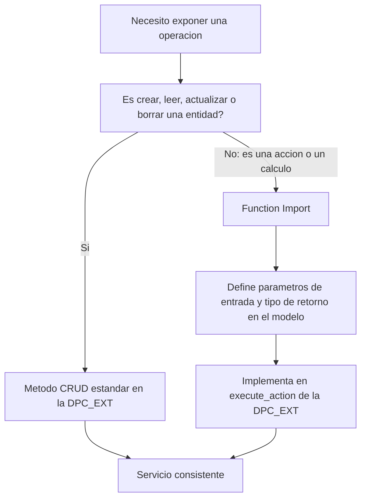

Todo servicio OData empieza con las cuatro operaciones de siempre: crear, leer, actualizar, borrar. Y casi todo cabe ahí. El problema aparece con la operación número cinco: "quiero un endpoint que consulte el estado de un pago". Eso no es un CREATE, no es un DELETE, no encaja en el CRUD. Ahí es donde la gente empieza a forzar la máquina, y ahí es donde entra el Function Import.

## El CRUD, cada operación en su método

En el modelo clásico del Gateway, cada operación de una entidad es un método concreto que redefines en la DPC_EXT:

```abap
" Entidad CustomersSet: el CRUD completo
METHOD customersset_create_entity.   " CREATE: alta de cliente
ENDMETHOD.

METHOD customersset_get_entity.      " READ:   un cliente por clave
ENDMETHOD.

METHOD customersset_get_entityset.   " QUERY:  lista de clientes
ENDMETHOD.

METHOD customersset_update_entity.   " UPDATE: modificar cliente
ENDMETHOD.

METHOD customersset_delete_entity.   " DELETE: baja de cliente
ENDMETHOD.
```

La regla es simple: **una operación por método, una entidad por conjunto**. Si te ves metiendo un `IF operacion = 'consultar_estado'` dentro de un GET_ENTITYSET, para. Eso no es CRUD.

## El Function Import: la operación que no es CRUD

Un Function Import es una operación con nombre propio, con parámetros de entrada, que devuelve lo que tú decidas. El ejemplo canónico: un `PaymentStatus` que recibe un identificador de pago y devuelve su estado. No crea nada, no borra nada, no encaja en ninguna letra del CRUD.



En SEGW defines el Function Import en el modelo (nombre, parámetros, tipo de retorno) y lo implementas en el método genérico de ejecución de acciones de la DPC_EXT, ramificando por el nombre de la función. Es el sitio legítimo para la lógica que no es CRUD.

## El error que ensucia el servicio

Meter lógica de negocio dentro del CRUD porque "es más rápido". Un GET que además dispara un cálculo, un CREATE que además manda un correo. Funciona el primer día y te condena después: un cliente que solo quería leer acaba provocando efectos colaterales que nadie espera de un GET.

Ademas, hay operaciones que ni CRUD ni Function Import cubren bien: las **deep entity**, donde creas o lees una cabecera con sus posiciones en una sola llamada (por ejemplo un cliente con sus pedidos). Esas tienen su propio par de métodos, y merecen su propio post.

> El CRUD no es una obligación de meterlo todo dentro. Es un contrato: si la operación no es una de las cuatro letras, no la disfraces de CRUD. Dale su Function Import y que el servicio siga siendo legible.

En el próximo post: expand y navegación por asociaciones, cómo traer una cabecera y sus posiciones sin hacer diez llamadas.
