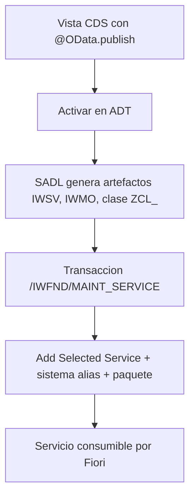

Exponer datos como OData desde ABAP tuvo un antes y un después el día que apareció `@OData.publish: true`. De repente una vista CDS se convertía en servicio con una línea. Bien. Pero como todo atajo, tiene letra pequeña, y en proyecto hay que saber cuándo el atajo vale y cuándo necesitas el camino largo (Service Definition más Service Binding).

## El atajo: @OData.publish

Pones la anotación en la vista y, al activar, el framework SADL (Service Adaptation Description Language) genera por ti todo el andamiaje del SAP Gateway.

```cds
@AbapCatalog.sqlViewName: 'SQL_VIEW_NAME'
@OData.publish: true
define view CDS_VIEW_NAME as select from ...
```

Al activar, SADL genera varios artefactos que se guardan en el back-end del servidor de aplicaciones:

- El servicio con nombre técnico `<CDS_VIEW>_CDS` (R3TR IWSV).
- Un modelo de SAP Gateway (R3TR IWMO) con el mismo nombre.
- Una clase ABAP `ZCL_<CDS_VIEW>` que proporciona los metadatos del modelo.

Y aquí viene lo que la gente olvida: **generar el servicio no lo activa**. Todavía tienes que ir a la transacción `/IWFND/MAINT_SERVICE` en el hub de Gateway, añadir el servicio con **Add Selected Service**, asignar el sistema alias y el paquete. Solo entonces es consumible.



## Cuándo el atajo NO te sirve

`@OData.publish` es cómodo pero rígido. Es OData V2, va atado a esa vista y su ciclo de vida vive dentro del DDL. En cuanto necesitas control sobre el binding, versiones, o quieres V4 o Fiori elements moderno, el atajo se queda corto. Ahí entra el par **Service Definition + Service Binding**:

- La **Service Definition** declara qué exposición ofreces (qué entidades, con qué nombres).
- El **Service Binding** decide el protocolo (OData V2, V4, UI o Web API) y publica.

Separar definición de binding es lo mismo que separar el qué del cómo. Puedes cambiar de V2 a V4 sin tocar la vista, versionar el contrato, y activar desde el propio ADT sin peregrinar al hub.

## El criterio honesto

- Prototipo, informe interno, demo rápida: `@OData.publish` y a correr.
- Servicio que va a producción, que otro equipo consume, o que quieres en V4: Service Definition más Service Binding, sin excepción.

> `@OData.publish` te da un servicio en un minuto. Service Definition te da un contrato que sobrevive al proyecto. No confundas velocidad con arquitectura.

En el próximo post: el modelo del SAP Gateway con SEGW frente al enfoque CDS moderno, y por qué el SEGW no está muerto aunque te lo digan.
