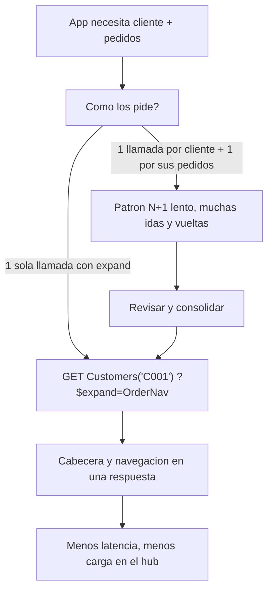

Hay un patrón que se repite en aplicaciones Fiori mal montadas: piden la lista de clientes, y luego, por cada cliente, lanzan otra petición para traer sus pedidos. Diez clientes, once llamadas. Cien clientes, ciento una. Es el clásico problema N+1 disfrazado de OData. La solución existe desde el primer día y se llama `$expand`.

## Navegación por asociación

En OData las entidades se relacionan por asociaciones, y esas asociaciones son navegables. Una entidad `Customers` con navegación hacia `Orders` te deja pedir, en una sola URL, el cliente y sus pedidos juntos:

```abap
" Peticion single read con expand desde el cliente hacia sus pedidos
" GET /CustomersSet('C001')?$expand=OrderNav
"
" Tambien funciona la navegacion directa:
" GET /CustomersSet('C001')/OrderNav
"
" Y el expand encadenado en una entidad de pagos:
" GET /PaymentsSet('P100')?$expand=OrderNav
```

En el modelo clásico del Gateway, el `$expand` no se resuelve solo: lo implementas redefiniendo los métodos de lectura profunda de la DPC_EXT (`GET_EXPANDED_ENTITY` y `GET_EXPANDED_ENTITYSET`), donde rellenas cabecera y elementos navegados en la misma respuesta. En CDS, en cambio, si la asociación está bien declarada, SADL resuelve el `$expand` genéricamente sin que escribas nada.



## Cuándo expandir y cuándo NO

`$expand` es potente, pero no es gratis. Traer todo siempre tiene su propio problema: pides un cliente con sus pedidos, y sus posiciones, y los materiales de cada posición, y de golpe una llamada arrastra medio sistema. El criterio:

- **Expande** lo que la pantalla va a mostrar de inmediato. Si el maestro y el detalle se ven juntos, una llamada con `$expand`.
- **No expandas** lo que el usuario quizá nunca abra. Deja esa asociación como navegación bajo demanda: solo se resuelve cuando alguien la pide.

Esa es la misma disciplina de las asociaciones en CDS: se declaran, pero no se materializan hasta que se navegan. Un `$expand` innecesario es un join que nadie pidió.

> El N+1 no lo comete OData: lo cometes tú al no usar `$expand`. Y el `$expand` de todo tampoco es la solución: expande lo que se ve, navega lo que se explora.

En el próximo post: paginación y `$filter` más `$select`, cómo no traer un millón de filas cuando la pantalla muestra veinte.
