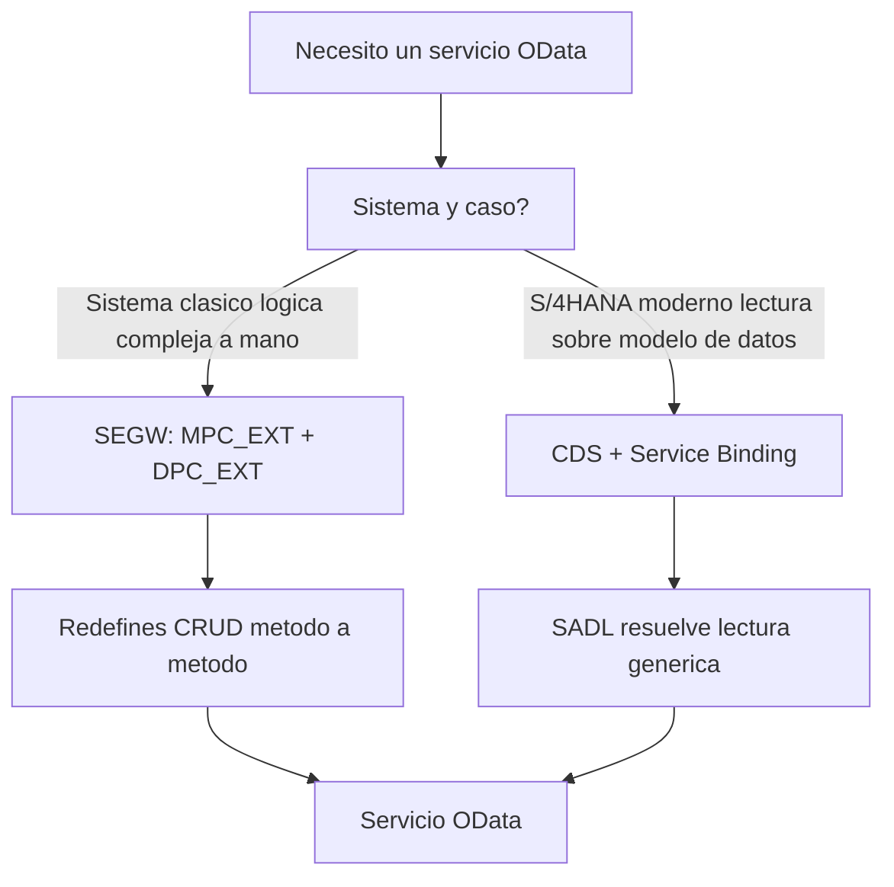

Hay una frase que se repite en charlas y en LinkedIn: "SEGW está muerto, ahora todo es CDS". Es medio verdad, y la otra media es la que te mete en problemas cuando llegas a un sistema real con doscientos servicios montados a la antigua. Vamos a entender el modelo del SAP Gateway sin dogma.

## El modelo clásico: SEGW con MPC y DPC

En SEGW defines un proyecto con entidades, propiedades, entity sets y asociaciones. Al generar, obtienes dos parejas de clases:

- **MPC / MPC_EXT** (Model Provider Class): describe el modelo, los tipos, las anotaciones. La `_EXT` es donde tú metes lo tuyo sin que una regeneración te lo pise.
- **DPC / DPC_EXT** (Data Provider Class): aquí vive la lógica. Cada operación es un método que tú rellenas.

El CRUD completo se implementa redefiniendo métodos concretos en la DPC_EXT:

```abap
" Metodos que redefines en la DPC_EXT para cada entidad
METHOD customersset_get_entity.      " READ  (single read)
  " leer un registro por su clave
ENDMETHOD.

METHOD customersset_get_entityset.   " QUERY (lista + filtros)
  " leer una coleccion, aplicar $filter, $orderby, paginacion
ENDMETHOD.

METHOD customersset_create_entity.   " CREATE
ENDMETHOD.

METHOD customersset_update_entity.   " UPDATE
ENDMETHOD.

METHOD customersset_delete_entity.   " DELETE
ENDMETHOD.
```

Y las anotaciones de UI se cablean en la MPC_EXT, por ejemplo `UI.HeaderInfo` para la cabecera de una lista o `UI.DataField` sobre columnas concretas de una entidad `Orders`. Todo a mano, todo explícito.

## El modelo moderno: CDS

Con CDS declaras el modelo una vez y el runtime lo pone SADL. No escribes GET_ENTITY ni GET_ENTITYSET: el framework resuelve la lectura, el filtro, la paginación y el `$expand` genéricamente a partir de tu vista y sus asociaciones. Menos código, menos métodos que mantener, menos sitios donde equivocarte.



## Cuándo cada uno, de verdad

- **CDS** cuando tu servicio es fundamentalmente lectura sobre un modelo de datos, o cuando construyes Fiori elements moderno. Es el camino por defecto en sistemas nuevos.
- **SEGW** cuando heredas cientos de servicios que ya existen, cuando la lógica de escritura es tan específica que no encaja en el flujo genérico, o cuando el sistema no te da el stack CDS que necesitas.

El error no es usar SEGW. El error es empezar un servicio nuevo en SEGW en 2026 por inercia, teniendo CDS disponible. Y el error simétrico es tirar a la basura un servicio SEGW estable para "modernizarlo" sin que nadie lo pidiera.

> SEGW no ha muerto: se ha convertido en el sitio donde vive lo que CDS todavía no hace bien. Saber dónde está esa frontera es la mitad del oficio.

En el próximo post: CRUD y Function Imports, cuándo una operación no cabe en el CRUD estándar y necesita un import propio.
