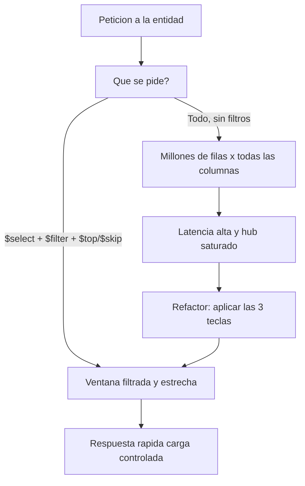

El servicio funciona en la demo con cincuenta registros. Sube a producción, la tabla tiene dos millones de filas, y la app tarda ocho segundos en pintar una lista de veinte. El servicio no ha cambiado; ha cambiado el volumen. El rendimiento en OData no es magia: son tres teclas que o pulsas o pagas. `$select`, `$filter` y la paginación.

## Las tres teclas

- **`$select` recorta lo ancho**: pides solo las columnas que la pantalla muestra. `$select=Customerid,Name,City` en vez de traer los cuarenta campos de la entidad.
- **`$filter` recorta lo alto**: reduces las filas en el origen, no en el cliente. `$filter=shipvia eq 'DHL'` filtra en el backend, no te traes todo para descartar en el navegador.
- **La paginación evita traer el mundo**: `$top` y `$skip` traen una ventana. `$top=20&$skip=40` es la tercera página de veinte.

Y para saber cuántas páginas hay sin traerlas todas, `$count`.



## Cómo se implementa, no solo cómo se pide

Pedir bien desde el cliente no basta: el backend tiene que respetar la petición. En el modelo clásico del Gateway, dentro del `GET_ENTITYSET` recibes los parámetros de la consulta y **debes empujarlos al origen**:

```abap
METHOD paymentsset_get_entityset.
  " Paginacion: leer $top y $skip para acotar la lectura
  DATA(lv_top)  = io_tech_request_context->get_top( ).
  DATA(lv_skip) = io_tech_request_context->get_skip( ).

  " $filter: obtener las opciones de filtrado del contexto
  DATA(lt_filter) = io_tech_request_context->get_filter( )->get_filter_select_options( ).

  " La clave del rendimiento: aplicar top, skip y filtro EN el SELECT,
  " no leer todo y recortar despues en ABAP.
  " Leer todo y filtrar en memoria es el error mas caro del Gateway.
ENDMETHOD.
```

El pecado capital: hacer un `SELECT *` sin `WHERE` y luego aplicar el filtro en un `LOOP` sobre la tabla interna. Le trajiste dos millones de filas a la memoria del servidor de aplicaciones para quedarte con veinte. El `$filter` tiene que llegar hasta el `WHERE` del SELECT.

## El orden mental correcto

1. **Filtra** primero (menos filas que mover).
2. **Selecciona** después (menos columnas por fila).
3. **Pagina** al final (una ventana, no todo).

Ese orden no es estético: es el que minimiza los datos que viajan en cada capa, desde HANA hasta el navegador.

> Un servicio OData no es lento por OData. Es lento porque alguien trajo el millón de filas cuando la pantalla mostraba veinte. Filtra, selecciona, pagina: las tres o ninguna.

Con esto cerramos la serie de ABAP OData: de la elección de versión al rendimiento en producción. El hilo común es el mismo de siempre: decidir antes de escribir la primera línea.
