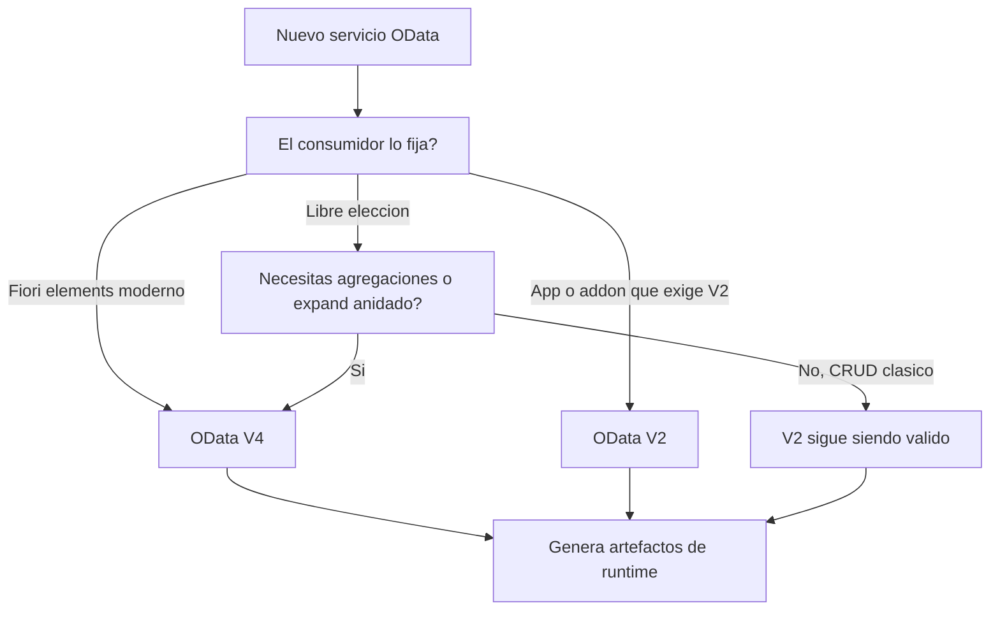

La pregunta llega en cada proyecto nuevo: ¿montamos el servicio en OData V2 o en V4? Y casi siempre se responde mal, por dos motivos opuestos. Unos eligen V2 "porque es lo que sabemos" y arrastran una decisión de hace diez años. Otros eligen V4 "porque es lo nuevo" sin saber qué ganan. Vamos a fijar el criterio.

## Qué cambia de verdad de V2 a V4

V4 no es "V2 con un número más grande". Son diferencias que se notan en el runtime:

- **Payload más ligero**: V4 recorta el JSON de respuesta. Menos metadatos repetidos por registro, menos bytes en la red.
- **Consultas más ricas**: V4 amplía lo que puedes pedir con `$filter`, `$expand` anidado, `$apply` para agregaciones. Con V2 muchas de esas cosas las tenías que resolver a mano en el backend.
- **Estándar OASIS**: V4 es un estándar abierto de verdad, no una variante SAP. Eso importa cuando el consumidor no es Fiori.
- **Herramienta distinta**: en SEGW creas el proyecto marcando explícitamente V2 o V4, y el modelo de clases de runtime que generas no es el mismo.

## El criterio que uso en proyecto



La regla corta: **si el consumidor no te obliga a V2, y estás empezando de cero, arranca en V4**. Lo que no debes hacer es reescribir un servicio V2 estable y probado solo para "modernizar". Eso es coste sin retorno.

## Un proyecto V4 real, paso a paso

En SEGW un proyecto V4 (por ejemplo `ZBILLING`) parte de tus tablas de diccionario, importa las entidades y define la navegación entre ellas. La secuencia práctica es esta:

```abap
" Modelo V4 en SEGW: se definen entidades desde tablas DDIC
" InvoiceHeader  -> tabla de cabeceras de factura
" InvoiceItems   -> tabla de posiciones
" y una navegacion InvoiceHeader --> InvoiceItems (1..*)

" Tras modelar, el paso que NO se puede olvidar:
" Generar los artefactos de tiempo de ejecucion del servicio.
" En V4 el servicio queda listo sin pasar por el hub clasico
" de la misma forma que en V2.
```

Fíjate en el punto que a todo el mundo se le olvida: en V4 hay que **generar los artefactos de tiempo de ejecución** después de modelar. Sin ese paso el servicio no existe, aunque el modelo esté perfecto. Es el equivalente moderno a la activación en el hub que arrastrábamos de V2.

## El error caro

Migrar de V2 a V4 tocando solo la versión y esperando que el consumidor no se entere. El JSON cambia, la navegación cambia, la forma de pedir `$expand` cambia. Un cliente escrito contra V2 se rompe. Si migras, migras las dos puntas o no migras.

> V4 no es mejor por ser nuevo. Es mejor cuando el consumidor pide lo que V4 hace bien. Elegir por moda cuesta lo mismo que no elegir.

En el próximo post: cómo exponer un servicio OData directamente desde una vista CDS sin tocar SEGW, y cuándo eso es buena idea y cuándo no.
