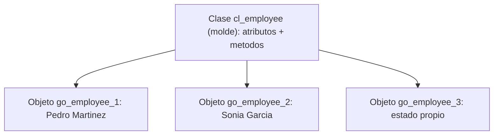

La mayoría del ABAP orientado a objetos que ves en los proyectos no es orientado a objetos. Es código procedimental metido dentro de una clase estática, con un `CLASS-METHODS` gigante que hace de todo. El problema de fondo casi siempre es el mismo: **confundir la clase con el objeto**.

## El molde y el mueble

Una clase es un molde: define atributos (variables) y métodos (funciones) comunes a un tipo de cosa. Un objeto es lo que sale del molde: una instancia con identidad propia y su propio estado. Dos objetos de la misma clase pueden tener valores idénticos y aun así no ser el mismo objeto, igual que dos tazas de café iguales siguen siendo dos tazas.

Esa capacidad de crear muchas instancias en tiempo de ejecución, cada una con su estado, sobre el mismo código, es la característica clave de la orientación a objetos. Si tu clase nunca se instancia, no estás haciendo OO: estás haciendo un grupo de funciones con otro nombre.



## Referencia, no el objeto

En ABAP nunca sostienes un objeto directamente: sostienes una referencia que apunta a él. La variable referenciada, o vale `INITIAL`, o apunta a una instancia existente. La declaras con `TYPE REF TO` y creas el objeto con `NEW` (lo recomendado en ABAP Cloud) o con la clásica `CREATE OBJECT`.

```abap
CLASS cl_employee DEFINITION.
  PUBLIC SECTION.
    METHODS constructor IMPORTING iv_name TYPE string.
    METHODS get_name RETURNING VALUE(rv_name) TYPE string.
  PRIVATE SECTION.
    DATA mv_name TYPE string.
ENDCLASS.

CLASS cl_employee IMPLEMENTATION.
  METHOD constructor.
    mv_name = iv_name.
  ENDMETHOD.
  METHOD get_name.
    rv_name = mv_name.
  ENDMETHOD.
ENDCLASS.

DATA go_employee TYPE REF TO cl_employee.
go_employee = NEW #( iv_name = 'Pedro Martinez' ).
```

Fíjate en el constructor: es un método especial que el sistema llama solo, una vez, justo después de crear el objeto con `NEW`. No lo invocas tú a mano. Es tu única oportunidad de dejar el objeto en un estado inicial válido, y por eso el estado no debería poder existir a medias.

## De instancia frente a estático

El otro corte importante: atributos y métodos de instancia (uno por objeto, con `DATA` y `METHODS`) frente a estáticos (uno por clase, con `CLASS-DATA` y `CLASS-METHODS`). Un atributo estático es compartido: si lo cambias en un objeto, cambia para todos. Se accede al de instancia con `->` y al estático con `=>`.

```abap
go_employee->get_name( ).      " metodo de instancia
cl_file=>word.                 " constante estatica de la clase
```

El error clásico es declarar todo estático "porque es más cómodo de llamar". Cómodo hoy; el día que necesitas dos estados en paralelo, tu clase estática no te deja y reescribes.

> Una clase que nunca se instancia no es orientación a objetos: es un grupo de funciones con abrigo nuevo.

En el próximo post: encapsulación de verdad, las tres secciones de visibilidad y por qué un atributo público es casi siempre una deuda que pagas en el mantenimiento.
