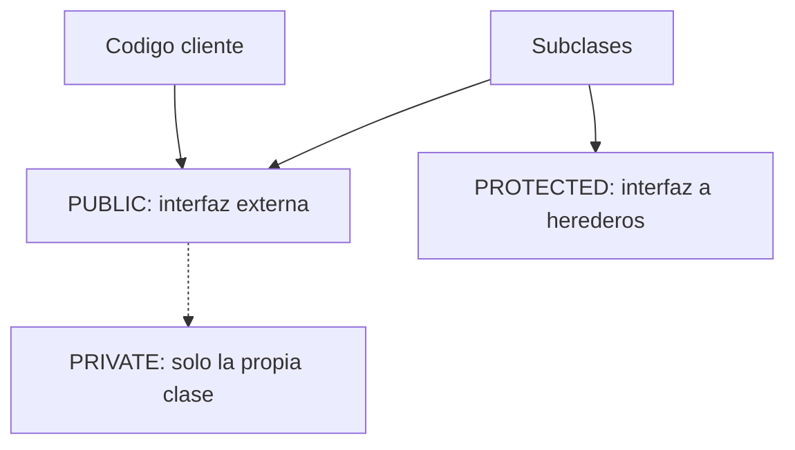

Encapsular es unir, dentro del mismo objeto, sus datos y su comportamiento, y tratar el objeto como una caja negra: solo sus métodos tocan sus datos. Suena a diapositiva de formación. En la práctica se traduce en una regla incómoda: **cada componente que declaras público es una promesa que no podrás romper sin romperle el código a otro**.

## Las tres secciones son un contrato

La parte declarativa de una clase se parte en tres áreas de visibilidad, y cada componente vive obligatoriamente en una:

- `PUBLIC SECTION`: accesible por todo el mundo. Es la interfaz externa de la clase.
- `PROTECTED SECTION`: accesible por la clase y sus subclases. Es la interfaz hacia tus herederos.
- `PRIVATE SECTION`: solo visible dentro de la propia clase. Es tu cocina.



La regla de diseño es dura y contraintuitiva: **declara tan poco público como puedas**. Todo lo que expones en `PUBLIC SECTION` entra en el contrato con tus clientes. Si mañana quieres cambiar un tipo, un nombre o eliminar un método, cada consumidor que lo usaba se rompe. Lo privado, en cambio, lo cambias cuando quieras: nadie de fuera lo ve.

## El atributo público, casi siempre un error

Si quieres encapsular de verdad el estado de un objeto, no declares ningún atributo público. Expón el estado a través de métodos, no de campos. Y cuando de verdad necesites que algo se lea desde fuera pero nadie lo modifique, tienes `READ-ONLY`:

```abap
CLASS cl_account DEFINITION.
  PUBLIC SECTION.
    DATA mv_balance TYPE p LENGTH 13 DECIMALS 2 READ-ONLY.
    METHODS deposit IMPORTING iv_amount TYPE p.
  PRIVATE SECTION.
    METHODS validate IMPORTING iv_amount TYPE p
                     RETURNING VALUE(rv_ok) TYPE abap_bool.
ENDCLASS.

CLASS cl_account IMPLEMENTATION.
  METHOD deposit.
    IF validate( iv_amount ) = abap_true.
      mv_balance = mv_balance + iv_amount.
    ENDIF.
  ENDMETHOD.
  METHOD validate.
    rv_ok = xsdbool( iv_amount > 0 ).
  ENDMETHOD.
ENDCLASS.
```

Cualquiera puede leer `mv_balance`, pero solo `deposit` lo cambia, y solo si pasa por `validate`. El método de validación es privado porque es un detalle interno: nadie de fuera necesita saber cómo compruebas un importe, y si mañana cambias la regla no rompes a nadie.

## Constantes y tipos también encapsulan

Las mismas tres secciones valen para `CONSTANTS` y `TYPES`. Un tipo declarado en la sección pública se usa desde fuera con `=>`; uno en la privada solo vive dentro. Colocar cada declaración en su sección no es adorno: es decidir, de forma explícita, qué forma parte del contrato y qué no.

```abap
CLASS cl_file DEFINITION.
  PUBLIC SECTION.
    CONSTANTS word TYPE char4 VALUE 'DOCX'.
ENDCLASS.

" desde fuera:
DATA(lv_ext) = cl_file=>word.
```

> Declarar de más cuesta un minuto hoy. Rectificarlo cuesta buscar cada consumidor que se acopló a lo que nunca debiste exponer.

En el próximo post: interfaces frente a herencia, y por qué ABAP resuelve la herencia múltiple sin admitirla.
