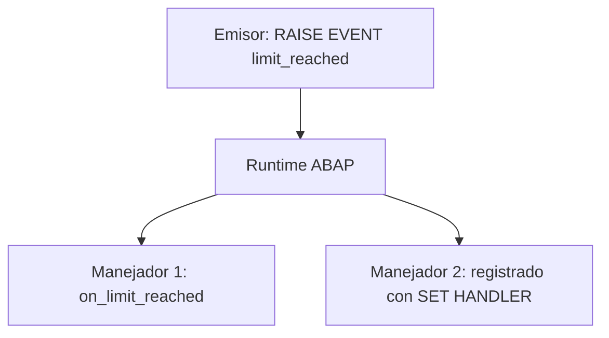

Atributos y métodos son los dos componentes que todo el mundo conoce. El tercero, los eventos, es el que casi nadie usa bien, y es una pena, porque es la vía más limpia que tiene ABAP para desacoplar de verdad dos partes de un sistema. La idea incómoda pero potente: **el objeto que provoca la acción no sabe, ni necesita saber, quién va a reaccionar**.

## Causa y efecto, separados

En una llamada a método normal, el cliente decide a quién llama y cuándo. Con eventos se invierte: la clase emisora lanza un evento y el sistema en tiempo de ejecución invoca automáticamente a los manejadores registrados. El emisor no llama a nadie por su nombre. Mientras desarrollas la clase que dispara el evento no necesitas saber nada de la que lo va a tratar; ni siquiera cuántas habrá.



## Definir, lanzar, tratar

Los eventos de instancia se declaran con `EVENTS` (los estáticos con `CLASS-EVENTS`) y solo admiten parámetros de exportación pasados por valor. Se disparan con `RAISE EVENT`. Un método se declara manejador con `FOR EVENT ... OF`, y lo que el evento exporta llega al manejador como parámetros de importación.

```abap
CLASS lcl_main DEFINITION.
  PUBLIC SECTION.
    DATA    lv_counter TYPE i.
    METHODS process IMPORTING iv_number TYPE i.
    EVENTS  limit_reached.
ENDCLASS.

CLASS lcl_main IMPLEMENTATION.
  METHOD process.
    lv_counter = iv_number.
    IF iv_number >= 2.
      RAISE EVENT limit_reached.
    ENDIF.
  ENDMETHOD.
ENDCLASS.

CLASS lcl_handler DEFINITION.
  PUBLIC SECTION.
    METHODS on_limit_reached FOR EVENT limit_reached OF lcl_main.
ENDCLASS.

CLASS lcl_handler IMPLEMENTATION.
  METHOD on_limit_reached.
    WRITE 'Evento procesado'.
  ENDMETHOD.
ENDCLASS.
```

## El registro es lo que enciende todo

Un manejador declarado no hace nada por sí solo. El evento solo llega a quien se ha registrado explícitamente con `SET HANDLER`. Sin ese paso, `RAISE EVENT` dispara al vacío:

```abap
DATA lo_main    TYPE REF TO lcl_main.
DATA lo_handler TYPE REF TO lcl_handler.

lo_main    = NEW #( ).
lo_handler = NEW #( ).

SET HANDLER lo_handler->on_limit_reached FOR lo_main.

lo_main->process( 5 ).   " dispara el evento y se ejecuta el manejador
```

El registro solo vive durante la ejecución del programa. Puedes desregistrar con `ACTIVATION ' '`, y con `FOR ALL INSTANCES` registrar un manejador para todas las instancias de la clase, incluso las que aún no existen: la única forma de escuchar objetos futuros.

## Dos trampas que muerden

- **El orden no está garantizado.** Si registras varios manejadores para el mismo evento, ABAP no promete en qué secuencia los llama. Si tu lógica depende del orden, los eventos son la herramienta equivocada.
- **El SENDER es tu ancla.** Además de los parámetros del evento, siempre puedes declarar el parámetro predefinido `SENDER` en el manejador: te llega la referencia al objeto que disparó el evento. Sin él, un manejador registrado en varios emisores no sabe cuál le habló.

> Los eventos brillan cuando la causa ya está disparada y lo único que cambia con el tiempo es quién reacciona. Añades un manejador y ya está; el emisor ni se entera.

Con esto cerramos la serie de fundamentos de ABAP OO: clases y objetos, encapsulación, interfaces frente a herencia, polimorfismo, excepciones y eventos. El siguiente paso natural es llevar todo esto a ABAP Cloud y RAP, donde estos mismos principios dejan de ser teoría y se convierten en la única forma de construir.
