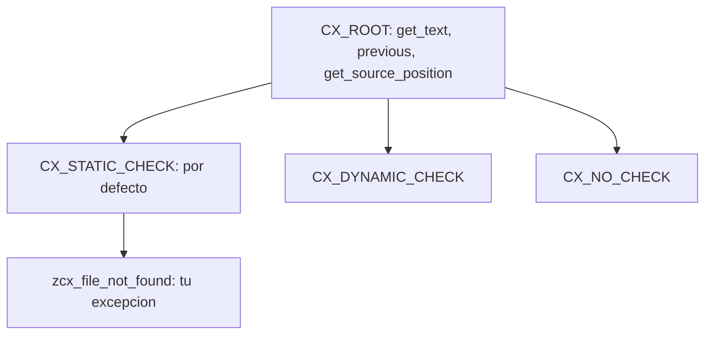

Sigue habiendo código nuevo que comprueba `sy-subrc` tras cada operación y confía en que el siguiente que lo lea entienda qué significaba un `4` en aquella línea. Desde SAP Web AS 6.10 tienes algo mucho mejor: **excepciones basadas en clases**, donde un error es un objeto con estado, no un código numérico que hay que descifrar de memoria.

## Un error es un objeto

Una excepción basada en clases es una instancia de una clase de excepción. Sus atributos llevan la información del error. Lanzarla es instanciar esa clase y fijar sus atributos; tratarla es evaluar ese objeto. Se emite con `RAISE EXCEPTION` y se intercepta con `TRY ... CATCH ... ENDTRY`.

```abap
TRY.
    DATA(lo_reader) = NEW zcl_file_reader( ).
    lo_reader->open( iv_path = lv_path ).
  CATCH zcx_file_not_found INTO DATA(lx_error).
    MESSAGE lx_error->get_text( ) TYPE 'E'.
ENDTRY.
```

`GET_TEXT` te da el texto descriptivo y `GET_SOURCE_POSITION` el programa y la línea exacta donde saltó. No lo tienes que reconstruir tú: viene en el objeto.

## La jerarquía manda

Toda clase de excepción desciende de `CX_ROOT`, pero no puedes heredar directamente de ella. Tu clase propia debe derivar de una de sus tres subclases, y esa elección cambia cómo la trata el chequeo de sintaxis:

- `CX_STATIC_CHECK`: es el grupo por defecto y el que debes usar casi siempre. Máxima verificación sintáctica: el compilador te obliga a declarar o tratar la excepción.
- `CX_DYNAMIC_CHECK`: se verifica en tiempo de ejecución. Para casos concretos.
- `CX_NO_CHECK`: no se verifica. Reservado para errores que pueden ocurrir en cualquier parte.



Como todas derivan de `CX_ROOT`, un `CATCH cx_root` atrapa cualquier cosa. Úsalo con cabeza: capturar demasiado genérico esconde errores que preferirías ver.

## Encadenar con PREVIOUS: no pierdas la causa raíz

Aquí está el detalle que separa un log útil de uno inservible. Un objeto de excepción deja de ser válido al salir de su `CATCH`. Si interceptas una excepción de bajo nivel y lanzas otra de más alto nivel sin más, **pierdes la causa original**. La solución es encadenar: cada clase de excepción expone el atributo público `PREVIOUS` (de tipo `REF TO CX_ROOT`) y su constructor acepta un parámetro `PREVIOUS`.

```abap
TRY.
    lo_db->select( ).
  CATCH cx_sy_open_sql_db INTO DATA(lx_sql).
    RAISE EXCEPTION TYPE zcx_order_load_failed
      EXPORTING previous = lx_sql.
ENDTRY.
```

Ahora `zcx_order_load_failed` apunta a la excepción SQL que lo provocó, que a su vez puede apuntar a su predecesora. El tratador de arriba recorre la cadena `PREVIOUS` y reconstruye la historia completa: qué falló, dónde y por qué. Es la diferencia entre "error al cargar el pedido" y "error al cargar el pedido porque la conexión a BD se cayó en tal línea".

Y si un `TRY` necesita limpiar recursos aunque salte una excepción que se trata más arriba, tienes el bloque `CLEANUP`, que se ejecuta al abandonar la estructura sin tratador propio.

> Un error que solo dice qué falló es la mitad de un error. Encadena con PREVIOUS y guarda también el porqué.

En el próximo post: eventos en orientación a objetos, cómo desacoplar el que provoca la acción del que reacciona, sin que ninguno conozca al otro.
