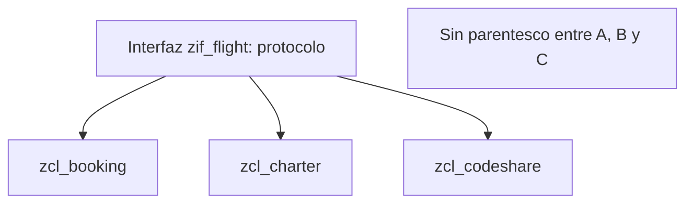

Cuando dos clases comparten comportamiento, el reflejo del desarrollador ABAP es crear una superclase y heredar. A veces está bien. Muchas veces es atarte a un árbol genealógico del que ya no puedes salir. **ABAP solo admite herencia simple**: una clase, un único padre. Y esa limitación, lejos de ser un problema, es una pista sobre qué deberías usar.

## Herencia: reutilizar y especializar

Con `INHERITING FROM`, una subclase recibe los componentes públicos y protegidos de su superclase (los privados existen pero no los ve) y puede especializar cualquier método público o protegido con `REDEFINITION`. La firma no cambia; solo la implementación. Dentro de la redefinición puedes llamar a `super->` para reutilizar lo que ya hacía el padre.

```abap
CLASS cl_vehicle DEFINITION.
  PUBLIC SECTION.
    METHODS describe RETURNING VALUE(rv_text) TYPE string.
ENDCLASS.

CLASS cl_car DEFINITION INHERITING FROM cl_vehicle.
  PUBLIC SECTION.
    METHODS describe REDEFINITION.
ENDCLASS.

CLASS cl_car IMPLEMENTATION.
  METHOD describe.
    rv_text = |{ super->describe( ) }, subtipo coche|.
  ENDMETHOD.
ENDCLASS.
```

El coste está en el acoplamiento: si tocas la superclase, alteras a todas sus subclases. Una jerarquía profunda es difícil de entender y peligrosa de cambiar.

## Interfaces: mismo protocolo, implementaciones distintas

Una interfaz es una clase superior que no se instancia, no tiene implementación y solo declara componentes públicos. Sirve para lo que la herencia no sabe hacer bien: **definir un protocolo uniforme que varias clases sin parentesco cumplen a su manera**. Y como una clase puede implementar todas las interfaces que quiera, es así como ABAP simula la herencia múltiple sin admitirla.

```abap
INTERFACE zif_flight.
  METHODS get_flight RETURNING VALUE(rv_id) TYPE string.
ENDINTERFACE.

INTERFACE zif_customer.
  METHODS get_customer RETURNING VALUE(rv_name) TYPE string.
ENDINTERFACE.

CLASS zcl_booking DEFINITION.
  PUBLIC SECTION.
    INTERFACES: zif_flight, zif_customer.
ENDCLASS.

CLASS zcl_booking IMPLEMENTATION.
  METHOD zif_flight~get_flight.
  ENDMETHOD.
  METHOD zif_customer~get_customer.
  ENDMETHOD.
ENDCLASS.
```

Se accede a los componentes con el operador `~`, o con `ALIASES` si quieres una forma corta. Dato que decide muchos diseños: normalmente **quien define la interfaz es quien consume el servicio**, no quien lo provee. El cliente describe qué espera y cada clase decide si lo cumple.



## Cómo elegir

- Si de verdad hay una relación "es un" y quieres compartir código ya implementado, hereda de una superclase (o abstracta).
- Si solo necesitas que varias clases hablen el mismo idioma sin parentesco real, define una interfaz.
- Recuerda el precio de cada una: añadir un método a una interfaz obliga a todas las clases que la implementan a implementarlo; añadir un método no abstracto a una superclase no obliga a nada.

> La herencia comparte implementación; la interfaz comparte contrato. Casi siempre lo que necesitas compartir es el contrato.

En el próximo post: polimorfismo y casting, cómo una referencia del padre ejecuta el método del hijo y cuándo el casting explota en tiempo de ejecución.
