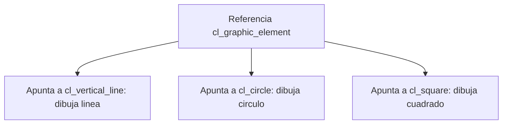

El polimorfismo es la parte de la orientación a objetos que parece magia hasta que la entiendes, y entonces se vuelve la herramienta más útil que tienes para escribir código genérico. La idea: **un único punto de acceso, comportamientos distintos según el objeto real que haya detrás**. Y en ABAP todo pasa por las referencias, porque a un objeto solo se llega a través de una referencia.

## Una referencia del padre que ejecuta al hijo

Si `cl_vertical_line` hereda de `cl_graphic_element` y redefine `draw`, puedes declarar una referencia del tipo del padre, apuntarla a un objeto del hijo y llamar al método. Se ejecuta la versión del hijo, no la del padre:

```abap
CLASS cl_graphic_element DEFINITION.
  PUBLIC SECTION.
    METHODS draw.
ENDCLASS.
CLASS cl_graphic_element IMPLEMENTATION.
  METHOD draw.
    WRITE / 'Elemento grafico'.
  ENDMETHOD.
ENDCLASS.

CLASS cl_vertical_line DEFINITION INHERITING FROM cl_graphic_element.
  PUBLIC SECTION.
    METHODS draw REDEFINITION.
ENDCLASS.
CLASS cl_vertical_line IMPLEMENTATION.
  METHOD draw.
    WRITE / 'Linea vertical'.
  ENDMETHOD.
ENDCLASS.

DATA go_element TYPE REF TO cl_graphic_element.
go_element = NEW cl_vertical_line( ).
go_element->draw( ).   " imprime 'Linea vertical'
```

Ese es el truco entero: iteras una tabla de `cl_graphic_element`, llamas `draw` sobre cada uno y cada objeto dibuja lo suyo. No hay `IF tipo = circulo` por ningún lado. Funciona igual con interfaces: una referencia de tipo interfaz apuntando a una clase que la implementa ejecuta la implementación de la clase.



## Narrowing y widening cast

Para que el polimorfismo funcione tienes que mover referencias entre tipos. Aquí es donde la gente se quema.

- **Narrowing cast** (de específico a genérico): asignas una instancia de la subclase a una referencia de la superclase. Siempre es seguro, porque el hijo tiene al menos todo lo que tiene el padre. Es una asignación normal con `=`.
- **Widening cast** (de genérico a específico): quieres volver a una referencia de la subclase. No es seguro, porque el objeto podría no ser de esa subclase. El compilador te obliga a usar el operador `?=` (o `CAST`), asumiendo tú el riesgo.

```abap
DATA go_element TYPE REF TO cl_graphic_element.
DATA go_line    TYPE REF TO cl_vertical_line.

go_element = NEW cl_vertical_line( ).   " narrowing, seguro

TRY.
    go_line ?= go_element.               " widening, puede fallar
  CATCH cx_sy_move_cast_error.
    " el objeto no era una cl_vertical_line
ENDTRY.
```

Si el objeto real no encaja con el tipo destino, el widening cast lanza `CX_SY_MOVE_CAST_ERROR` en tiempo de ejecución. Nunca hagas un widening cast a pelo si no controlas al 100% el tipo: envuélvelo en un `TRY ... CATCH`.

## La trampa: crear el objeto en la referencia genérica

Recuerda que no puedes instanciar sobre una referencia de interfaz o de clase abstracta con `NEW #( )` a secas: el compilador no sabe qué tipo concreto crear. Pero sí puedes indicarle la clase en la misma sentencia:

```abap
DATA go_employee TYPE REF TO zif_employee.
go_employee = NEW zcl_administrator( ).   " tipo concreto explicito
```

> El polimorfismo te ahorra el IF por tipo; el casting es el precio, y se paga en tiempo de ejecución si no lo controlas.

En el próximo post: excepciones basadas en clases, la jerarquía de CX_ROOT y por qué encadenar excepciones con PREVIOUS te salva la vida en el análisis de errores.
