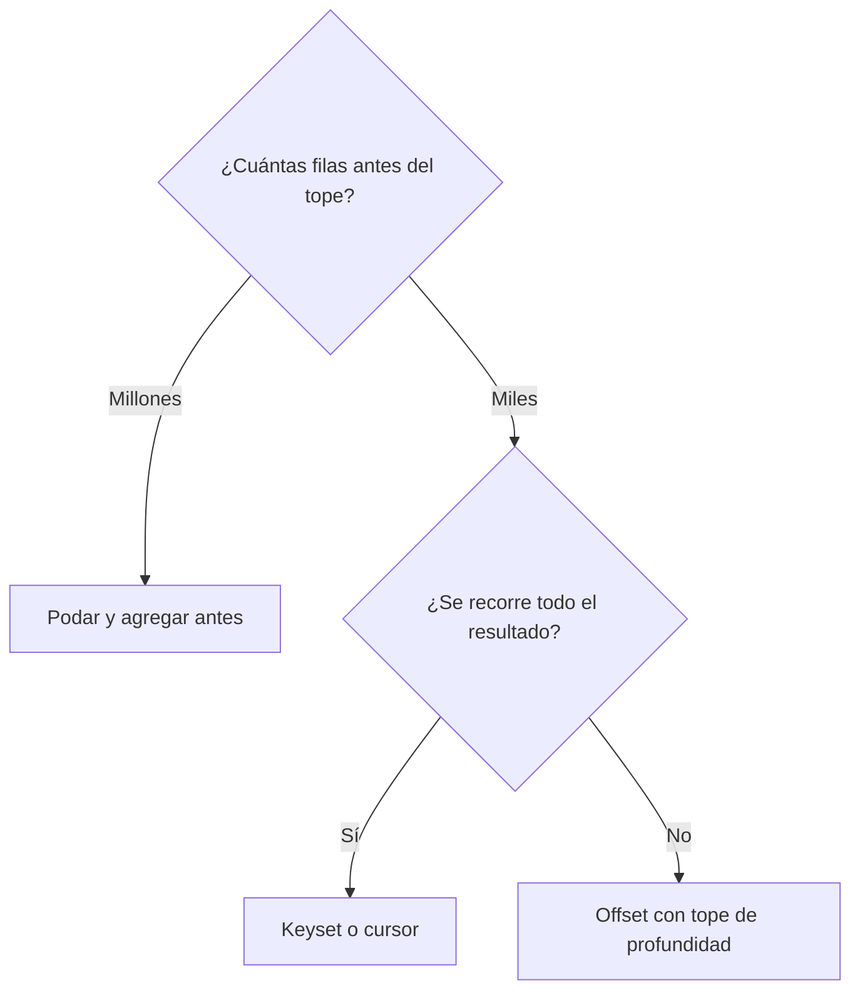

Un resultado de dos millones de filas no se entrega de una vez: se entrega por páginas. La forma de pedir a la base de datos la página número N determina el coste, y la diferencia entre las dos técnicas habituales no es apreciable en la página tres. En la página quinientos, sí.

Este artículo compara ambas técnicas con mediciones en un laboratorio propio (SAP S/4HANA 2025 sobre SAP HANA 2.0 SPS 08, con datos sintéticos), expone los requisitos de cada una y termina con un criterio de elección por escenario.

## Offset: pedir a partir de una posición

Es la técnica más extendida y la que aplican los protocolos de consumo cuando se usan sus parámetros de salto y tope (`$skip` y `$top` en OData).

```abap
" Página de 1.000 filas a partir de la posición lv_offset
SELECT rbukrs, belnr, docln
  FROM zcdsa_glitem
  WHERE rldnr = '0L' AND gjahr = '2025'
  ORDER BY rbukrs, belnr, docln
  INTO TABLE @lt_page
  UP TO 1000 ROWS
  OFFSET @lv_offset.
```

La sentencia se lee como «mil filas a partir de la posición indicada». Para cumplirla, el motor necesita saber cuál es la fila número quinientos mil en ese orden, y para ello **produce las quinientas mil filas anteriores y las descarta**. El trabajo descartado crece con la profundidad de la página, de modo que recorrer el resultado completo por páginas tiene un coste que crece con el cuadrado del número de páginas.

ABAP SQL exige `ORDER BY` para usar `OFFSET`, y la documentación de SAP advierte de que, si el orden no es único, no es posible determinar qué filas componen el resultado. Un orden que termine en la clave completa es la primera condición de cualquier paginación.

## Keyset: pedir a partir de la última clave entregada

La alternativa no usa posiciones, sino el valor de la clave por la que se ordena. `keyset` no es una palabra clave del lenguaje: no existe ninguna cláusula con ese nombre ni en ABAP SQL ni en el SQL de HANA. Es el nombre de un patrón, que la literatura técnica denomina también paginación por clave o *seek method*. Todo lo que contiene el código es un `WHERE` escrito de una forma concreta y un tope de filas.

```abap
" Página siguiente a la última clave entregada (ls_last)
SELECT rbukrs, belnr, docln
  FROM zcdsa_glitem
  WHERE rldnr = '0L' AND gjahr = '2025'
    AND (    rbukrs > @ls_last-rbukrs
          OR ( rbukrs = @ls_last-rbukrs AND belnr > @ls_last-belnr )
          OR ( rbukrs = @ls_last-rbukrs AND belnr = @ls_last-belnr
               AND docln > @ls_last-docln ) )
  ORDER BY rbukrs, belnr, docln
  INTO TABLE @lt_page
  UP TO 1000 ROWS.
```

La cascada de condiciones expresa una única idea: todo lo que viene después de esta clave, en este orden. Se escribe así porque la clave de ordenación tiene tres campos y la comparación es lexicográfica: primero el primer campo; si coincide, el segundo; si también coincide, el tercero.

Las filas anteriores a la página no se producen para después descartarlas: las excluye el propio filtro. Por eso el coste de una página no depende de su profundidad.

> **La cascada de `OR` no es un OR-join.** Tiene el mismo aspecto que el antipatrón del `OR` en una condición de join, pero está en el `WHERE`, actúa sobre una sola tabla y sigue un orden total. No hay ningún emparejamiento que resolver. La estructura de la construcción importa más que el operador que aparece en ella.

## La curva medida: offset frente a keyset

Condiciones de la medición:

- Tabla del diario del laboratorio, ledger `0L` y ejercicio 2025: unos 2,4 millones de filas.
- Páginas de 1.000 filas y cuatro profundidades: 0, 100.000, 500.000 y 2.000.000 filas saltadas.
- Tres ejecuciones por punto tras una de calentamiento, lanzadas desde una clase de test ABAP en las mismas condiciones para las dos variantes. Se publica la media.

| Filas saltadas | Offset | Keyset |
|---|---|---|
| 0 | 32 ms | 26 ms |
| 100.000 | 1.146 ms | 36 ms |
| 500.000 | 3.786 ms | 32 ms |
| 2.000.000 | 2.013 ms | 15 ms |


La columna de keyset es **plana**: entre 15 y 36 milisegundos, sin relación con la profundidad. La de offset **crece con la profundidad**: con 100.000 filas saltadas, una página cuesta unas 36 veces lo que costaba la primera; con 500.000, más de 100 veces.

Recorrer el resultado completo por keyset supone unas 2.400 páginas de coste constante. Por offset, cada página cuesta lo que indica la curva en su profundidad, y la suma de todas ellas crece con el cuadrado del número de páginas.

### El punto anómalo

El punto de dos millones por offset midió menos que el de quinientas mil, una inversión que contradice la tendencia. La explicación coherente con el laboratorio está en el particionado: la tabla está particionada por hash en cuatro particiones por sociedad, de tamaños muy distintos, y el orden de la consulta empieza por esa misma columna. A profundidades distintas, las filas que el motor produce y descarta proceden de particiones distintas, y el plan de ejecución no tiene por qué ser el mismo.

La conclusión práctica no cambia, y el método tampoco: se publica la curva completa, con sus anomalías, y se decide por su forma, no por un punto aislado. Una medición que solo muestra los puntos que confirman la tesis no permite decidir.

> **Para reproducirlo.** Conviene medir desde un programa o una clase de test, no desde la consola SQL de ADT: en el laboratorio, la consola rechazó `UP TO ... OFFSET` detrás del `ORDER BY` y lo ignoró detrás del `FROM`, de modo que el lado del offset no se puede medir allí con fiabilidad. El método general de medición está descrito en [Analizar rendimiento en HANA](/blog/hana-analisis-rendimiento/).

## Lo que exige el keyset

Ninguna de las dos técnicas es gratuita. El keyset obtiene un coste constante a cambio de tres requisitos:

1. **Un orden total y estable que termine en una clave única.** Si dos filas pueden coincidir en todos los campos del `ORDER BY`, la paginación puede saltarse filas o repetirlas en la frontera entre páginas. Al ordenar por fecha, el desempate con la clave del documento es obligatorio.
2. **Estado.** Alguien tiene que recordar la última clave entregada: el programa, el cliente o un testigo incluido en el enlace a la página siguiente.
3. **Renuncia al acceso aleatorio.** Ir a la página 4.512 deja de ser una operación natural, porque no hay posiciones, solo claves.

## OData: el nextLink no garantiza keyset

En OData, `$top` y `$skip` son paginación por posición por definición: el cliente pide una posición. El modelo OData V4 de SAPUI5 calcula ambos parámetros de forma automática según el rango de filas que solicita el control, de modo que una tabla de Fiori pagina por offset. Es una elección adecuada, porque el usuario de una tabla en pantalla rara vez pasa de las primeras páginas.

La paginación dirigida por el servidor es distinta. El servicio devuelve un resultado parcial con un `@odata.nextLink`, y el protocolo reserva la opción `$skiptoken` para construir ese enlace. El contenido del testigo lo decide el servicio y es opaco para el cliente: puede ser una posición, con la curva de coste del offset, o la última clave entregada, con la del keyset. Antes de basar una exportación masiva en el `nextLink`, conviene comprobar cómo lo construye el servicio concreto. La prueba más directa es comparar el tiempo de respuesta de las últimas páginas con el de las primeras.

## Cursor ABAP para procesos por lotes

Para un proceso por lotes que recorre un conjunto grande dentro del servidor de aplicaciones, la tercera opción es un cursor de base de datos: una única sentencia cuyo resultado se consume por paquetes.

```abap
TYPES: BEGIN OF ty_line,
         accountingdocument TYPE i_journalentryitem-accountingdocument,
         ledgergllineitem   TYPE i_journalentryitem-ledgergllineitem,
         glaccount          TYPE i_journalentryitem-glaccount,
         amount             TYPE i_journalentryitem-amountincompanycodecurrency,
       END OF ty_line.
DATA lt_batch TYPE STANDARD TABLE OF ty_line WITH EMPTY KEY.

OPEN CURSOR @DATA(dbcur) FOR
  SELECT AccountingDocument, LedgerGLLineItem, GLAccount,
         AmountInCompanyCodeCurrency
    FROM I_JournalEntryItem
    WHERE Ledger = '0L' AND CompanyCode = '1010' AND FiscalYear = '2025'
    ORDER BY AccountingDocument, LedgerGLLineItem.

DO.
  " FETCH no admite declaraciones en línea: la tabla se declara antes
  FETCH NEXT CURSOR @dbcur INTO TABLE @lt_batch PACKAGE SIZE 5000.
  IF sy-subrc <> 0.
    EXIT.
  ENDIF.
  " Procesar el paquete
ENDDO.
CLOSE CURSOR @dbcur.
```

Los paquetes de 1.000 a 10.000 filas mantienen la memoria bajo control. El cursor conserva abierto el resultado en la base de datos mientras dura el recorrido, por lo que se reserva a procesos por lotes y no se usa en sesiones interactivas. La documentación recomienda cerrarlo siempre de forma explícita con `CLOSE CURSOR`.

## Criterio de elección

| Escenario | Técnica |
|---|---|
| Tabla en pantalla, donde el usuario rara vez pasa de las primeras páginas | Offset |
| Búsqueda con salto a una página concreta | Offset, con filtros que reduzcan el conjunto y un tope de profundidad explícito |
| Exportación completa a un fichero | Keyset o cursor |
| Integración que descarga incrementos | Keyset, con la marca de tiempo como parte del testigo |
| Proceso por lotes sobre una tabla grande | Cursor con paquetes de 1.000 a 10.000 filas |
| Informe analítico con navegación | Primero, filtros que reduzcan el conjunto; después, cualquiera de las dos |

La misma decisión, en forma de árbol:



## La regla que está por encima de las dos

**Si el tope de filas llega después de agrupar millones de filas, el problema no es la paginación: es el modelo.** Un informe que agrupa un ejercicio completo, ordena el resultado y después conserva las primeras filas no tiene un problema de paginación. El tope se aplica cuando el trabajo costoso ya se ha realizado y no evita ningún coste. La corrección consiste en filtrar y agregar antes, en la capa de datos: el principio de [code-to-data](/blog/hana-code-to-data/) aplicado al diseño de la vista. Los filtros que llegan pronto a la vista, por ejemplo mediante [parámetros tipados](/blog/cds-parametros/), reducen el conjunto antes de cualquier paginación.

## Síntesis

1. El offset produce y descarta todo lo que salta, de modo que su coste crece con la profundidad de la página. En el laboratorio pasó de 32 ms en la primera página a 3.786 ms con 500.000 filas saltadas.
2. El keyset filtra por la última clave entregada, de modo que su coste no depende de la profundidad. En la misma medición se mantuvo entre 15 y 36 ms.
3. El keyset exige un orden total terminado en clave única, un estado que recuerde la última clave y la renuncia al acceso aleatorio.
4. En OData, `$skip` es offset; un `nextLink` con `$skiptoken` puede ser cualquiera de las dos técnicas, según el servicio.
5. Las anomalías de una curva se publican y se explican; no se recortan.
6. Ninguna técnica de paginación corrige un modelo que materializa millones de filas antes de descartarlas.

El diseño de vistas CDS para grandes volúmenes se trabaja con ejercicios guiados en el curso [SAP ABAP Cloud CDS: Core Data Services](/courses/sap-abap-cloud-cds-core-data-services/) y en el libro [ABAP Cloud: Modelado de Datos con CDS](/books/abap-cds/).
