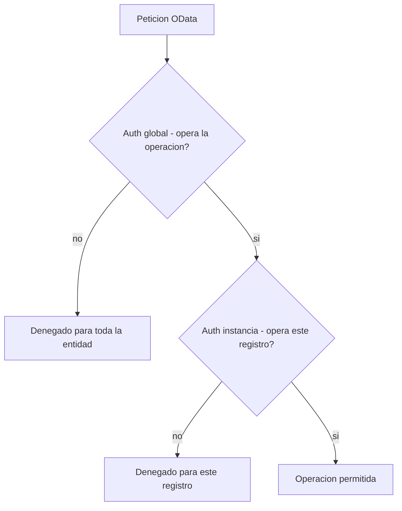

RAP tiene dos mecanismos de autorización que resuelven preguntas distintas. "¿Puede este usuario borrar registros?" es global. "¿Puede borrar **este** registro, que pertenece a un centro al que no tiene acceso?" es de instancia. Elegir mal no da un error de compilación: da un agujero de seguridad silencioso.

## Los dos niveles

- **Global**: se aplica a **toda** la entidad. Sirve para vetar operaciones enteras (por ejemplo, "este grupo de usuarios no puede crear ni borrar, solo leer"). No mira el contenido del registro.
- **Instancia**: se evalúa **registro a registro** según sus datos (código de sociedad, centro, estado). Un usuario puede editar unos registros y otros no, dependiendo de lo que contengan.



## Declararlas en la behavior definition

Se activan en la cabecera con `authorization master ( ... )`. Puedes pedir una, otra o las dos:

```cds
define behavior for I_SalesOrder alias SalesOrder
persistent table zsalesorder
lock master
authorization master ( global, instance )
{
  create;
  update;
  delete;

  // una accion tambien puede exigir su propia comprobacion
  action ( authorization : update ) approve result [1] $self;
}
```

Cada modo que declaras genera un método que debes implementar en la Behavior Pool:

- `authorization master ( global )` genera `get_global_authorizations`: decides ahí, con los objetos de autorización clásicos, qué operaciones se habilitan para el usuario.
- `authorization master ( instance )` genera `get_instance_authorizations`: recibes las claves de los registros y decides, mirando sus datos, cuáles puede tocar.

## La regla para elegir

Empieza por **instancia** si el acceso depende del contenido (lo normal en datos de negocio: por sociedad, por organización de ventas, por estado del documento). Añade **global** solo si además hay operaciones que quieres vetar en bloque a ciertos perfiles. Muchos objetos de negocio bien diseñados usan solo instancia; el global entra cuando hay una segregación de roles clara por encima del dato.

Y no olvides las acciones: una acción custom como `approve` puede llevar su propia `authorization : update`, `instance`, `global` o `none`. Una acción sensible sin comprobación es la puerta trasera que nadie revisa hasta que la auditan.

> "Compila y funciona en la demo" no significa "está autorizado". La autorización de instancia solo protege si el método `get_instance_authorizations` está implementado; vacío, deja pasar todo.

En el próximo post: EML, cómo leer y modificar entidades de negocio desde código sin escribir un solo SELECT.
