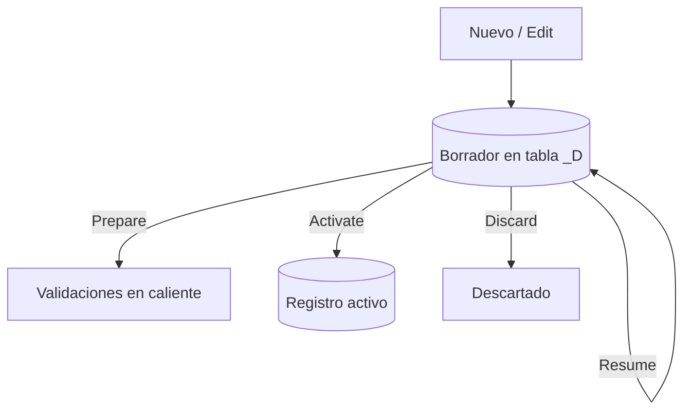

Un usuario rellena media ficha, se va a consultar un dato y vuelve. Sin Draft, o ha perdido el trabajo o has metido un registro a medias en la base de datos de producción. El modo Draft de RAP resuelve exactamente ese momento: guarda el progreso en una tabla temporal y solo persiste en la activa cuando el usuario confirma.

## El ciclo de vida de un borrador



Cada flecha del diagrama es una **draft action** que declaras; el framework la implementa.

## Activarlo en la behavior definition

Draft no es un flag suelto: exige tres cosas juntas. La tabla draft (con su include `%admin`), el `total etag`, y el bloque de draft actions.

```cds
managed implementation in class zbp_i_salesorder unique;
strict ( 2 );
define behavior for I_SalesOrder alias SalesOrder
persistent table zsalesorder
draft table zsalesorder_d
lock master
total etag LastChangedAt
etag master LocalLastChangedAt
authorization master ( instance )
{
  create;
  update;
  delete;

  draft action Resume;
  draft action Edit;
  draft action Activate optimized;
  draft action Discard;

  draft determine action Prepare
  {
    validation validateCustomer;
  }

  mapping for zsalesorder { }
}
```

Tres claves para que no te explote:

1. **`total etag` es obligatorio con Draft.** El borrador gestiona concurrencia sobre el volumen total de datos, no solo sobre la instancia; sin el ETag total, el framework no sabe reconciliar dos ediciones.
2. **`Activate optimized`** salta la re-lectura innecesaria al confirmar. Úsalo salvo que tengas lógica de activación custom.
3. **`draft determine action Prepare`** engancha tus validaciones al borrador: se ejecutan en caliente mientras el usuario escribe, no solo al guardar. Es lo que hace que los mensajes de error aparezcan en tiempo real.

## El campo Editing Status no es decorativo

Al activar Draft, la UI de Fiori Elements gana el filtro **Editing Status**: el usuario ve sus borradores, los que la app dejó a medias y los registros bloqueados por otros. Es feedback gratis que solo aparece si el modelo de datos (tabla draft + `%admin`) está bien montado. Si no lo ves, revisa el include antes que nada.

> Draft no es "una feature más de la UI". Es la diferencia entre una app que la gente usa para trabajo real y una que abandonan al primer formulario largo.

En el próximo post: dónde poner cada regla de negocio, con validaciones que vetan el guardado y determinaciones que rellenan campos solas.
