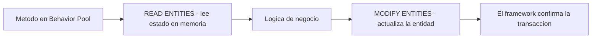

Dentro de un objeto de negocio RAP no accedes a los datos con `SELECT` ni confirmas con `COMMIT`. Lo haces con el **Entity Manipulation Language (EML)**, y el framework se encarga de la transacción. Si vienes de ABAP clásico, este es el cambio mental más grande: dejas de hablarle a la tabla y empiezas a hablarle a la entidad.

## Por qué no un SELECT

El framework RAP mantiene datos en memoria que aún no están en la base de datos: borradores, cambios pendientes de la misma LUW. Un `SELECT` directo no los vería. `READ ENTITIES ... IN LOCAL MODE` lee justo ese estado transaccional, el que el usuario está viendo.



## Leer una entidad

```abap
READ ENTITIES OF i_salesorder IN LOCAL MODE
  ENTITY SalesOrder
  ALL FIELDS WITH CORRESPONDING #( keys )
  RESULT DATA(lt_orders)
  FAILED failed.
```

Lo importante no es la sintaxis, son las claves técnicas que vienen en el resultado y que gobiernan todo lo demás:

- **`%tky`**: la clave técnica de la instancia. Es la que usas para identificar el registro en cualquier operación transaccional.
- **`%is_draft`**: si la instancia está en modo borrador.
- **`%pky`** y **`%key`**: clave persistente y clave de negocio.

El parámetro `keys` llega como `importing` a los métodos de tu Behavior Pool: es la tabla de registros sobre los que tu operación tiene que actuar.

## Modificar una entidad

Nada de `UPDATE dbtab`. Declaras qué campos tocas y con qué valores, iterando sobre `keys` por `%tky`:

```abap
MODIFY ENTITIES OF i_salesorder IN LOCAL MODE
  ENTITY SalesOrder
  UPDATE FIELDS ( OverallStatus )
  WITH VALUE #( FOR key IN keys
                ( %tky         = key-%tky
                  OverallStatus = 'A' ) ).
```

Y una acción que devuelve resultado transfiere los datos actualizados al framework por la tabla `result`, usando `%tky` y `%param`:

```abap
result = VALUE #( FOR ls_order IN lt_orders
                  ( %tky   = ls_order-%tky
                    %param = ls_order ) ).
```

## Las reglas que evitan el 90% de los errores

1. **Nunca** `COMMIT WORK` ni `ROLLBACK` dentro de la Behavior Pool. El framework gestiona la LUW; si confirmas a mano, la rompes.
2. Trabaja siempre por **`%tky`**, no por la clave de negocio. La técnica es la que sobrevive al draft y a las operaciones encadenadas.
3. Revisa `failed` y `reported`: ahí el framework te dice qué instancias fallaron y por qué. Ignorarlas es tragarte errores en silencio.

> EML no es "SQL con otro nombre". Es hablar con el objeto de negocio en sus términos: entidades, claves técnicas y una transacción que no gestionas tú. Cuando lo interiorizas, el código RAP se vuelve mucho más difícil de romper.

Con esto cerramos la serie de RAP: del escenario managed al EML, pasando por el modelo de datos, el draft, las reglas de negocio y las autorizaciones. En [logalitech.com/masters](https://logalitech.com/masters) tienes el máster de ABAP RAP en vivo si quieres el recorrido completo con ejercicios.
