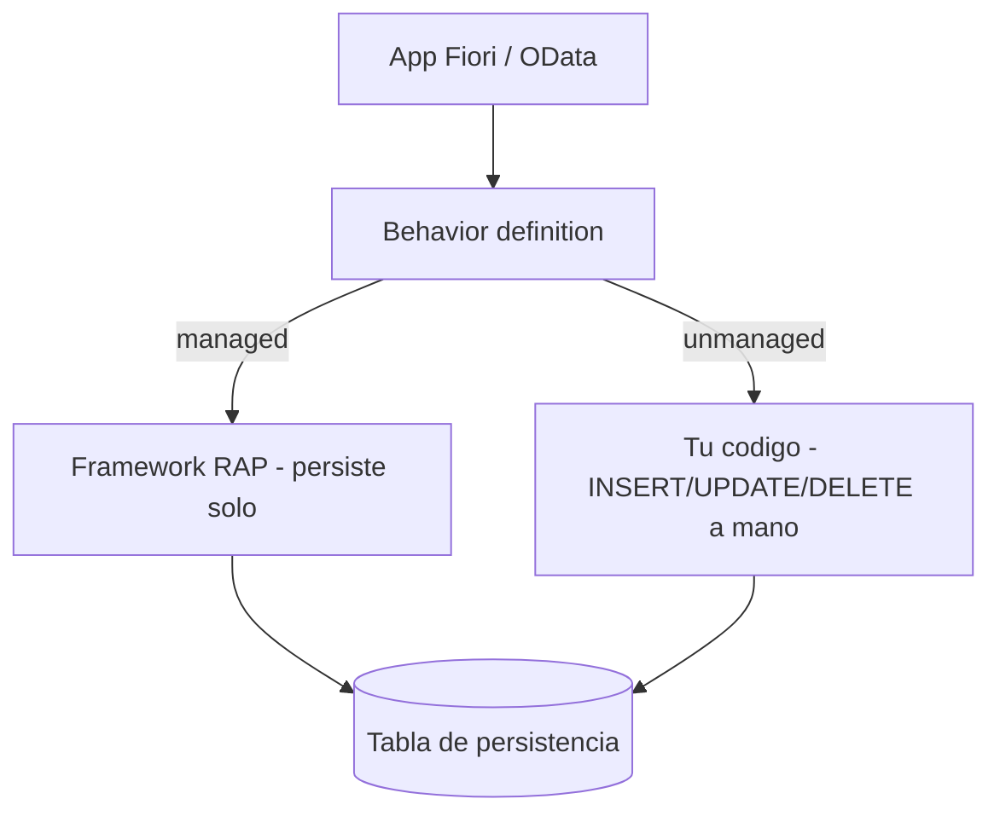

La primera decisión de arquitectura al construir un objeto de negocio con el RESTful ABAP Programming Model (RAP) no es qué campos expones: es **quién persiste los datos**. Y la responde una sola palabra en la cabecera de la behavior definition: `managed` o `unmanaged`.

## Las dos implementaciones

- **Managed**: el framework RAP gestiona automáticamente las operaciones de creación, actualización y eliminación contra la tabla de persistencia. Es la opción por defecto y la que usarás el 90% de las veces.
- **Unmanaged**: tú implementas a mano cada operación en la capa de persistencia. Se reserva para envolver lógica heredada (una función BAPI, una tabla que ya tiene su propia lógica de guardado) que no puedes reescribir.



## La behavior definition de un escenario managed

Fíjate en lo que declaras y lo que el framework te regala a cambio:

```cds
managed implementation in class zbp_i_salesorder unique;
strict ( 2 );
define behavior for I_SalesOrder alias SalesOrder
persistent table zsalesorder
lock master
authorization master ( instance )
etag master LocalLastChangedAt
{
  create;
  update;
  delete;

  field ( numbering : managed, readonly ) SalesOrderUuid;
  field ( mandatory ) CustomerId;

  mapping for zsalesorder
  {
    SalesOrderUuid = sales_order_uuid;
    CustomerId     = customer_id;
  }
}
```

Tres decisiones que valen oro:

1. `strict ( 2 )` activa el modo estricto más reciente: obliga a declarar el `lock` y caza errores que en modo laxo aparecerían en tiempo de ejecución. Úsalo siempre en proyecto nuevo.
2. `field ( numbering : managed )` deja que el framework genere el UUID de la clave. No vuelves a asignar claves a mano.
3. El bloque `mapping for` conecta los nombres OData (UpperCamelCase) con las columnas de la tabla. Sin él, el framework no sabe dónde guardar cada campo.

## La regla para decidir

Empieza siempre en `managed`. Solo baja a `unmanaged` cuando envuelvas una persistencia que **ya existe y no controlas**: un módulo funcion legacy, una tabla con triggers, una API antigua. Si estás creando la tabla desde cero, no hay ninguna razón para escribir a mano lo que el framework hace gratis y mejor.

> El escenario managed no es "la versión fácil": es la que menos superficie de bug te deja. Cada `INSERT` que no escribes es un `INSERT` que no puedes equivocar.

En el próximo post: el modelo de datos que sostiene todo esto, con su tabla activa, su tabla draft y las columnas de auditoría que el framework espera.
