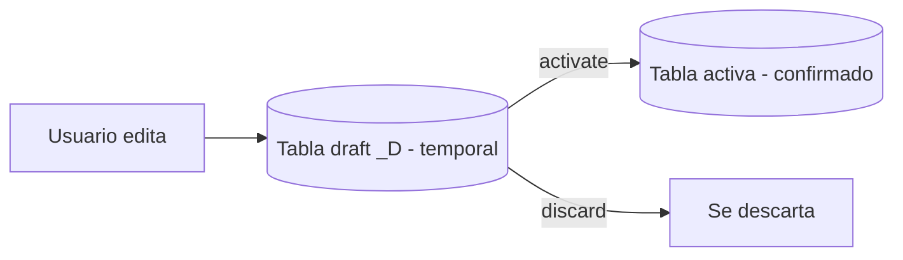

En ABAP Cloud desaparece el editor gráfico de tablas del SAP GUI: una tabla de base de datos es un fichero DDL con anotaciones. Y para que un objeto de negocio RAP funcione, esa tabla tiene que traer un conjunto de columnas muy concretas. Saltártelas es la causa número uno de "por qué mi draft no guarda".

## La tabla de persistencia activa

Es la que respalda los datos confirmados. El framework espera tres cosas de ella: mandante, una clave UUID y columnas de auditoría con los elementos de datos estándar `abp_*`.

```cds
@EndUserText.label: 'Sales order'
@AbapCatalog.enhancement.category: #NOT_EXTENSIBLE
@AbapCatalog.tableCategory: #TRANSPARENT
@AbapCatalog.deliveryClass: #A
define table zsalesorder {
  key client            : abap.clnt not null;
  key sales_order_uuid  : sysuuid_x16 not null;
  customer_id           : /dmo/customer_id;
  @Semantics.amount.currencyCode: 'currency_code'
  net_amount            : /dmo/total_price;
  currency_code         : /dmo/currency_code;
  // columnas de auditoria
  local_created_by      : abp_creation_user;
  local_created_at      : abp_creation_tstmpl;
  local_last_changed_by : abp_locinst_lastchange_user;
  local_last_changed_at : abp_locinst_lastchange_tstmpl;
  last_changed_at       : abp_lastchange_tstmpl;
}
```

Dos detalles que la gente pasa por alto:

1. La clave es un **UUID** (`sysuuid_x16`), no un número correlativo. El framework lo genera; tú no lo tocas.
2. Hay dos timestamps de cambio distintos: `local_last_changed_at` (para el ETag de instancia) y `last_changed_at` (para el ETag total). No son redundantes: cada uno alimenta una capa de concurrencia.

## La tabla draft es un clon con reglas

La experiencia de borrador necesita una segunda tabla, gemela de la activa, con dos diferencias:

- Nombres en estilo OData (UpperCamelCase, sin guiones bajos), porque de ahí sale la clave técnica que viaja al frontend.
- Un include `%admin` con la estructura estándar `sych_bdl_draft_admin_inc`, que le da al framework las columnas para saber quién creó el borrador y qué operación guarda.

```cds
@EndUserText.label: 'Sales order draft'
@AbapCatalog.tableCategory: #TRANSPARENT
@AbapCatalog.dataMaintenance: #RESTRICTED
define table zsalesorder_d {
  key client           : abap.clnt not null;
  key salesorderuuid   : sysuuid_x16 not null;
  customerid           : /dmo/customer_id;
  netamount            : /dmo/total_price;
  currencycode         : /dmo/currency_code;
  "%admin" : include sych_bdl_draft_admin_inc;
}
```



## Por qué importa

El modelo de datos no es papeleo previo: es el contrato que el framework lee para saber generar claves, resolver concurrencia y sostener el borrador. Una tabla activa sin columnas `abp_*` compila, arranca y falla el día que dos usuarios editan el mismo registro. Media hora de anotaciones hoy te ahorra un ticket irreproducible dentro de seis meses.

> Si tu tabla draft no es un espejo exacto de la activa (mismos campos, nombres OData, include `%admin`), el modo borrador te dará errores que parecen de otro planeta.

En el próximo post: cómo ese par de tablas se convierte en la experiencia Draft que tus usuarios agradecen.
