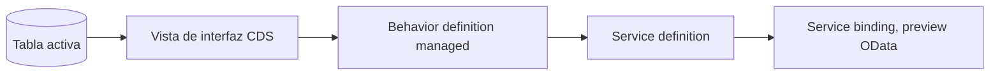

Ya leíste sobre el modelo de datos, sobre managed versus unmanaged, sobre EML. Y aun así, la primera vez que te sientas a crear un business object RAP desde cero, la pregunta sigue siendo la misma: ¿por dónde empiezo exactamente? Este recorrido responde eso con una sola pieza real, de punta a punta: una tabla, una vista de interfaz CDS y una behavior definition managed. Nada más, nada menos que lo necesario para tener algo que compile, se active y responda en el service preview.

El objeto que vamos a construir es deliberadamente pequeño: un registro de solicitudes internas (`zin_deal`), con un identificador, un cliente, un importe y un estado. No resuelve ningún caso de negocio real todavía, pero trae exactamente la forma que RAP espera, y eso es lo que importa en un primer recorrido.

Si ya conoces alguna de estas piezas por separado, los posts de esta misma categoría entran en detalle en cada una: [el modelo de datos completo](/blog/rap-modelo-de-datos), [managed versus unmanaged](/blog/rap-managed-unmanaged), [validaciones y determinaciones](/blog/rap-validaciones-determinaciones), [el modo draft](/blog/rap-draft), [autorizaciones](/blog/rap-autorizaciones) y [EML](/blog/rap-eml). Aquí el objetivo es distinto: verlas encajar todas juntas, una sola vez, en orden.



## Paso 1: la tabla de persistencia activa

Todo objeto de negocio RAP arranca en una tabla de base de datos con anotaciones, no en el editor gráfico del SAP GUI. Para el escenario managed, el framework espera un mandante, una clave UUID y las columnas de auditoría estándar.

```cds
@EndUserText.label: 'Solicitud interna'
@AbapCatalog.enhancement.category: #NOT_EXTENSIBLE
@AbapCatalog.tableCategory: #TRANSPARENT
@AbapCatalog.deliveryClass: #A
define table zin_deal {
  key client            : abap.clnt not null;
  key deal_uuid          : sysuuid_x16 not null;
  customer_id           : /dmo/customer_id;
  @Semantics.amount.currencyCode: 'currency_code'
  net_amount            : /dmo/total_price;
  currency_code         : /dmo/currency_code;
  status                : zin_deal_status;
  local_created_by      : abp_creation_user;
  local_created_at      : abp_creation_tstmpl;
  local_last_changed_by : abp_locinst_lastchange_user;
  local_last_changed_at : abp_locinst_lastchange_tstmpl;
  last_changed_at       : abp_lastchange_tstmpl;
}
```

Un detalle que se repite en todo primer intento: la clave es un UUID, no un número correlativo que tú generes. Deja que el framework lo maneje; es una de las cosas que managed te regala, y adelantarte a resolverla a mano es la forma más común de romper la generación automática más adelante.

## Paso 2: la vista de interfaz CDS

Sobre la tabla se define una vista de interfaz, la capa que RAP usa como contrato semántico del objeto de negocio. Aquí es donde declaras la clave semántica, el texto asociado a cada campo y qué vista es la raíz.

```cds
@AccessControl.authorizationCheck: #CHECK
@EndUserText.label: 'Solicitud interna, vista de interfaz'
@ObjectModel.dataCategory: #TRANSACTIONAL
define root view entity ZI_Deal
  as select from zin_deal
{
  key deal_uuid          as DealUUID,
  customer_id            as CustomerId,
  @Semantics.amount.currencyCode: 'CurrencyCode'
  net_amount             as NetAmount,
  currency_code          as CurrencyCode,
  status                 as Status,
  @Semantics.user.createdBy: true
  local_created_by       as LocalCreatedBy,
  @Semantics.systemDateTime.createdAt: true
  local_created_at       as LocalCreatedAt,
  @Semantics.user.localInstanceLastChangedBy: true
  local_last_changed_by  as LocalLastChangedBy,
  @Semantics.systemDateTime.localInstanceLastChangedAt: true
  local_last_changed_at  as LocalLastChangedAt,
  @Semantics.systemDateTime.lastChangedAt: true
  last_changed_at        as LastChangedAt
}
```

Dos anotaciones que se pasan por alto en un primer intento y luego cuestan una tarde de depuración: `@ObjectModel.dataCategory: #TRANSACTIONAL` es lo que le dice al framework que esta vista es candidata a business object, y sin los semantics de auditoría (`@Semantics.user.*`, `@Semantics.systemDateTime.*`) mapeados uno a uno con la tabla, la behavior definition del siguiente paso no compila.

Falta un elemento de datos que la tabla del Paso 1 ya da por hecho: `zin_deal_status`. Se define aparte, como un `abap.char(10)` con valores fijos, antes de activar la tabla:

```cds
@EndUserText.label: 'Estado de la solicitud'
@AbapCatalog.enhancement.category: #NOT_EXTENSIBLE
define type zin_deal_status : abap.char(10);
```

Para este primer recorrido no hace falta un dominio con valores fijos ni un value help; eso encaja mejor en el post sobre [validaciones y determinaciones](/blog/rap-validaciones-determinaciones), donde ya hay lógica que decide qué estados son válidos.

## Paso 3: la behavior definition managed

Con la tabla y la vista de interfaz activas, el siguiente archivo es la behavior definition. Es lo que convierte una vista CDS en algo con lo que un cliente OData puede hacer create, update y delete.

```abap
managed implementation in class zbp_i_deal unique;
strict 2;

define behavior for ZI_Deal alias Deal
  persistent table zin_deal
  lock master
  authorization master ( instance )
  etag master local_last_changed_at
{
  create;
  update;
  delete;

  field ( readonly ) DealUUID, LocalCreatedBy, LocalCreatedAt, LocalLastChangedBy, LocalLastChangedAt, LastChangedAt;

  mapping for zin_deal
  {
    DealUUID              = deal_uuid;
    CustomerId             = customer_id;
    NetAmount               = net_amount;
    CurrencyCode           = currency_code;
    Status                 = status;
    LocalCreatedBy         = local_created_by;
    LocalCreatedAt         = local_created_at;
    LocalLastChangedBy     = local_last_changed_by;
    LocalLastChangedAt     = local_last_changed_at;
    LastChangedAt          = last_changed_at;
  }
}
```

No hay una sola línea de código ABAP propio aquí todavía; `create`, `update` y `delete` sin cuerpo son la promesa de que el framework se encarga de la persistencia por ti. Eso es exactamente lo que managed quiere decir: tú declaras el contrato, y el guardado, el bloqueo optimista (`etag master`) y la generación del UUID los resuelve RAP. La clase `zbp_i_deal` hay que crearla vacía (con el `unique` ya la pide el compilador), pero no necesita ni una sola línea dentro para que este recorrido funcione.

## Paso 4: service definition, service binding y preview

Lo último que falta es exponer la vista de interfaz como un servicio OData que se pueda probar.

```cds
@EndUserText.label: 'Solicitudes internas'
define service definition ZI_DEAL_O4 {
  expose ZI_Deal as Deal;
}
```

La service binding se crea sobre esa definición, tipo OData V4, categoría UI. Un clic en "Publish" registra el servicio, y "Preview" abre una lista Fiori Elements genérica, generada sin una sola línea de anotación de UI. Ahí se puede crear una solicitud interna, guardarla y verla aparecer en la lista, con el `DealUUID` ya resuelto por el framework.

## Lo que queda armado en tu objeto de negocio RAP, y lo que sigue

Con estas cuatro piezas activas, `ZI_Deal` ya es un objeto de negocio RAP completo en su forma más simple: create, read, update y delete funcionando desde el preview, sin una línea de lógica de negocio propia. Es deliberadamente poco. Lo que sigue naturalmente desde aquí no es una funcionalidad nueva, sino las piezas que le faltan a este mismo objeto para acercarse a algo real: [validaciones y determinaciones](/blog/rap-validaciones-determinaciones) para que el estado tenga reglas, [el modo draft](/blog/rap-draft) para que un usuario pueda guardar a medias, y [autorizaciones](/blog/rap-autorizaciones) para que no cualquiera pueda tocar la solicitud de otro. Las tres parten exactamente de este mismo `zin_deal`.

Si este primer recorrido te dejó con ganas de ver el mismo patrón aplicado a un caso de negocio real y no a un ejemplo de cuatro campos, el libro [ABAP Cloud: Aplicaciones Empresariales con RAP](/books/abap-rap) construye una aplicación de pedidos de venta completa con el mismo enfoque, caso a caso. Y si prefieres el recorrido guiado con evaluación, el curso [SAP ABAP RAP: Arquitectura Cloud](/courses/sap-abap-rap-arquitectura-cloud/) cubre el mismo terreno con ejercicios sobre un sistema S/4HANA real.
