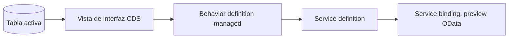

Ya leíste sobre el modelo de datos, sobre managed versus unmanaged, sobre EML. Y aun así, la primera vez que te sientas a crear un business object RAP desde cero, la pregunta sigue siendo la misma: ¿por dónde empiezo exactamente? Este recorrido responde eso con una sola pieza real, de punta a punta: una tabla, una vista de interfaz CDS y una behavior definition managed. Nada más, nada menos que lo necesario para tener algo que compile, se active y responda en el service preview.

El objeto que vamos a construir es deliberadamente pequeño: un registro de solicitudes internas (`zin_deal`), con un identificador, un cliente, un importe y un estado. No resuelve ningún caso de negocio real todavía, pero trae exactamente la forma que RAP espera, y eso es lo que importa en un primer recorrido.

Si ya conoces alguna de estas piezas por separado, los posts de esta misma categoría entran en detalle en cada una: [el modelo de datos completo](/blog/rap-modelo-de-datos), [managed versus unmanaged](/blog/rap-managed-unmanaged), [validaciones y determinaciones](/blog/rap-validaciones-determinaciones), [el modo draft](/blog/rap-draft), [autorizaciones](/blog/rap-autorizaciones) y [EML](/blog/rap-eml). Aquí el objetivo es distinto: verlas encajar todas juntas, una sola vez, en orden.



## Paso 1: la tabla de persistencia activa

Todo objeto de negocio RAP arranca en una tabla de base de datos con anotaciones, no en el editor gráfico del SAP GUI. Para el escenario managed, el framework espera un mandante, una clave UUID y las columnas de auditoría estándar.

```cds
@EndUserText.label: 'Solicitud interna'
@AbapCatalog.enhancement.category: #NOT_EXTENSIBLE
@AbapCatalog.tableCategory: #TRANSPARENT
@AbapCatalog.deliveryClass: #A
define table zin_deal {
  key client            : abap.clnt not null;
  key deal_uuid          : sysuuid_x16 not null;
  customer_id           : /dmo/customer_id;
  @Semantics.amount.currencyCode: 'currency_code'
  net_amount            : /dmo/total_price;
  currency_code         : /dmo/currency_code;
  status                : zin_deal_status;
  local_created_by      : abp_creation_user;
  local_created_at      : abp_creation_tstmpl;
  local_last_changed_by : abp_locinst_lastchange_user;
  local_last_changed_at : abp_locinst_lastchange_tstmpl;
  last_changed_at       : abp_lastchange_tstmpl;
}
```

Un detalle que se repite en todo primer intento: la clave es un UUID, no un número correlativo que tú generes. Deja que el framework lo maneje; es una de las cosas que managed te regala, y adelantarte a resolverla a mano es la forma más común de romper la generación automática más adelante.

## Paso 2: la vista de interfaz CDS

Sobre la tabla se define una vista de interfaz, la capa que RAP usa como contrato semántico del objeto de negocio. Aquí es donde declaras la clave semántica, el texto asociado a cada campo y qué vista es la raíz.

```cds
@AccessControl.authorizationCheck: #CHECK
@EndUserText.label: 'Solicitud interna, vista de interfaz'
@ObjectModel.dataCategory: #TRANSACTIONAL
define root view entity ZI_Deal
  as select from zin_deal
{
  key deal_uuid          as DealUUID,
  customer_id            as CustomerId,
  @Semantics.amount.currencyCode: 'CurrencyCode'
  net_amount             as NetAmount,
  currency_code          as CurrencyCode,
  status                 as Status,
  @Semantics.user.createdBy: true
  local_created_by       as LocalCreatedBy,
  @Semantics.systemDateTime.createdAt: true
  local_created_at       as LocalCreatedAt,
  @Semantics.user.localInstanceLastChangedBy: true
  local_last_changed_by  as LocalLastChangedBy,
  @Semantics.systemDateTime.localInstanceLastChangedAt: true
  local_last_changed_at  as LocalLastChangedAt,
  @Semantics.systemDateTime.lastChangedAt: true
  last_changed_at        as LastChangedAt
}
```

Dos anotaciones que se pasan por alto en un primer intento y luego cuestan una tarde de depuración: `@ObjectModel.dataCategory: #TRANSACTIONAL` es lo que le dice al framework que esta vista es candidata a business object, y sin los semantics de auditoría (`@Semantics.user.*`, `@Semantics.systemDateTime.*`) mapeados uno a uno con la tabla, la behavior definition del siguiente paso no compila.

<!--
TODO (continuar mañana, ziua 16):
- Paso 3: behavior definition managed minima (managed, early numbering, campo etag)
- Paso 4: service definition + service binding, registro y prueba en el preview OData
- Cierre: que se ve en el preview (create/read funcionando), y enlace hacia adelante a validaciones/autorizaciones/draft como "siguientes pasos naturales"
- Revisar que zin_deal_status (elemento de datos) se defina o se sustituya por un tipo existente antes de publicar
-->
