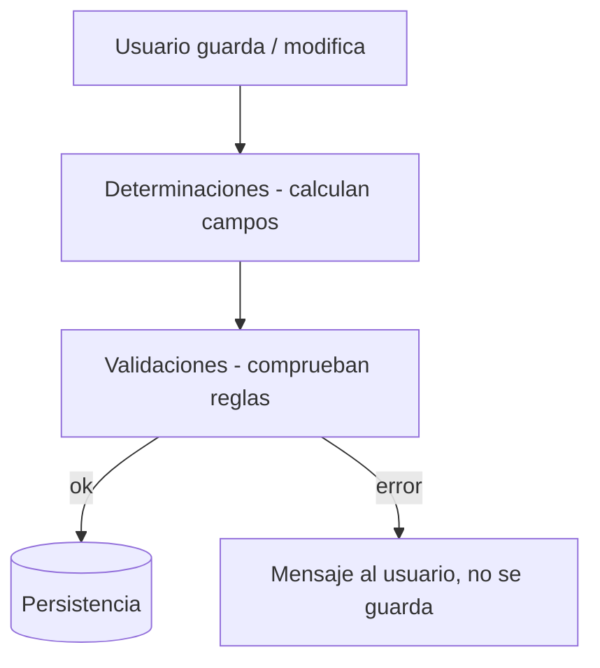

En RAP hay dos sitios para la lógica de negocio que la gente confunde constantemente: las **validaciones** y las **determinaciones**. La regla es simple: si tu regla dice "no dejes guardar esto", es una validación; si dice "cuando pase esto, calcula aquello", es una determinación. Meter una donde va la otra es la fuente de la mitad de los bugs raros en aplicaciones RAP.

## La diferencia en una frase

- **Validación**: comprueba la integridad de los datos y **bloquea** el guardado si no se cumple, devolviendo un mensaje al usuario. No modifica nada.
- **Determinación**: **calcula y asigna** valores de campos automáticamente según reglas de negocio. Los campos determinados suelen ser `readonly` (el usuario no los toca).



## Declararlas en la behavior definition

Ambas se enganchan a un momento (`on save`, `on modify`) y se implementan en la Behavior Pool:

```cds
define behavior for I_SalesOrder alias SalesOrder
persistent table zsalesorder
lock master
authorization master ( instance )
{
  create;
  update;
  delete;

  // veta el guardado si el cliente no es valido
  validation validateCustomer on save { create; field CustomerId; }

  // rellena el total sumando las posiciones, al guardar
  determination calculateTotal on save { create; update; }

  // rellena estado inicial solo al crear
  determination setInitialStatus on modify { create; }
}
```

Dos matices que se pasan por alto:

1. El momento importa. `on save` se dispara al confirmar la transacción; `on modify` en cuanto se toca el campo. Una determinación de estado inicial va `on modify { create; }` (solo al nacer el registro); un cálculo de total va `on save` (cuando ya están todas las posiciones).
2. Una validación declara **qué campos** la disparan (`field CustomerId`). Así el framework no re-ejecuta la validación cuando cambia un campo que no le incumbe. Es rendimiento gratis.

## El error clásico: validar cambiando datos

La tentación es aprovechar una validación para "de paso" corregir un valor. No lo hagas: una validación que modifica datos rompe el modelo transaccional y produce comportamientos imposibles de depurar (el framework asume que validar no tiene efectos secundarios). Si necesitas tocar un campo, es una determinación. Punto.

> Ordena siempre la behavior definition: primero operaciones, luego campos, luego acciones, y al final validaciones y determinaciones. No es obligatorio, pero un objeto de negocio que se lee de arriba abajo se mantiene solo.

En el próximo post: autorizaciones en RAP, y por qué "global" e "instancia" no son lo mismo ni se implementan igual.
