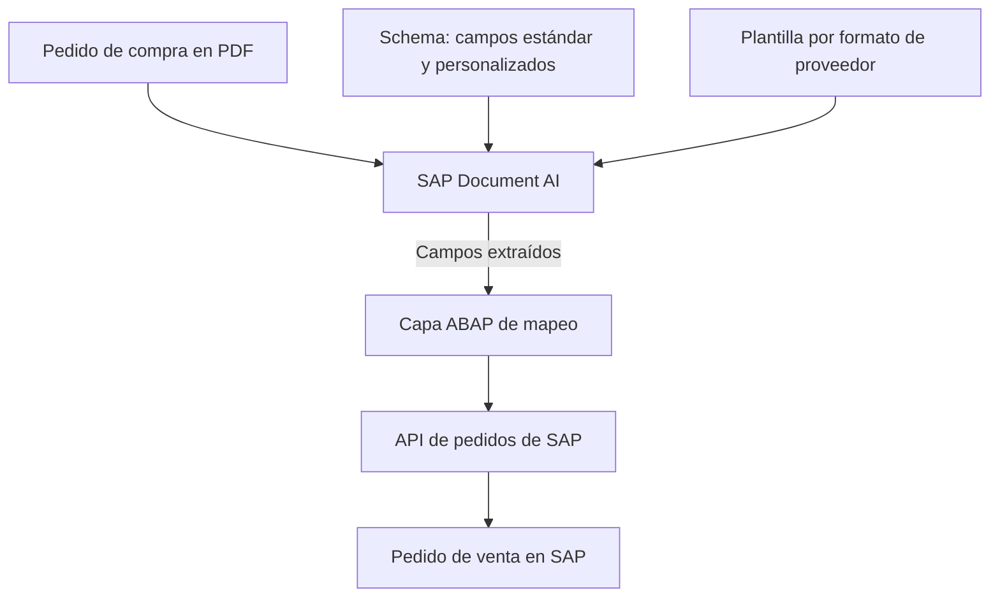
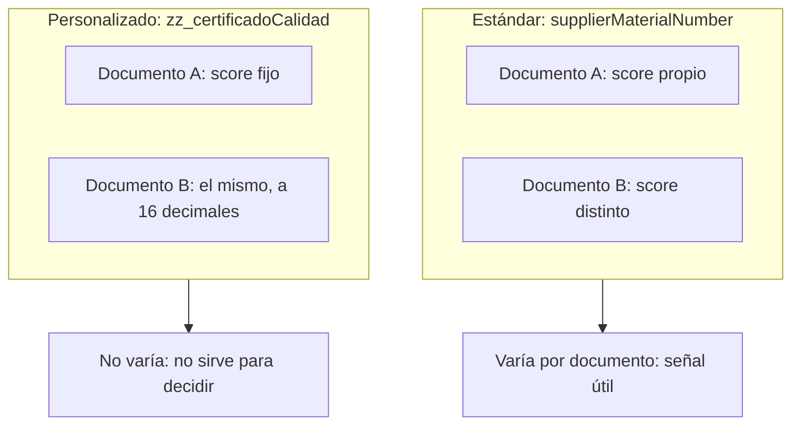

Este artículo cuenta un caso concreto de integración con SAP, pero el problema de fondo no es específico de SAP: es lo que pasa cuando un sistema de extracción de documentos con IA da una respuesta *y también* un número que dice hasta qué punto está segura de esa respuesta, y ese número resulta no significar lo que el diseño del proceso asumía que significaba. Cualquiera que esté automatizando decisiones a partir de la salida de un modelo (no solo en compras, no solo en SAP) se va a topar con una versión de este mismo problema. Por eso vale la pena seguir el caso hasta el final, incluidos los intentos que no funcionaron.

**Términos clave, por si no son familiares** (el vocabulario completo está en la [parte 1 de la serie](/blog/que-es-sap-document-ai/)):

- **Document AI / SAP Document Information Extraction:** servicio de SAP que usa modelos de IA para leer documentos (PDF, escaneos) y extraer campos estructurados; por ejemplo, de un pedido de compra: número de material, cantidad, precio.
- **Schema:** la definición de qué campos extrae Document AI de un documento y de qué tipo es cada uno (estándar, ya definidos por SAP, o personalizados, definidos para este proyecto).
- **API de pedidos SAP:** interfaz estándar de SAP para crear o modificar datos (aquí, para crear el pedido de venta) desde un programa externo o desde otra capa de SAP.
- **`MARA-BISMT`:** el campo de la ficha de material en SAP donde vive el código de material antiguo o de referencia cruzada, que es contra el que hay que hacer coincidir el código que llega en el PDF.

## Contexto: SAP Document AI en pedidos multiproveedor

Estamos integrando **SAP Document Information Extraction (Document AI)** para convertir pedidos de compra en PDF, con dos formatos de proveedor distintos, en pedidos de venta automáticos en SAP. El diseño es el habitual: un schema con campos estándar y personalizados, una plantilla entrenada por formato, y una capa ABAP que traduce lo extraído a la API de pedidos de SAP para la creación del pedido.

El caso que merece la pena contar empieza cuando ese diseño, correcto sobre el papel, se enfrenta a un documento real de 86 líneas de pedido (en términos SAP, 86 posiciones de material).

### Diagrama de la arquitectura en SAP BAIP

Así se ve ese diseño en SAP BAIP: el PDF entra a Document AI, que lo extrae contra un schema y una plantilla por formato de proveedor, y entrega el resultado a la capa ABAP que lo traduce a la API de pedidos. El problema que sigue no está en ningún componente de este diagrama por separado, sino en la frontera entre Document AI y la capa ABAP: en qué campo de la extracción decide leer la capa ABAP.

## El problema concreto

El pedido de venta en SAP identifica cada línea de material buscando un código en la ficha de material (`MARA-BISMT`). Ese código tiene que salir de algún campo de la extracción. El problema es que **no hay un único campo candidato**: cada línea del PDF trae impresas dos columnas de código (el código interno del cliente y el código del proveedor), y Document AI las mapea a dos campos distintos del schema (`customerMaterialNumber` y `supplierMaterialNumber`).

### Ejemplo de línea de pedido: los dos códigos que compiten por el mismo material

### Confirmado en el schema estándar: dos campos separados

`customerMaterialNumber` y `supplierMaterialNumber` ya son campos separados en el schema estándar `SAP_purchaseOrder_schema`:

La pregunta, entonces, es en cuál de los dos campos aparecía realmente el código en cada caso. Revisando una por una las 86 líneas del documento real, esto fue lo que trajo cada campo:

| Campo con código | Líneas (de 86) |
|---|---:|
| Solo código de cliente | 19 |
| Solo código de proveedor | 30 |
| Ambos códigos | 12 |
| **Ninguno de los dos** | **25** |

Es decir: dependiendo del documento y del formato de proveedor, el código «bueno» para SAP aparecía unas veces en un campo y otras veces en otro, y en 25 de las 86 líneas no aparecía en ninguno, aunque en el papel la columna está impresa y es legible a simple vista. Como el control de aprobación del pedido se niega, a propósito, a crear un pedido mientras quede una sola línea sin material identificado (la alternativa es crear un pedido con el material equivocado, que es peor), el resultado práctico era que **un pedido de este tamaño nunca podía aprobarse**.

## Los intentos que no funcionaron

**1. Mapear siempre el mismo campo de origen.** El primer documento de prueba, con solo dos líneas, funcionaba leyendo un campo fijo. Al escalar a un documento real con 86 líneas y dos formatos de proveedor distintos, ese supuesto se rompió: el código bueno para SAP no vivía siempre en el mismo campo del schema, así que el mapeo automático fallaba de forma silenciosa según qué formato hubiera generado el documento.

**2. Confiar en que la capa SAP lo resolviera aguas abajo.** La lógica ABAP de mapeo de materiales ya sabe derivar campos adicionales (como la unidad de medida) desde el maestro de materiales una vez que encuentra el material correspondiente. Pero esa derivación solo actúa **después** de que el material se haya identificado; si la línea no trae ningún código utilizable, no hay nada de lo que partir. Delegar el problema a una capa posterior del proceso no funcionaba porque esa capa depende de que el problema anterior ya esté resuelto.

**3. Usar el score de confianza para decidir automáticamente.** La idea era razonable: si la extracción no está segura, marcar la línea para revisión manual en vez de bloquear todo el pedido. En este caso, los códigos de material vienen de campos del schema estándar (`customerMaterialNumber` y `supplierMaterialNumber`), cuyo score sí varía de un documento a otro, como muestra la comparación de más abajo. El problema es que el score acompaña a un valor extraído: en las 25 líneas sin ningún código, Document AI no rellena el campo del schema, así que tampoco hay score (ni siquiera un 0), y eran justo las que bloqueaban el pedido. Si el código hubiera venido de un campo personalizado, el score tampoco habría servido: como se ve al final del artículo, en esos campos la confianza no se recalcula por documento (devuelve el mismo valor, idéntico hasta el decimal 16), así que un umbral fijo los clasificaría siempre igual, todos como dudosos o todos como fiables, sea cual sea el documento.

**4. Corregir un documento a mano en la interfaz de revisión, esperando que el modelo «aprendiera».** Como se explicó en la [parte 1](/blog/que-es-sap-document-ai/), corregir y confirmar son dos acciones distintas: la corrección manual deja bien ese documento concreto, pero solo los documentos confirmados sirven de referencia para las extracciones siguientes, ya sea mediante *instant learning* o como muestras de una plantilla. Corregir en pantalla resuelve ese documento, no el problema de fondo.

## La solución que funcionó, y sus límites

La parte que sí se resolvió fue la ambigüedad de «a qué campo mirar»: una decisión de negocio, tomada junto con el equipo funcional (no algo que se pudiera deducir solo desde la integración), fijó un único campo canónico, el correspondiente al código de proveedor, como el que debe coincidir siempre con el material interno, para ambos formatos de documento. Con eso, la capa ABAP dejó de tener que adivinar según el formato de origen y simplemente lee siempre ese campo.

Esto elimina la inconsistencia de mapeo, pero **no resuelve la cobertura**: las 25 líneas de 86 que no traían ningún código extraído siguen sin traerlo. Ese es un problema distinto, de datos de entrenamiento y no de diseño de mapeo, y su solución pasa por conseguir varios documentos de muestra representativos por formato y reentrenar la plantilla.

Hay además un límite más sutil, descubierto comparando dos documentos sin ninguna relación entre sí: los campos **personalizados** del schema (los que no forman parte del set estándar de SAP) devolvían exactamente la misma confianza hasta el decimal 16 en ambos documentos. Los campos estándar, en cambio, variaban con normalidad entre uno y otro. La conclusión práctica es que, en campos personalizados, todo indica que ese número no se calcula por documento, sino que se hereda de la plantilla, y por tanto no sirve como señal para decidir automáticamente qué revisar, aunque la cobertura de extracción mejore. Cualquier automatización futura que dependa del score de confianza tiene que tratar los campos estándar y los personalizados como dos fuentes de fiabilidad completamente distintas.

## La lección, fuera de SAP

Nada de esto es específico de Document AI ni de pedidos de compra. El patrón es este: un modelo devuelve una respuesta y un número que se supone mide cuánto confiar en ella, el diseño del proceso trata ese número como si fuera homogéneo y comparable entre campos, y no lo es. Aquí se rompió de dos formas distintas: el score no dice nada de los valores que el modelo no llega a extraer (intento 3), y en los campos personalizados ni siquiera se recalculaba por documento (hallazgo final). Ninguna de las dos formas es visible leyendo la documentación del proveedor; las dos solo aparecieron al comparar casos reales entre sí.

La consecuencia práctica, para cualquiera que esté a punto de automatizar una decisión a partir de la salida de un modelo (no solo en SAP, no solo con Document AI): antes de fijar un umbral de confianza para decidir «esto pasa automático, esto va a revisión manual», hay que verificar, campo por campo, que ese número se comporta como una señal real y no como un valor heredado o saturado. Si no se verifica, el umbral que se fije no va a estar discriminando lo que se cree que está discriminando.
