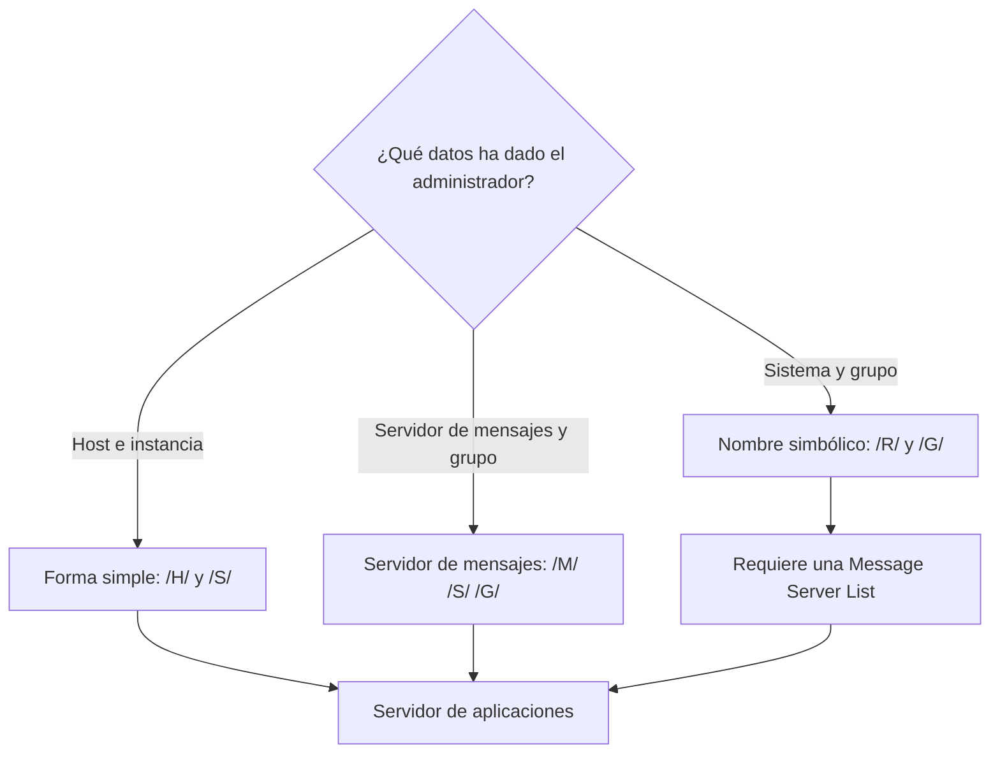

En un Mac, el cliente para trabajar con un sistema SAP es **SAP GUI for Java**. Descargarlo e instalarlo lleva pocos minutos. Lo que de verdad cuesta es la primera conexión: el administrador facilita un host, la pestaña **Sistema** pide un sistema y un grupo, y no hay forma de hacer encajar una cosa con la otra.

Este artículo recoge una instalación real de principio a fin. Explica por qué no hace falta instalar Java, cuáles son las tres formas que tiene SAP GUI for Java de dirigirse a un sistema y cuál corresponde a cada situación, y cómo diagnosticar la red cuando la conexión no responde.

## Entorno de la prueba

| Elemento | Valor |
|---|---|
| Equipo | Mac con procesador de la serie M (ARM64) |
| Sistema operativo | macOS Tahoe 26.6.2 |
| Versión instalada | SAP GUI for Java 8.10, patch 14 |
| Fichero | `platingui_inst_810_14-80009301.dmg` |
| Navegador | Safari |
| Red | Conexión por VPN al sistema SAP |
| Fechas | 8 y 9 de octubre de 2026 |

Antes de empezar se necesita:

- un usuario de SAP for Me (S-user) con la autorización **Software Download**: según indica el propio portal, se solicita al administrador de usuarios de la empresa;
- los datos de conexión del sistema, que facilita el administrador (en este caso, el host del servidor de aplicaciones y el número de instancia);
- acceso a la VPN, si el sistema no es accesible desde fuera de la red de la empresa.

## Paso 1. Descargar SAP GUI for Java desde SAP for Me

En [Software Downloads](https://support.sap.com/en/my-support/software-downloads.html) de SAP Support, el botón **Software Downloads in SAP for Me** lleva al inicio de sesión con el SAP ID. Dentro de SAP for Me, el buscador encuentra el componente al escribir `sap gui for java`. Al desplegarlo aparece la versión disponible, **SAP GUI FOR JAVA 8.10**.


En la pestaña **DOWNLOADS** de la versión, el desplegable de plataforma ofrece cuatro opciones: LINUX ON X86_64 64BIT, MACOS ON ARM64 64BIT, MACOS ON X86_64 64BIT y WINDOWS ON X64 64BIT. Para un Mac con procesador de la serie M se elige **MACOS ON ARM64 64BIT**.

La lista muestra, para cada patch, un fichero `.jar` y un fichero `.dmg`. Se descarga el `.dmg` del patch más reciente: `platingui_inst_810_14-80009301.dmg`, patch 14, 318623 KB, publicado el 18.09.2026.


## Paso 2. Permitir ventanas emergentes y descargas en Safari

Al pulsar el fichero, la descarga no empieza: la barra de direcciones de Safari muestra **Ventana emergente bloqueada**. SAP for Me abre la descarga en una ventana nueva, y Safari la bloquea por defecto.

Para permitirla:

1. Menú **Safari**, **Ajustes…**
2. Pestaña **Sitios web**, apartado **Ventanas emergentes**.
3. En `me.sap.com`, cambiar **Bloquear y notificar** por **Permitir**.


Al repetir la descarga, Safari pregunta si se permiten las descargas de `me.sap.com` y `launchpad.support.sap.com`. Se responde **Permitir**. El fichero descargado ocupa 326,3 MB.


## Paso 3. Instalar desde el DMG

Al abrir el DMG aparece la ventana del instalador, **SAP NetWeaver, SAP GUI for the Java Environment 8.10**, con dos elementos: la carpeta **SAP Clients** y un acceso directo a **Applications**. La instalación consiste en arrastrar **SAP Clients** sobre **Applications**.


La aplicación queda en `/Applications/SAP Clients/SAPGUI 8.10rev14/` con el nombre **SAPGUI 8.10rev14**, y se puede abrir desde Spotlight.

## No hace falta instalar Java: SAP GUI trae el suyo

SAP GUI for Java es una aplicación Java, y es fácil suponer que antes hay que instalar Java en el Mac. En esta instalación no hizo falta: el DMG funcionó sin más pasos. La razón está dentro de la propia aplicación, que incluye su propio entorno de ejecución de Java:

```bash
grep JAVA_VERSION "/Applications/SAP Clients/SAPGUI 8.10rev14/SAPGUI 8.10rev14.app/Contents/Resources/jre/Contents/Home/release"
```

```text
JAVA_VERSION="21.0.12.1"
```

Para comprobar que SAP GUI usa ese Java y no otro, se puede mirar con SAP GUI abierto qué máquina virtual de Java tiene cargada su proceso. Primero se obtiene el número del proceso y después se buscan, entre sus ficheros abiertos, la librería `libjvm.dylib`, que es la máquina virtual de Java:

```bash
pgrep -l SAPGUI
lsof -p <número de proceso> | grep libjvm
```

La salida (resumida) apunta a la carpeta de la aplicación:

```text
SAPGUI ... /Applications/SAP Clients/SAPGUI 8.10rev14/SAPGUI 8.10rev14.app/Contents/Resources/jre/Contents/Home/lib/server/libjvm.dylib
```

Dos conclusiones:

- **Java se ejecuta dentro del proceso `SAPGUI`.** Por eso un `ps -ax | grep java` no muestra nada: no existe un proceso llamado `java`.
- **SAP GUI usa el Java que trae, no el del sistema.** En el Mac de la prueba había además un OpenJDK 25 instalado aparte, y SAP GUI no lo utilizó.

## Las tres formas de dirigirse a un sistema SAP

Antes de crear la conexión conviene entender qué espera SAP GUI for Java. Según la documentación de SAP sobre los [connection strings de SAP GUI for Java](https://help.sap.com/docs/sap_gui_for_java/e665f2b67dbd4328ab6bd9e029b84581/fea559caf24b4af390f75af0a12e0a0b.html?locale=en-US), un sistema se puede direccionar de tres formas:

| Forma | Connection string | Qué hay que conocer |
|---|---|---|
| Simple | `/H/<host>/S/<puerto>` | Host y puerto del servidor de aplicaciones |
| Servidor de mensajes | `/M/<host>/S/<puerto>/G/<grupo>` | Host y puerto del servidor de mensajes, y el grupo de logon |
| Nombre simbólico | `/R/<SID>/G/<grupo>` | Nombre del sistema, grupo de logon y una Message Server List |

Las tres terminan en un servidor de aplicaciones, que es donde se trabaja. La diferencia está en quién decide a cuál se conecta el usuario:

- **Simple:** el usuario se conecta directamente a un servidor de aplicaciones concreto.
- **Servidor de mensajes:** SAP GUI pregunta al servidor de mensajes del sistema, que reparte a los usuarios entre los servidores de aplicaciones del grupo indicado.
- **Nombre simbólico:** SAP GUI busca el nombre del sistema en la Message Server List, un fichero de texto que traduce cada nombre a la dirección de su servidor de mensajes, y continúa como en la forma anterior.



## Por qué la pestaña Sistema no sirve con solo un host

La primera ventana de SAP GUI for Java muestra la carpeta **JavaGUI Services** vacía. El botón de nueva conexión, junto a **Conectar**, abre las **Propiedades de conexión**.


La solución evidente es rellenar la primera pestaña, **Sistema**. Sus campos obligatorios son **Sistema** y **Grupo/Servidor**; el campo **Servidor de mensajes** aparece en gris, sin posibilidad de escribir en él.


Comparada con la tabla anterior, esta pestaña corresponde a la forma de **nombre simbólico**: pide el nombre del sistema y el grupo de logon. Con solo el host del servidor de aplicaciones no hay forma de rellenarla: no se conoce el grupo de logon, y la forma simbólica necesita además que el sistema figure en una Message Server List.

El dato del administrador corresponde a la **forma simple**, y esa forma no tiene pestaña propia: se escribe a mano.

## Paso 4. Escribir el connection string en modo de experto

La conexión con la forma simple se crea así:

1. En la ventana inicial, pulsar el botón de nueva conexión, junto a **Conectar**.
2. En **Descripción**, escribir un nombre para reconocer la conexión en la lista.
3. Abrir la pestaña **Ampliada**.
4. Marcar **Modo de experto**.
5. En el cuadro de texto, escribir el connection string con el host del servidor de aplicaciones y el puerto: `conn=/H/<host>/S/3200` para la instancia 00.
6. Comprobar que el cuadro inferior muestra **Todos los parámetros válidos**.
7. Pulsar **Grabar**.

El campo valida el string mientras se escribe, y un valor que no empieza bien se rechaza con este mensaje:

```text
El string de conexión debe empezar por /H/, /M/, o /R/.
```


Los tres prefijos admitidos son, precisamente, las tres formas de la tabla. Para la forma simple:

```text
conn=/H/<host>/S/3200
```

El puerto no es arbitrario. La documentación de SAP GUI for Java indica que, por convención, el puerto de un servidor de aplicaciones es 3200 más el número de sistema de dos cifras. La página de SAP [TCP/IP Ports of All SAP Products](https://help.sap.com/docs/Security/575a9f0e56f34c6e8138439eefc32b16/616a3c0b1cc748238de9c0341b15c63c.html?locale=en-US) lo recoge como `32NN` para Application Server ABAP, en el rango 3200 a 3299. Para la instancia 00, el puerto es el 3200.

La validación confirma el string con el mensaje **Todos los parámetros válidos**.


Una consecuencia del modo de experto: al editar después una conexión creada así, solo se puede abrir la pestaña **Ampliada**. El connection string pasa a ser la única definición de la conexión.

Escribir este string fue el paso que más tiempo llevó en la prueba, aunque solo contiene el host y el puerto.

## Diagnosticar la red con nc

Cuando la conexión no responde, conviene separar dos problemas: si el Mac llega al servidor y si el puerto es el correcto. Para lo primero sirve `nc` desde la Terminal de macOS:

```bash
nc -vz <host> 3200
```

Estos son los tres resultados que se obtuvieron en la prueba:

| Situación | Resultado de `nc` | Qué significa |
|---|---|---|
| VPN conectada, puerto 3200 | `Connection to <host> port 3200 [tcp/tick-port] succeeded!` | Hay red y el puerto está abierto |
| VPN desconectada, puerto 3200 | No responde; el comando se queda esperando y hay que cortarlo con Control+C | No hay red hasta el servidor |
| VPN conectada, puerto 3201 | `succeeded!` | El puerto está abierto, pero eso no lo convierte en el correcto |

El tercer caso es el importante. Con el puerto 3201, `nc` informa de que la conexión se abre, pero SAP GUI la rechaza al conectar: 3201 correspondería a la instancia 01, que no es la del sistema. **`nc` comprueba la red, no el puerto correcto.** El número de instancia lo facilita el administrador, y el puerto se obtiene de él con la regla `32NN`.

## Paso 5. Primera conexión

Tras pulsar **Grabar**, la conexión aparece en la lista de **JavaGUI Services**. Al pulsar **Conectar** por primera vez, SAP GUI for Java pide clasificar el sistema: **Ningún nivel de confianza especificado** para ese sistema. La opción por defecto es **Interno: En general es fiable; no se necesitan autorizaciones adicionales**. Se mantuvo y se pulsó **OK**.


A continuación aparece la pantalla de acceso, con los campos **Mandante**, **Usuarios**, **Clv.acc.** e **Idioma**.


Tras el aviso de copyright, el sistema muestra **SAP Easy Access**: la instalación y la conexión funcionan.


## Resumen

| Obstáculo | Solución |
|---|---|
| Safari bloquea la ventana de descarga | Permitir ventanas emergentes y descargas en `me.sap.com` |
| Duda sobre si instalar Java | No hace falta: SAP GUI trae su propio Java 21 |
| La pestaña Sistema pide sistema y grupo | Corresponde a `/R/`; con solo un host se usa la forma simple |
| El string de conexión se rechaza | Empezar por `/H/`, `/M/` o `/R/` según los datos disponibles |
| El puerto no se conoce | Calcularlo con la regla `32NN` a partir del número de instancia |
| La conexión no responde | `nc -vz` para comprobar la red y la VPN |
